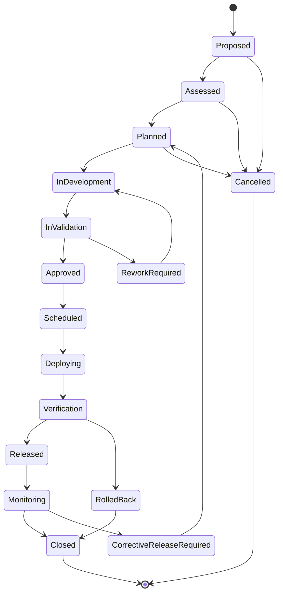
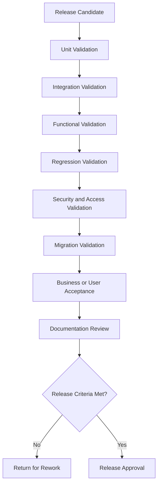
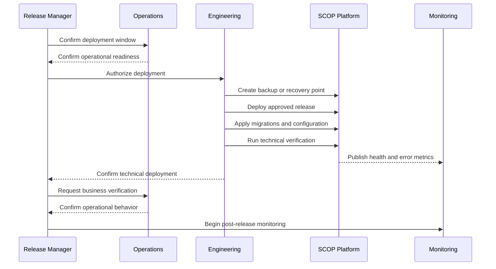
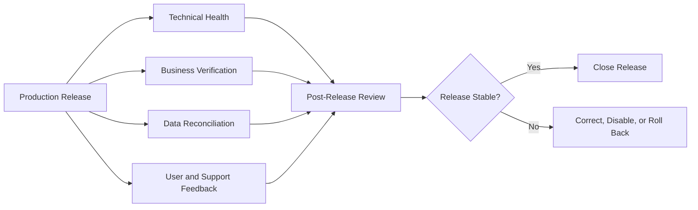

import DocumentInfo from '@site/src/components/DocumentInfo';

# إدارة الإصدارات

<DocumentInfo
  category="ملاحظات الإصدار"
  audience={['التنفيذيون', 'المنتج', 'الأعمال', 'العمليات', 'التقنية', 'التطوير', 'الدعم']}
  status="Approved"
  version="1.0"
  owner="فريقا المنتج والهندسة"
  updated="يوليو 2026"
  readingTime="12 دقيقة"
/>

## الغرض

تحدد إدارة الإصدارات كيفية إعداد تغييرات SCOP (منصة تشغيل سلسلة التوريد) والتحقق من صحتها واعتمادها ونشرها والتواصل بشأنها ومراقبتها وتسجيلها.

وهي توفر إطارًا محكومًا لإطلاق التغييرات التي تؤثر على:

- تهيئة Odoo 17 (نظام تخطيط موارد المؤسسات)
- وحدات SCOP المخصصة
- سير العمل التشغيلي
- تخطيط سلسلة التوريد
- سلوك Decision Engine (محرك القرار)
- قدرات AI Platform (منصة الذكاء الاصطناعي)
- قواعد الأعمال وقيودها
- التكاملات
- التقارير والتحليلات
- ضوابط الأمان
- البنية التحتية التقنية
- التوثيق

تضمن إدارة الإصدارات أن يفهم المستخدمون التشغيليون ما الذي تغيّر، ولماذا تغيّر، وكيف يؤثر عليهم، وما الإجراءات التي قد تكون مطلوبة.

## الأهداف

صُممت عملية إصدارات SCOP من أجل:

- تسليم التغييرات المعتمدة بأمان.
- حماية استمرارية التشغيل.
- الحفاظ على إمكانية التتبع من المتطلب إلى الإنتاج.
- التحقق من صحة السلوك التجاري والتقني.
- التواصل بشأن التغييرات بوضوح.
- تحديد متطلبات الترقية أو الترحيل.
- تسجيل القيود المعروفة.
- دعم rollback (التراجع) أو التعافي.
- مراقبة السلوك بعد الإصدار.
- الحفاظ على سجل تاريخ الإصدارات.
- إبقاء التوثيق متزامنًا مع الوظائف المُطلقة.

## مبادئ الإصدار

### التغيير المحكوم

لا ينبغي أن يحدث أي تغيير في بيئة الإنتاج دون:

- نطاق محدد
- مالك محدد
- مراجعة مناسبة
- تحقق من الصحة
- اعتماد
- خطة نشر
- خطة تحقق
- تواصل
- مراعاة إجراءات التعافي

### السلامة التشغيلية

يجب ألا يعرّض الإصدار السجلات التشغيلية أو التزامات العملاء أو المخزون أو الرحلات أو القرارات أو التكاملات لمخاطر غير مقبولة.

تتطلب التغييرات عالية التأثير تحققًا واعتمادًا أقوى.

### إمكانية التتبع

ينبغي أن يكون كل إصدار قابلًا للتتبع إلى:

- متطلبات الأعمال
- قرارات المنتج
- التغييرات التقنية
- الاختبارات
- الاعتمادات
- سجلات النشر
- التوثيق
- الحوادث أو الإجراءات التصحيحية حيثما ينطبق ذلك

### التوثيق مع التسليم

ينبغي تحديث التوثيق ضمن الإصدار نفسه الذي يغيّر السلوك الموثق.

لا ينبغي اعتبار الميزة مكتملة عندما يتعذر على المستخدمين فهم كيفية عملها أو كيفية تأثيرها على العمليات.

### التغيير القابل للعكس

حيثما كان ذلك عمليًا، ينبغي أن تدعم الإصدارات:

- rollback
- إلغاء تفعيل الميزات
- استعادة التهيئة
- استعادة إصدار النموذج
- الاسترداد المحكوم لقاعدة البيانات
- الرجوع اليدوي إلى إجراءات تشغيلية بديلة

### الإصدار المُقاس

لا يكتمل الإصدار عند انتهاء النشر.

بل لا يكتمل إلا بعد أن يؤكد التحقق اللاحق للإصدار أن السلوك المقصود يعمل بشكل مقبول.

## نطاق الإصدار

قد يحتوي إصدار SCOP على نوع واحد أو أكثر من أنواع التغيير.

| نوع التغيير | أمثلة |
| --- | --- |
| تغيير المنتج | قدرة جديدة أو سير عمل جديد أو تجربة مستخدم جديدة |
| تغيير تشغيلي | عملية جديدة للتخطيط أو المستودع أو الرحلات أو الاستثناءات |
| تغيير قاعدة أعمال | قاعدة قرار أو قيد أو سياسة اعتماد جديدة أو محدثة |
| تهيئة Odoo | تهيئة المستودع أو أدوار المستخدمين أو سير العمل أو البيانات الرئيسية |
| تغيير وحدة Odoo | وحدة SCOP جديدة أو محدثة |
| تغيير Decision Engine | تحديث منطق التخطيط أو التقييم أو القيود أو التفسير |
| تغيير AI Platform | تحديث النموذج أو الخصائص أو التنبؤ أو المراقبة أو fallback (الآلية الاحتياطية) |
| تغيير التكامل | واجهة خارجية أو مصادقة أو تعيين حقول أو معالجة أخطاء |
| تغيير التقارير | تحديث مؤشرات الأداء الرئيسية أو لوحات المعلومات أو التقارير أو البيانات التحليلية |
| تغيير أمني | تحديث الصلاحيات أو المصادقة أو التبعيات أو ضوابط الأمان |
| تغيير البنية التحتية | تحديث البيئة أو قاعدة البيانات أو الخدمات أو المراقبة أو النشر |
| تغيير التوثيق | محتوى جديد أو محدث في Knowledge Hub |
| تغيير تصحيحي | إصلاح عيب أو تصحيح متعلق بحادث |

## دورة حياة الإصدار

```mermaid
flowchart LR
    Request[Change Request] --> Assess[Scope and Impact Assessment]
    Assess --> Plan[Release Planning]
    Plan --> Develop[Development or Configuration]
    Develop --> Review[Technical and Business Review]
    Review --> Validate[Testing and Validation]
    Validate --> Approve[Release Approval]
    Approve --> Communicate[Release Communication]
    Communicate --> Deploy[Deployment]
    Deploy --> Verify[Post-Release Verification]
    Verify --> Monitor[Operational Monitoring]
    Monitor --> Close[Release Closure]
    Monitor --> Correct[Corrective Action]
    Correct --> Verify
```



قد تختلف العملية الدقيقة وفقًا لمخاطر الإصدار، لكن يجب عدم إزالة الضوابط المطلوبة بصمت.

## حالات الإصدار



ينبغي أن يحدد كل انتقال:

- الجهة الفاعلة المسؤولة
- الطابع الزمني
- دليل التحقق أو الاعتماد
- السبب حيثما ينطبق
- سجلات التغيير ذات الصلة
- نسخة الإصدار
- البيئة

## أنواع الإصدارات

### إصدار Major (الإصدار الرئيسي)

قد يتضمن إصدار Major ما يلي:

- قدرات أعمال جديدة مهمة
- تغييرات معمارية جوهرية
- إعادة تصميم مهمة لسير العمل
- ترحيل بيانات واسع النطاق
- تغييرات تكامل كاسرة للتوافق
- تغييرات كبرى في سلوك Decision Engine
- تغييرات أتمتة عالية التأثير

تتطلب إصدارات Major تحققًا موسعًا من جانب الأعمال، وتواصلًا، وتخطيطًا للتعافي.

### إصدار Minor (الإصدار الفرعي)

قد يتضمن إصدار Minor ما يلي:

- قدرات متوافقة مع الإصدارات السابقة
- تقارير جديدة
- تحسينات في سير العمل
- خيارات تهيئة جديدة
- ميزات جديدة محكومة في Decision Engine
- قدرات جديدة مدعومة بالذكاء الاصطناعي
- تحسينات تكامل غير كاسرة للتوافق

### إصدار Patch (الإصدار التصحيحي)

قد يتضمن إصدار Patch ما يلي:

- تصحيحات العيوب
- تحسينات صغيرة في قابلية الاستخدام
- تصحيحات الأداء
- تصحيحات التوثيق
- إصلاحات تهيئة منخفضة المخاطر
- تحديثات أمنية لا تُدخل سلوكًا كاسرًا للتوافق

### إصدار Emergency (الإصدار الطارئ)

يعالج إصدار Emergency مشكلة حرجة لا يمكن أن تنتظر دورة الإصدار العادية.

ومن الأمثلة على ذلك:

- انقطاع حاد في بيئة الإنتاج
- ثغرة أمنية حرجة
- خطر على سلامة البيانات
- انسداد تشغيلي كبير
- سلوك قرار غير صحيح عالي التأثير
- فشل حرج في التكامل

قد تستخدم إصدارات Emergency عملية مُعجَّلة، لكن يجب أن تحافظ مع ذلك على:

- التفويض
- إمكانية تتبع التغيير
- اختبار مركّز
- تسجيل النشر
- التحقق
- المراجعة الاستعادية
- التوثيق بعد الاستقرار

## استراتيجية ترقيم الإصدارات

ينبغي أن تستخدم SCOP نموذج ترقيم إصدارات واضحًا ومتسقًا.

صيغة إصدار المنتج الموصى بها هي:

```text
MAJOR.MINOR.PATCH
```

مثال:

```text
1.4.2
```

حيث:

| عنصر الإصدار | المعنى |
| --- | --- |
| MAJOR | تغيير كبير أو كاسر للتوافق في المنتج |
| MINOR | قدرة متوافقة مع الإصدارات السابقة أو تحسين وظيفي |
| PATCH | تصحيح متوافق مع الإصدارات السابقة أو تحسين صغير |

قد تستخدم الإصدارات التمهيدية معرفات مثل:

```text
1.5.0-alpha.1
1.5.0-beta.1
1.5.0-rc.1
```

يجب ألا تستخدم إصدارات الإنتاج أسماء غامضة مثل:

```text
final
final-new
latest-copy
production-fixed
```

## ملكية الإصدار

ينبغي أن تمثل نسخة الإصدار إصدار المنتج المعتمد، وليس نسخة كل مكوّن تقني على حدة.

يجوز للمكونات الفردية أن تحتفظ بإصداراتها التقنية الخاصة، بما في ذلك:

- وحدات Odoo
- خدمة Decision Engine
- خدمة AI Platform
- خدمة التكامل
- إصدارات النماذج
- إصدارات ترحيل قاعدة البيانات
- إصدار التوثيق

يجب أن يحدد سجل الإصدار (Release Record) إصدارات المكونات المضمّنة في إصدار المنتج.

## تعريف الإصدار

ينبغي أن يكون لكل إصدار معرف إصدار (Release ID) فريد.

الصيغة الموصى بها:

```text
REL-YYYY-MM-NNN
```

مثال:

```text
REL-2026-07-001
```

ينبغي أن يتضمن سجل الإصدار:

| العنصر | الوصف |
| --- | --- |
| معرف الإصدار (Release ID) | معرف فريد للإصدار |
| إصدار المنتج | نسخة إصدار SCOP المعتمدة |
| اسم الإصدار | اسم اختياري مقروء لجمهور الأعمال |
| نوع الإصدار | Major أو Minor أو Patch أو Emergency |
| الحالة | حالة الإصدار الحالية |
| النطاق | ملخص التغييرات المضمّنة |
| المالك | مالك الإصدار المسؤول |
| التاريخ المخطط | تاريخ الإطلاق في الإنتاج المقصود |
| التاريخ الفعلي | تاريخ النشر الفعلي |
| المكونات | إصدارات الوحدات والخدمات المضمّنة |
| البيئات | البيئات التي تستقبل الإصدار |
| المعتمدون | الاعتمادات التقنية والتجارية |
| التوثيق | ملاحظات الإصدار والأدلة ذات الصلة |
| القيود المعروفة | المشكلات المقبولة عند الإصدار |
| خطة Rollback | نهج التعافي المعتمد |
| نتيجة التحقق | نتيجة التحقق بعد الإصدار |

## تصنيف التغييرات

ينبغي تصنيف كل تغيير مضمّن.

| التصنيف | المعنى |
| --- | --- |
| Added (مضاف) | قدرة أو سلوك جديد |
| Changed (مُغيَّر) | تعديل سلوك قائم |
| Improved (مُحسَّن) | تحسين قدرة قائمة دون تغيير غرضها الأساسي |
| Fixed (مُصلَح) | تصحيح عيب |
| Deprecated (مُهمَل تدريجيًا) | تظل القدرة متاحة لكن من المخطط إزالتها |
| Removed (مُزال) | القدرة لم تعد متاحة |
| Security (أمني) | تصحيح أو تحسين متعلق بالأمان |
| Data Migration (ترحيل بيانات) | تغيير يؤثر على البيانات المخزنة |
| Configuration (تهيئة) | تغيير يتطلب تهيئة على مستوى البيئة أو الأعمال |
| Documentation (توثيق) | تغيير خاص بالتوثيق فقط أو متعلق بالتوثيق |
| Known Issue (مشكلة معروفة) | قيد موجود في الإصدار |

ينبغي استخدام هذه التصنيفات باتساق في ملاحظات الإصدار.

## تخطيط الإصدار

ينبغي أن يحدد تخطيط الإصدار:

- النطاق
- إصدار المنتج
- التاريخ المستهدف
- التبعيات
- المستخدمين المتأثرين
- عمليات الأعمال المتأثرة
- البيئات المطلوبة
- متطلبات الاختبار
- متطلبات ترحيل البيانات
- تغييرات التهيئة
- تغييرات التكامل
- التأثير الأمني
- التوثيق المطلوب
- متطلبات التدريب
- خطة التواصل
- خطة rollback أو التعافي
- فترة المراقبة بعد الإصدار

## ضبط النطاق

يجب أن يكون للإصدار المخطط نطاق محكوم.

لا ينبغي إضافة تغييرات في وقت متأخر إلا إذا:

- كانت حاجة الأعمال مبررة.
- تم تقييم التأثير.
- أمكن إتمام التحقق المطلوب.
- ظلت مخاطر الإصدار مقبولة.
- وافق مالك الإصدار على التغيير.

يزيد التوسع غير المحكوم في النطاق من مخاطر الإصدار ويقلل من جودة التحقق.

## تبعيات الإصدار

قد تشمل التبعيات:

- تبعيات وحدات Odoo
- ترتيب ترحيل قاعدة البيانات
- توفر واجهات API الخارجية
- تغييرات أنظمة العملاء أو الموردين
- تجهيز التهيئة
- جاهزية البيانات الرئيسية
- نشر النماذج
- feature flags (أعلام الميزات)
- صلاحيات المستخدمين
- نشر التوثيق
- تدريب المستخدمين
- الجدولة التشغيلية

يجب تحديد التبعيات قبل اعتماد الإصدار.

## تقييم التأثير

ينبغي أن يقيّم كل إصدار التأثير عبر المجالات ذات الصلة.

### تأثير الأعمال

- العمليات المتأثرة
- أدوار المستخدمين المتأثرة
- التزامات العملاء المتأثرة
- السياسات التشغيلية المتأثرة
- التدريب المطلوب
- التواصل المطلوب

### التأثير التشغيلي

- عمليات المستودع
- المخزون
- المشتريات
- المركبات
- السائقون
- المسارات
- الرحلات
- التخطيط
- اعتماد القرارات
- المرتجعات والاستثناءات

### التأثير التقني

- وحدات Odoo
- الخدمات
- التكاملات
- قاعدة البيانات
- البنية التحتية
- المراقبة
- الأمان
- الأداء
- النسخ الاحتياطي والاستعادة

### تأثير البيانات

- حقول جديدة
- تعريفات مُغيَّرة
- ترحيل البيانات
- التوافق مع البيانات التاريخية
- التقارير
- التحليلات
- سجلات القرارات
- سجلات التنبؤات

## تصنيف المخاطر

ينبغي إسناد مستوى مخاطر لكل إصدار.

| مستوى المخاطر | الخصائص النموذجية |
| --- | --- |
| Low (منخفض) | توثيق، أو تعديل بسيط في واجهة المستخدم، أو إصلاح معزول منخفض التأثير |
| Medium (متوسط) | تحسين متوافق مع الإصدارات السابقة في سير العمل أو الوحدات |
| High (مرتفع) | تغيير في سير العمل التشغيلي أو التخطيط أو التكامل أو الترحيل أو الأمان |
| Critical (حرج) | تغيير كاسر للتوافق، أو ترحيل كبير، أو سلوك ذاتي التشغيل، أو تصحيح طارئ |

ينبغي أن يراعي تقييم المخاطر:

- تأثير الأعمال
- عدد المستخدمين
- الأهمية التشغيلية
- تأثير البيانات
- قابلية العكس
- تأثير التكامل
- التأثير الأمني
- التعقيد
- تغطية الاختبارات
- الحداثة
- مستوى الأتمتة

## متطلبات الاعتماد

ينبغي أن تتناسب متطلبات الاعتماد مع مخاطر الإصدار.

من المعتمدين المحتملين:

- مالك المنتج
- مالك عملية الأعمال
- مدير العمليات
- قائد الهندسة
- ضمان الجودة
- مالك الأمان
- مالك البيانات أو الذكاء الاصطناعي
- مدير الإصدارات
- الإدارة

يتطلب الإصدار الذي يؤثر على سلوك عالي التأثير في Decision Engine أو الذكاء الاصطناعي اعتمادًا تجاريًا وتقنيًا مناسبًا.

## التحقق من الإصدار

قد يشمل التحقق من الإصدار:

- اختبارات الوحدات
- اختبارات التكامل
- الاختبارات الوظيفية
- الاختبارات الشاملة من الطرف إلى الطرف
- اختبارات الانحدار
- اختبارات الأداء
- الفحوص الأمنية
- التحقق من ترحيل البيانات
- التحقق من الصلاحيات
- اختبار قبول المستخدم UAT
- مراجعة التوثيق
- التحقق من rollback
- التحقق من المراقبة



لا يتطلب كل إصدار كل أنواع الاختبارات، لكن يجب تبرير الاستثناءات وفقًا للمخاطر.

## معايير قبول الإصدار

قبل الاعتماد، ينبغي أن يستوفي الإصدار المعايير المنطبقة:

- اكتمال النطاق.
- نجاح الاختبارات الحرجة.
- عدم وجود عيب حرج غير محلول.
- معالجة المخاوف الأمنية.
- التحقق من صحة عمليات ترحيل البيانات المطلوبة.
- التحقق من صحة الصلاحيات.
- التحقق من صحة سير العمل التشغيلي.
- توثيق القيود المعروفة.
- تحديد rollback أو التعافي.
- جاهزية المراقبة.
- تحديث التوثيق.
- إعداد ملاحظات الإصدار.
- إبلاغ المستخدمين المطلوبين أو تدريبهم.
- تسجيل اعتماد الأعمال.

## القيود المعروفة

قد يتضمن الإصدار قيودًا مقبولة عندما:

- يكون القيد مفهومًا.
- يكون تأثير الأعمال مقبولًا.
- يوجد حل بديل حيثما يلزم.
- تُسند الملكية.
- يُخطط للحل حيثما يكون ذلك مناسبًا.
- يُبلَّغ عن القيد بوضوح.

يجب ألا تُخفي القيود المعروفة:

- ثغرات أمنية حرجة
- تلفًا غير مقبول في البيانات
- سلوكًا تشغيليًا غير آمن
- وصولًا غير محكوم
- انتهاكات للقواعد الإلزامية

## هيكل ملاحظات الإصدار

ينبغي أن يكون لكل إصدار إنتاجي صفحة مخصصة لملاحظات الإصدار.

التسمية الموصى بها للملفات:

```text
docs/release-notes/releases/1.0.0.mdx
docs/release-notes/releases/1.1.0.mdx
docs/release-notes/releases/1.1.1.mdx
```

لا تُنشأ صفحات الإصدارات هذه كجزء من هذه المهمة.

ينبغي أن تتضمن كل صفحة مستقبلية لملاحظات الإصدار:

1. ملخص الإصدار
2. تاريخ الإصدار
3. نوع الإصدار
4. المستخدمين المستهدفين
5. القدرات المضافة
6. السلوك المُغيَّر
7. التحسينات
8. الإصلاحات
9. التغييرات الأمنية
10. تغييرات البيانات أو الترحيل
11. تغييرات التهيئة
12. القدرات المُهمَلة تدريجيًا
13. القدرات المُزالة
14. القيود المعروفة
15. إجراءات الترقية
16. اعتبارات rollback (التراجع)
17. ملخص التحقق
18. التوثيق ذا الصلة

## البيانات الوصفية لملاحظات الإصدار

ينبغي أن تستخدم صفحة ملاحظات الإصدار المستقبلية بيانات front matter مثل:

```yaml
---
id: release-1-0-0
title: SCOP 1.0.0
description: Release notes for SCOP version 1.0.0.
sidebar_label: 1.0.0
sidebar_position: 10
---
```

كما ينبغي أن تستخدم `DocumentInfo`، على سبيل المثال:

```mdx
<DocumentInfo
  category="Release Notes"
  audience={['Business', 'Operations', 'Technical', 'Support']}
  status="Approved"
  version="1.0.0"
  owner="Product and Engineering Teams"
  updated="Month YYYY"
  readingTime="5 min"
/>
```

القيم الواردة أمثلة فقط.

يجب أن تستخدم صفحات الإصدار الفعلية معلومات الإصدار الصحيحة.

## كتابة ملاحظات الإصدار

ينبغي أن تشرح ملاحظات الإصدار التغيير من منظور المستخدم والأعمال.

يُفضَّل:

```text
Operations Managers can now review unplanned demand together with the reason
each movement could not be assigned to a feasible trip.
```

يُتجنَّب:

```text
Updated planner method and added fields to planning result model.
```

يمكن تضمين تفاصيل التنفيذ التقنية حيثما تساعد المسؤولين أو المطورين أو فرق الدعم.

## جمهور ملاحظات الإصدار

قد تخدم ملاحظات الإصدار عدة جماهير.

| الجمهور | المعلومات المطلوبة |
| --- | --- |
| التنفيذيون | تأثير الأعمال والمخاطر والقيمة والقيود الرئيسية |
| العمليات | تغييرات سير العمل والإجراءات المطلوبة والتأثيرات التشغيلية |
| مستخدمو المستودع | تغييرات الاستلام والانتقاء والتجهيز والتحميل والمخزون |
| السائقون | تغييرات الرحلات أو التنفيذ |
| فريق المنتج | النطاق المُسلَّم والقيود |
| المسؤولون | متطلبات التهيئة والصلاحيات والترحيل |
| المطورون | التغييرات التقنية والتوافق |
| الدعم | المشكلات المعروفة واستكشاف الأخطاء وإصلاحها وتأثير المستخدم |
| فرق البيانات والذكاء الاصطناعي | تغييرات النماذج والخصائص والمراقبة والتنبؤ |

ينبغي أن تحدد ملاحظة الإصدار جمهورها المعني بوضوح.

## التغييرات الجذرية (Breaking Changes)

التغيير الجذري (Breaking Change) هو تغيير يتطلب تحديث المستهلكين أو المستخدمين أو التهيئات أو التكاملات أو البيانات.

من الأمثلة:

- حقل مُزال
- تغيير معنى سير العمل
- تغيير عقد API
- صلاحية مُزالة
- تغيير دورة حياة الحالة
- تغيير سلوك قاعدة أعمال
- ترحيل بيانات مطلوب
- إيقاف نموذج أو تنسيق تنبؤ
- خيار تهيئة مُزال

تتطلب التغييرات الجذرية:

- تحديدًا صريحًا
- إرشادات ترحيل
- تواصلًا
- تحديد التأثير على رقم الإصدار
- تقييمًا للتوافق
- اعتمادًا
- تخطيطًا للتعافي

## سياسة الإهمال التدريجي (Deprecation)

يمنح الإهمال التدريجي (Deprecation) المستخدمين وقتًا للاستعداد قبل إزالة قدرة ما.

ينبغي أن تحدد القدرة المُهمَلة تدريجيًا:

- القدرة الجاري إهمالها
- السبب
- البديل
- تاريخ الإهمال
- إصدار الإزالة المخطط أو تاريخها
- إجراءات الترحيل
- المالك
- موقف الدعم

يجب عدم إزالة الوظائف المُهمَلة تدريجيًا دون اعتماد موثق وتواصل.

## ترحيل قاعدة البيانات

يجب أن يحدد الإصدار الذي يتضمن ترحيلًا لقاعدة البيانات:

- غرض الترحيل
- البيانات المتأثرة
- المدة المتوقعة
- التوقف المطلوب عن الخدمة
- استعلامات أو فحوص التحقق
- متطلبات النسخ الاحتياطي
- التعامل مع الفشل
- قيود rollback
- التأثير على البيانات التاريخية
- التسوية بعد الترحيل

يتطلب الترحيل الإتلافي اعتمادًا صريحًا.

## تغييرات التهيئة

يجب أن تحدد ملاحظات الإصدار تغييرات التهيئة مثل:

- القيم المطلوبة الجديدة
- القيم الافتراضية المُغيَّرة
- feature flags (أعلام الميزات)
- تهيئة قواعد الأعمال
- نقاط نهاية التكامل
- المهل الزمنية
- الصلاحيات
- تهيئة المستودع
- عتبات التخطيط
- تفعيل قدرات النماذج

يجب ألا تظهر الأسرار وبيانات اعتماد الإنتاج مطلقًا في ملاحظات الإصدار.

## تغييرات قواعد الأعمال

ينبغي أن يحدد الإصدار الذي يغيّر قاعدة أعمال:

- معرف القاعدة (Rule ID)
- السلوك السابق
- السلوك الجديد
- سبب الأعمال
- تاريخ السريان
- العمليات المتأثرة
- التعامل مع الاستثناءات
- المالك
- التحقق المنفذ

يجب ألا تُوصف تغييرات قواعد الأعمال بوصفها تغييرات تنفيذ تقنية فقط.

## تغييرات Decision Engine

ينبغي أن يحدد الإصدار الذي يؤثر على Decision Engine (محرك القرار):

- أنواع القرارات المتأثرة
- القواعد أو القيود المُغيَّرة
- التغيّر في سلوك الأهداف
- التغيّر في سلوك التوصيات
- التغيّر في سلوك التفسير
- التأثير على الاعتماد
- التأثير التشغيلي المتوقع
- القيود المعروفة
- سيناريوهات التحقق
- المراقبة المطلوبة

يجب ألا يحوّل أي تغيير توصيةً إلى إجراء ذاتي التنفيذ بصورة صامتة.

## تغييرات AI Platform

ينبغي أن يحدد الإصدار الذي يؤثر على AI Platform (منصة الذكاء الاصطناعي):

- القدرة
- إصدار النموذج
- إصدار الخصائص
- فترة التدريب أو التقييم
- ملخص الأداء
- الشرائح المُقيَّمة
- القيود المعروفة
- سلوك الثقة
- سلوك fallback (الآلية الاحتياطية)
- حالة المراقبة
- مستوى الأتمتة
- الاعتماد

ينبغي عدم تصوير ترقية النموذج على أنها أفضل تلقائيًا دون تحقق داعم.

## تغييرات التكامل

ينبغي أن يحدد الإصدار الذي يؤثر على التكاملات:

- المزوِّد والمستهلك
- إصدار العقد
- التأثير على المصادقة
- تغييرات ربط الحقول
- التوافق مع الإصدارات السابقة
- تغييرات المهل الزمنية أو إعادة المحاولة
- سلوك Idempotency (عدم تكرار الأثر)
- تسلسل النشر
- المراقبة
- الإجراءات المطلوبة من المستهلكين

## الإصدارات الأمنية

ينبغي أن تنقل ملاحظات الإصدار المتعلقة بالأمان معلومات كافية ليتصرف المستخدمون المخولون دون كشف تفاصيل استغلال غير ضرورية.

قد تتضمن الإصدارات الأمنية:

- تحديثات التبعيات
- تصحيحات الصلاحيات
- تحسينات المصادقة
- تحسينات التعامل مع بيانات الاعتماد
- تحسينات التدقيق
- تصحيحات التحقق من المدخلات
- إصلاحات التحكم في الوصول

قد تتطلب التفاصيل الحساسة توثيقًا مقيد الوصول.

## التواصل بشأن الإصدار

ينبغي أن يتم التواصل قبل النشر عندما يتعين على المستخدمين الاستعداد لما يلي:

- التوقف عن الخدمة
- تغييرات سير العمل
- تغييرات الصلاحيات
- بيانات مطلوبة جديدة
- التدريب
- تغييرات التكامل
- الترحيل
- تفعيل الميزات
- السلوك المُزال

ينبغي أن يحدد التواصل:

- ما الذي يتغير
- سبب التغيير
- موعد حدوثه
- من يتأثر به
- الإجراء المطلوب من المستخدم
- التوقف المتوقع عن الخدمة
- جهة اتصال الدعم أو مسار التصعيد
- مكان وجود التوثيق

## نافذة النشر

ينبغي أن يختار مالك الإصدار نافذة النشر مع مراعاة:

- الطلب التشغيلي
- نشاط المستودع
- الرحلات النشطة
- دورة التخطيط
- التزامات العملاء
- توافر الدعم
- توافر الكوادر التقنية
- وقت التعافي
- توافر الأنظمة الخارجية
- التوقف المطلوب عن الخدمة

ينبغي عدم جدولة الإصدارات عالية المخاطر خلال فترات التشغيل الحرجة ما لم تكن مخاطر الأعمال الناتجة عن التأجيل أكبر.

## تسلسل النشر

قد يتطلب الإصدار تسلسلًا محكومًا.



تعتمد خطوات النشر الفعلية على تصميم الإصدار.

## التحقق بعد الإصدار

ينبغي أن يؤكد التحقق بعد الإصدار:

- توافر التطبيق
- مصادقة المستخدمين
- الصلاحيات
- سير العمل الحرج
- عمليات المخزون
- عمليات المستودع
- التخطيط
- إنشاء الرحلات وتنفيذها
- توصيات القرار
- سلوك fallback أو التنبؤ في الذكاء الاصطناعي حيثما ينطبق
- سلامة التكاملات
- التقارير
- المهام الخلفية
- معدل الأخطاء
- الأداء
- تسوية البيانات

يجب تسجيل نتائج التحقق.

## مراقبة الإصدار

ينبغي أن تعقب النشر فترة مراقبة محددة.

قد تشمل المراقبة:

- معدل الأخطاء
- المشكلات المبلغ عنها من المستخدمين
- إخفاقات التكامل
- إخفاقات المهام الخلفية
- أداء قاعدة البيانات
- مدة التخطيط
- إخفاقات القرارات
- إخفاقات التنبؤ
- معدل fallback في الذكاء الاصطناعي
- الاستثناءات التشغيلية
- زمن الاستجابة
- استخدام الموارد
- التنبيهات الأمنية



## قرار rollback

يمكن النظر في rollback (التراجع) عندما:

- تفشل الوظائف الحرجة.
- تتعرض سلامة البيانات للتهديد.
- يُخترق الأمان.
- يتعذر استمرار سير العمل التشغيلي بأمان.
- تفشل التكاملات المطلوبة دون آلية احتياطية مقبولة.
- يصبح سلوك القرار غير آمن.
- تكون نتائج الترحيل غير مقبولة.
- يكون التعافي عبر إجراء تصحيحي صغير غير موثوق.

يجب أن تراعي قرارات rollback:

- المعاملات التشغيلية المكتملة بعد النشر
- توافق قاعدة البيانات
- ترحيل البيانات
- رسائل التكامل
- تنبؤات النماذج
- إجراءات المستخدمين
- حركات المخزون
- تنفيذ الرحلات
- وقت التعافي

يجب ألا يزيل rollback سجل أعمال صحيحًا.

## إلغاء تفعيل الميزات

حيثما كان ذلك مدعومًا، يمكن تعطيل قدرة تسبب مشكلات دون التراجع عن الإصدار بالكامل.

قد يستخدم إلغاء تفعيل الميزات:

- feature flag (علم الميزة)
- التهيئة
- التراجع عن إصدار النموذج
- تعطيل التكامل
- آلية احتياطية محكومة
- سير عمل يدويًا

يجب أن يكون إلغاء تفعيل الميزات مُصرَّحًا به ومُسجَّلًا ومُبلَّغًا عنه.

## الإصدار التصحيحي

قد يلزم إصدار تصحيحي (Corrective Release) عند اكتشاف مشكلة بعد النشر.

ينبغي أن يحدد الإصدار التصحيحي:

- الإصدار الأصلي
- المشكلة
- تأثير الأعمال
- السبب الجذري حيثما كان معروفًا
- التخفيف المؤقت
- التصحيح
- التحقق
- خطة النشر
- المراقبة
- تحديث التوثيق

## إغلاق الإصدار

يمكن إغلاق الإصدار عندما:

- يكتمل النشر.
- ينجح التحقق.
- تستقر المراقبة.
- تُحل المشكلات الحرجة.
- تُسجل القيود المعروفة.
- تُنشر ملاحظات الإصدار.
- يُحدَّث التوثيق.
- يُبلَّغ المستخدمون المطلوبون.
- تُسند أعمال المتابعة.
- يكتمل سجل الإصدار.

## المراجعة بعد الإصدار

ينبغي إجراء مراجعة منظمة من أجل:

- الإصدارات الرئيسية (Major Releases)
- الإصدارات عالية المخاطر
- الإصدارات الطارئة (Emergency Releases)
- الإصدارات الفاشلة
- عمليات rollback
- الإصدارات المسببة لحوادث جوهرية

ينبغي أن تفحص المراجعة:

- ما كان مخططًا
- ما حدث
- جودة التحقق
- التواصل
- تنفيذ النشر
- المراقبة
- تأثير المستخدم
- الحوادث
- الأسباب الجذرية
- إجراءات التحسين

الغرض هو التحسين المستمر لا إلقاء اللوم.

## مقاييس الإصدار

تشمل مقاييس إدارة الإصدارات المحتملة:

### التسليم

- تواتر الإصدارات
- المهلة الزمنية للإصدار
- تاريخ الإصدار المخطط مقابل الفعلي
- معدل اكتمال النطاق
- معدل الإصدارات الطارئة

### الجودة

- معدل فشل التغييرات
- معدل العيوب بعد الإصدار
- معدل الانحدار (Regression)
- معدل rollback
- معدل الإصدارات التصحيحية

### الموثوقية

- التوقف عن الخدمة المرتبط بالإصدارات
- وقت اكتشاف فشل الإصدار
- وقت التعافي
- معدل نجاح التحقق
- تغطية المراقبة

### الحوكمة

- الإصدارات ذات الاعتمادات المكتملة
- الإصدارات ذات خطط rollback
- الإصدارات ذات التوثيق المكتمل
- تغييرات الإنتاج غير المحكومة
- سجلات الإصدار المكتملة في موعدها

### التبني

- اكتمال تدريب المستخدمين
- نسبة قراءة ملاحظات الإصدار
- تبني الميزات
- طلبات الدعم بعد الإصدار
- الالتباس المبلغ عنه من المستخدمين

ستُحدد الصيغ والأهداف الدقيقة في مواصفات الحوكمة اللاحقة.

## إصدار التوثيق

ينبغي إصدار SCOP Knowledge Hub جنبًا إلى جنب مع تغييرات المنصة المنطبقة.

ينبغي أن يؤكد التحقق من صحة التوثيق:

- نجاح بناء الصفحات.
- عمل الروابط الداخلية بصورة صحيحة.
- عرض مخططات Mermaid بصورة صحيحة.
- صحة البيانات الوصفية للحالة والإصدار.
- توثيق السلوك المُغيَّر.
- عدم تمثيل الصفحات المستقبلية كروابط معطوبة.
- غياب الأسرار وبيانات اعتماد الإنتاج الداخلية.
- بقاء المصطلحات متسقة.
- تحديد ملاحظات الإصدار لتأثير المستخدم.

## حوكمة ملاحظات الإصدار

### الملكية

يجب أن يكون لكل إصدار مالك خاضع للمساءلة.

### الدقة

يجب أن تعكس ملاحظات الإصدار السلوك المنشور فعليًا.

### الاعتماد

ينبغي أن يراجع ملاحظات الإصدار عالية التأثير مالكو الأعمال والمالكون التقنيون المعنيون.

### التوقيت

ينبغي أن تتوفر ملاحظات الإصدار في موعد لا يتجاوز الإصدار الإنتاجي المرتبط بها.

### إمكانية التتبع

ينبغي أن ترتبط ملاحظات الإصدار بالتوثيق المعتمد ذي الصلة حيثما توفر.

### السلامة التاريخية

ينبغي عدم إعادة كتابة ملاحظات الإصدار المنشورة بصورة صامتة على نحو يغيّر السجل التاريخي.

ينبغي أن تكون التصحيحات قابلة للتمييز.

### سهولة الوصول

ينبغي أن تستخدم ملاحظات الإصدار لغة واضحة مناسبة لجمهورها المستهدف.

## حدود البنية

تحدد هذه الصفحة:

- دورة حياة الإصدار
- ترقيم الإصدارات
- أنواع الإصدارات
- تصنيف التغييرات
- ضبط النطاق والمخاطر
- التحقق من الصحة
- الاعتماد
- ملاحظات الإصدار
- التواصل
- حوكمة النشر
- التحقق بعد النشر
- المراقبة
- rollback
- الإغلاق
- مقاييس الإصدار

ولا تحدد:

- منصة CI/CD معينة
- نصوص النشر البرمجية
- مزود استضافة Git
- طوبولوجيا البنية التحتية
- أوامر النسخ الاحتياطي لقاعدة البيانات
- برمجيات الاعتماد الفعلية
- بيانات الاعتماد التفصيلية للبيئات
- إصدارات الإنتاج الفعلية
- تواريخ الإصدارات الفردية
- إجراءات الترحيل الفردية

ستُوثق تلك الموضوعات في سجلات تقنية أو سجلات إصدار خاصة بالتنفيذ.

## الملخص

تضمن إدارة الإصدارات في SCOP تسليم تغييرات المنتج والعمليات وDecision Engine والذكاء الاصطناعي والتكامل والأمان والتوثيق عبر عملية محكومة.

يجب أن يكون لكل إصدار نطاق واضح وملكية وتحقق من الصحة واعتماد وتواصل وضوابط نشر ومراقبة وتوثيق تاريخي.

لا يُعد النشر ناجحًا لمجرد أن البرمجيات بدأت في العمل.

الإصدار الناجح في SCOP هو إصدار مستقر تقنيًا، وآمن تشغيليًا، ومفهوم لدى مستخدميه، وقابل للتتبع إلى نطاقه المعتمد، ومدعوم بتوثيق دقيق.

## الصفحات ذات الصلة

- [نظام تصميم التوثيق](../getting-started/documentation-design-system.mdx)
- [مخطط المنتج](../product/product-blueprint.mdx)
- [بنية الأعمال](../business/business-architecture.mdx)
- [نموذج تشغيل سلسلة التوريد](../operations/supply-chain-operating-model.mdx)
- [محرك قرارات سلسلة التوريد](../decision-engine/supply-chain-decision-engine.mdx)
- [نظرة عامة على AI Platform](../ai-platform/ai-platform-overview.mdx)
- [نظرة عامة على التطوير](../development/development-overview.mdx)
- Release Notes Template
- Deployment Guide
- Testing Strategy
- Change Management
- Incident Management
