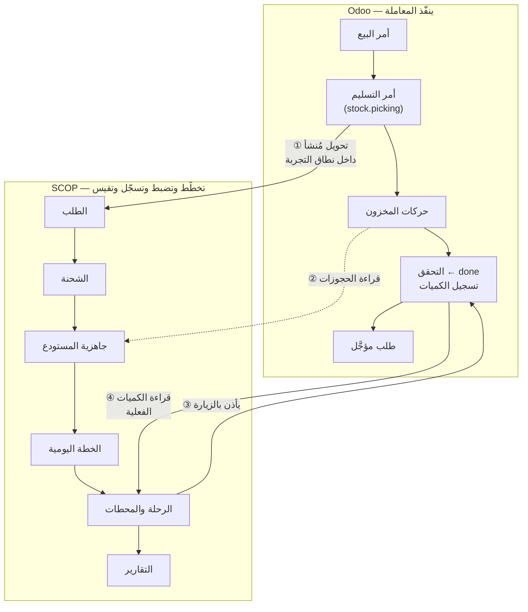

import DocumentInfo from '@site/src/components/DocumentInfo';

# SCOP و Odoo

<DocumentInfo
  category="دليل المستخدم"
  audience={['عمليات', 'مستودعات', 'تخطيط', 'إدارة', 'اختبار قبول المستخدم']}
  status="Draft"
  version="1.0"
  owner="فريق المنتج"
  updated="أغسطس 2026"
  readingTime="7 دقائق"
/>

:::info[هذه هي الصفحة المرجعية لقسمة الصلاحية]

كل فصل آخر يحيل إلى هنا بدل إعادة الشرح. وإن قرأت صفحة واحدة من هذا الدليل قبل بدء العمل، فلتكن هذه.

:::

## القسمة في جملة واحدة

**Odoo ينفّذ المعاملة. و SCOP تخطّط العملية المحيطة بها وتضبطها وتسجّلها وتقيسها.**

ولا أحد النظامين «مسؤول» عن الآخر. فكلٌّ يملك حقائق مختلفة، وكلٌّ مرجعٌ فيما يملك.

| الحقيقة | يملكها | علاقة SCOP بها |
| --- | --- | --- |
| أمر بيع العميل | Odoo | تقرأ رقمه ولا تعدّله |
| أمر التسليم وحجوزاته | Odoo | تقرأها لتحسب الجاهزية |
| المخزون المتاح والدفعات وتواريخ الصلاحية | Odoo | تقرأها |
| **الكمية المسلَّمة** | **Odoo** | **تقرأها. ولا تكتبها أبداً** |
| الطلبات المؤجَّلة (Backorders) | Odoo | تعدّها تلبية أخرى للطلب نفسه |
| المركبات والسائقون | Odoo (Fleet وEmployees) | توسّعها بالسعة والتوافر والمؤهلات |
| ما يجب أن يتحرك، ككائن قابل للتخطيط | **SCOP** | تملكه — الطلب (Demand) |
| هل يمكن أن يتحرك ولماذا | **SCOP** | تملكها — جاهزية المستودع |
| ما ينبغي أن يكون عليه يوم التشغيل | **SCOP** | تملكها — الخطة اليومية |
| من الذي أذِن بذلك | **SCOP** | تملكه — الاعتماد والحوكمة |
| ما حدث فعلاً وبأي جودة | **SCOP** | تملكها — أحداث التنفيذ والتقارير |

## أين يلتقي النظامان

هناك أربع نقاط تماس بالضبط. وما عداها فهو في نظام أو الآخر.



### ① يُنشئ Odoo تحويلاً، فتُنشئ SCOP طلباً

حين يُنشئ Odoo تحويلاً **نوع عمليته داخل نطاق التجربة**، تلاحظ SCOP ذلك وتُنشئ سجلها الخاص لما يجب أن يتحرك.

ولا أحد يكتب الطلب. راجع [كيف تُنشأ الطلبات](../demand/how-demands-are-created.mdx).

ويجب تحقق ثلاثة شروط، وإلا لم يظهر أي طلب:

| الشرط | إن لم يتحقق |
| --- | --- |
| نوع العملية مُفعَّل في [نطاق التجربة](../configuration/pilot-scope.mdx) | لا طلب، بلا ضجيج — وهذا هو الفلتر المقصود |
| التحويل أُنشئ **بعد** لحظة انطلاق التجربة | لا طلب. ولا يوجد استرجاع تاريخي عمداً |
| كلا طرفَي الحركة يُحلّان إلى [عقدة تخطيط](../configuration/planning-nodes.mdx) | لا طلب، لكن يُسجَّل حدث `DemandGenerationSkipped` |

:::note[توليد الطلب لا يمكن أن يعطّل عامل المستودع أبداً]

إذا فشل توليد الطلب لأي سبب، يُتراجع عن الفشل وحده ويُسجَّل كحدث قابل للاستعلام. **ويُحفظ التحويل على أي حال.** فلا يجوز أن يعجز عامل مستودع عن تسجيل حركة لأن إسقاطاً تخطيطياً فيه خلل.

والإخفاقات ظاهرة في `SCOP → Reporting → Failed Projections`.

:::

### ② تقرأ SCOP حجوزات Odoo لتحسب الجاهزية

جاهزية المستودع **محسوبة من الأدلة**، والدليل هو حالة الحجز والانتقاء في Odoo نفسه. ولا أحد يكتب قيمة جاهزية.

راجع [جاهزية المستودع](../readiness/warehouse-readiness.mdx).

### ③ الرحلة تأذن بالزيارة الفعلية

الخطة المعتمدة تقول أي مركبة تذهب إلى أين، وبأي ترتيب، وبأي حمولة. وهذا قرار SCOP، ولا رأي لـ Odoo فيه.

### ④ تحويل Odoo بعد التحقق منه هو مصدر الكمية الفعلية

هذه نقطة التماس التي تفاجئ الناس أكثر من غيرها، ولذلك تُذكر صراحةً:

:::warning[لا يوجد في SCOP حقل كمية ثانٍ]

**لا يوجد في SCOP أي موضع يكتب فيه مستخدم مقدار ما سُلِّم.** لا السائق ولا المخطِّط ولا مدير العمليات.

فالكميات الفعلية تأتي من **تحويل Odoo بعد التحقق منه**، وتقرأها SCOP وتنقلها إلى المحطة والطلب.

:::

والسبب ليس أسلوبياً. فلو حملت SCOP كميتها الخاصة، لما استطاع أحد عند اختلافهما أن يقول أيهما الصحيح — ولحُسِب المخزون والفوترة و OTIF كلها من رقم لم يُطابقه أحد. رقم واحد، ومالك واحد.

ومسار العمل الكامل موثَّق في [التحقق من التسليم في Odoo](../execution/odoo-delivery-validation.mdx).

## ماذا يعني ذلك عملياً

### التسليم الناقص يُسجَّل في Odoo

يُبلِّغ السائق بما حدث. و**يتحقق المستودع من تحويل Odoo بالكمية التي تحركت فعلاً**، فيُنشئ Odoo طلباً مؤجَّلاً للباقي.

ثم تقرأ SCOP ذلك: تصبح نتيجة المحطة **Partially Completed**، ويصبح الطلب **Partially Completed**، ويُفهم الطلب المؤجَّل على أنه تلبية أخرى **للطلب نفسه** — لا طلباً جديداً.

راجع [التسليم الجزئي والطلبات المؤجَّلة](../execution/partial-deliveries-and-backorders.mdx).

### الطلب ليس هو التحويل

لا يوجد ربط واحد-لواحد بين الطلب والتحويل، وهذا مقصود.

```text
التحويل الواحد  → قد يحمل عدة طلبات
الطلب الواحد    → قد تُلبّيه عدة تحويلات (الأصلي وطلباته المؤجَّلة)
```

والرابط المرجعي على مستوى **الحركة**، ولذلك يرتبط الطلب المؤجَّل بالطلب الذي جاء منه دون أن يعيد أحد إدخال شيء.

### شاشة SCOP لا تحتاج صلاحيات على أمر المصدر

يلتقط الطلب **رقم مستند المصدر** عند توليده. فيقرأ المخطِّط `S09520` على نموذج الطلب دون أن يملك أي صلاحية مبيعات، ولا يكتسب أياً منها بقراءته.

ويرى مسؤول النظام إضافةً إلى ذلك **رابط مستند المصدر** التقني، الذي يفتح السجل الهدف ويتطلب بالتالي صلاحيات عليه.

### SCOP ترفض ما لا تستطيع تبريره

حيث تمنع قاعدة عمل إجراءً، تذكر SCOP السجل والسبب بدل أن تفشل بصمت. وهذه ميزة لا عقبة — راجع [نموذج الحوكمة](../concepts/the-governance-model.mdx).

## أي صلاحيات Odoo لا تمنحها SCOP

SCOP تمنح صلاحيات SCOP. وحيث يؤدي دور ما عملَ Odoo نفسه، فهو يحتاج مجموعات Odoo نفسها. وهذا ما يقع فيه كل تنصيب جديد مرة واحدة على الأقل.

| الدور | يحتاج أيضاً | لأن |
| --- | --- | --- |
| المخطِّط / المُوزِّع | **Fleet → Administrator** | معالج التخطيط يقرأ كل المركبات. و Fleet → *Officer* لا يكفي: فهو يحمل قاعدة سجلات تحصر المستخدم في المركبات التي يقودها بنفسه |
| المخطِّط / المُوزِّع | **Employees → Officer** | إسناد سائق إلى رحلة يقرأ سجل الموظفين |
| المخطِّط / المُوزِّع | **Inventory → User** | حل الملكية وتأهيل الطلب يُحدِّثان التخصيص مقابل حجوزات Odoo |
| من يتحقق من التحويلات | **Inventory → User** | هذا عمل Odoo نفسه |
| الجميع | **لا صلاحية مبيعات في أي مرحلة** | رقم أمر المصدر مُلتقَط على الطلب |

ومجرد *قراءة* شاشة SCOP لا يتطلب شيئاً من هذه. والجدول الكامل في [مرجع الصلاحيات](../roles/permissions-reference.mdx).

## صفحات ذات صلة

- [التحقق من التسليم في Odoo](../execution/odoo-delivery-validation.mdx) — مسار الكميات كاملاً
- [كيف تُنشأ الطلبات](../demand/how-demands-are-created.mdx)
- [نطاق التجربة](../configuration/pilot-scope.mdx)
- [تشخيص العقدة المفقودة](../configuration/missing-node-diagnostics.mdx)
- [مرجع الصلاحيات](../roles/permissions-reference.mdx)
- [نطاق الإصدار الأول](./release-1-scope.mdx)
