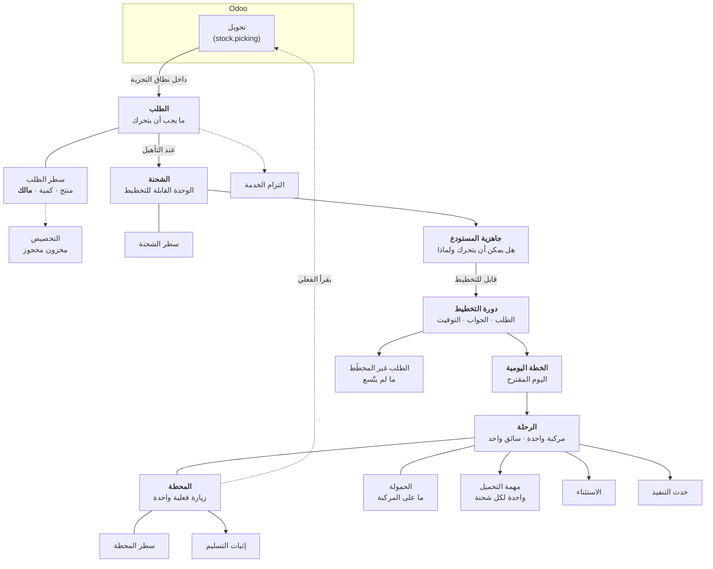

import DocumentInfo from '@site/src/components/DocumentInfo';

# نموذج الكائنات

<DocumentInfo
  category="دليل المستخدم"
  audience={['عمليات', 'مستودعات', 'تخطيط', 'إدارة', 'اختبار قبول المستخدم']}
  status="Draft"
  version="1.0"
  owner="فريق المنتج"
  updated="أغسطس 2026"
  readingTime="9 دقائق"
/>

## الخريطة

كل ما تفعله SCOP هو أحد هذه الكائنات يغيّر حالته. وهذا المخطط شكل المنصة كلها؛ وبقية الدليل تفصيل لصندوق واحد في كل مرة.

## كائنات التشغيل

### الطلب (Demand) — *ما يجب أن يتحرك*

| | |
| --- | --- |
| **يمثّل** | متطلب عمل واحداً لنقل بضائع، مستقلاً عن الأوراق خلفه |
| **من يعمل عليه** | المخطِّط أساساً؛ وخدمة العملاء تقرؤه |
| **من أين يأتي** | يُنشأ **تلقائياً** حين يُنشئ Odoo تحويلاً داخل النطاق |
| **دورة الحياة** | 12 حالة، Draft ← Completed، إضافةً إلى Rejected وCancelled وFailed |
| **يرتبط بـ** | له سطور؛ ويُكوِّن شحنة؛ ويحمل التزام خدمة |

والطلب عمداً **ليس** الكائن نفسه الذي هو التحويل. فقد يحمل تحويل واحد عدة طلبات، وقد تُلبّي عدة تحويلات طلباً واحداً — الأصلي وطلباته المؤجَّلة. فالطلب المؤجَّل *تلبية أخرى للطلب نفسه*، لا طلب جديد.

→ [إدارة الطلب](../demand/demand-management.mdx)

### سطر الطلب — *منتج واحد، مالك واحد*

| | |
| --- | --- |
| **يمثّل** | منتجاً وكمية داخل طلب |
| **يحمل** | الكمية المطلوبة والمُلبّاة والمتبقية، و**مالك** البضائع |
| **لماذا يهم** | الملكية تُحَل لكل سطر لا لكل طلب |

→ [ملكية المخزون](../ownership/inventory-ownership.mdx)

### التخصيص — *المخزون المحجوز لسطر*

| | |
| --- | --- |
| **يمثّل** | أي مخزون بعينه — موقعاً ودفعة ومالكاً — خُصِّص لسطر طلب |
| **من أين يأتي** | يُحدَّث مقابل حجوزات Odoo عند التحقق من الطلب أو تأهيله |

→ [أهلية التخطيط](../demand/planning-eligibility.mdx)

### الشحنة — *الوحدة القابلة للتخطيط*

| | |
| --- | --- |
| **تمثّل** | متطلب نقل — طلباً أو أكثر متوافقة تتحرك معاً |
| **من يعمل عليها** | المخطِّط والمستودع |
| **من أين تأتي** | تتكوّن **تلقائياً** حين يبلغ الطلب **Eligible for Planning** |
| **دورة الحياة** | Created ← Ready ← Planned ← In Execution ← Completed، وCancelled |

**والطلب الواحد لا يعني دائماً شحنة واحدة.** فالمتطلب الثاني على المسار نفسه والتاريخ المطلوب نفسه ينضم إلى الشحنة المفتوحة.

→ [التكوين والتجميع](../shipments/formation-and-consolidation.mdx)

### جاهزية المستودع — *هل يمكن أن يتحرك ولماذا*

| | |
| --- | --- |
| **تمثّل** | هل تستطيع الشحنة التحرك فعلياً، مع التعليل بالكلمات |
| **من يعمل عليها** | المستودع |
| **من أين تأتي** | **محسوبة من الأدلة** — حجوزات Odoo والتجهيز والملكية |
| **الحالات** | Ready · Conditionally Ready · Partially Ready · Not Ready · Blocked |
| **ملاحظة** | ليست دورة حياة محكومة. بل قيمة محسوبة قد تصعد **وتنزل** |

→ [جاهزية المستودع](../readiness/warehouse-readiness.mdx)

### دورة التخطيط — *محاولة واحدة، محفوظة*

| | |
| --- | --- |
| **تمثّل** | طلباً واحداً إلى مزوّد قرار، وجوابه، والمدة التي استغرقها |
| **من أين تأتي** | معالج **Generate a Plan** |
| **دورة الحياة** | Requested ← Evaluating ← Recommended ← Reviewed ← Closed، وFailed وCancelled |
| **لماذا توجد** | كي يُعاد فحص قرار اتُّخذ قبل أسابيع بالمدخلات التي كانت لديه فعلاً |

→ [دورات التخطيط](../planning/planning-runs.mdx)

### الخطة اليومية — *يوم التشغيل المقترح*

| | |
| --- | --- |
| **تمثّل** | مجموعة الرحلات الموصى بها لتاريخ واحد |
| **من يعمل عليها** | المخطِّط يقترح؛ و**مدير العمليات يعتمد** |
| **من أين تأتي** | تنتجها دورة تخطيط |
| **دورة الحياة** | Generated ← Under Review ← Approved ← Released، وModified وRejected |
| **تحكمها** | `BR-PLN-001` فصل المهام، و`BR-PLN-002` منع إطلاق رحلة محجوبة |

→ [الخطة اليومية](../planning/the-daily-plan.mdx)

### الرحلة — *مركبة وسائق وسلسلة محطات*

| | |
| --- | --- |
| **تمثّل** | مركبة وسائقاً ينفّذان مساراً |
| **من يعمل عليها** | المخطِّط يخطّطها؛ والمستودع يحمّلها؛ و**السائق ينفّذها** |
| **دورة الحياة** | 13 حالة، Draft ← Completed / Partially Completed، وException وCancelled |
| **تحكمها** | `BR-RTE-001` جدوى السعة عند كل نقطة، و`BR-RTE-002` تحذير الاستغلال |

→ [الرحلات](../execution/trips.mdx)

### المحطة — *زيارة فعلية واحدة*

| | |
| --- | --- |
| **تمثّل** | وصولاً واحداً وفترة خدمة واحدة ومغادرة واحدة، عند عقدة واحدة |
| **من يعمل عليها** | السائق |
| **دورة الحياة** | Planned ← Arrived ← Servicing ← Completed، وFailed وSkipped |
| **النتيجة** | تصنيف منفصل: Completed · Partially Completed · Failed · Skipped · Rescheduled |

والمحطة **زيارة فعلية**، لا عميل. فأمران للعميل نفسه في فرعين مختلفين أو تاريخين مختلفين أو نافذتين مختلفتين محطتان.

→ [الزيارة الفعلية](../shipments/the-physical-visit.mdx)

### سطر المحطة — *ما سُلِّم هنا*

| | |
| --- | --- |
| **يمثّل** | منتجاً واحداً عند محطة، بكميته المخطَّطة و**الفعلية** |
| **الكمية الفعلية تأتي من** | **تحويل Odoo بعد التحقق منه**. لا تُكتب أبداً |
| **يُتتبَّع إلى** | **سطر الشحنة**، ومنه إلى الطلب |

→ [التحقق من التسليم في Odoo](../execution/odoo-delivery-validation.mdx)

### الحمولة — *ما على المركبة فعلياً*

| | |
| --- | --- |
| **تمثّل** | الشحنة الفعلية على المتن، متتبَّعة من الاقتراح إلى الإغلاق |
| **دورة الحياة** | Proposed ← Confirmed ← Staged ← Loaded ← In Transit ← Unloaded ← Closed، وCancelled |
| **ملاحظة** | تتحرك أساساً من تلقاء نفسها، مدفوعةً بأحداث الرحلة والتحميل |

→ [عمليات التحميل](../execution/loading-operations.mdx)

### مهمة التحميل — *عمل المستودع لتحميل شحنة واحدة*

| | |
| --- | --- |
| **تمثّل** | مهمة وضع شحنة واحدة على مركبة واحدة |
| **من أين تأتي** | تُنشأ **واحدة لكل شحنة** عند إطلاق الرحلة |
| **الحالة** | Pending ← In Progress ← Done، وCancelled |
| **الأثر** | المهمة المفتوحة تحتجز المركبة عند البوابة |

→ [عمليات التحميل](../execution/loading-operations.mdx)

### الاستثناء — *مشكلة تشغيلية مُسجَّلة*

| | |
| --- | --- |
| **يمثّل** | مشكلة تحتاج من يملكها ويعالجها |
| **من يعمل عليه** | مدير العمليات يملك الطابور |
| **دورة الحياة** | 10 حالات، Detected ← Closed، وEscalated وCancelled |
| **يحمل** | فئة وشدّة وموعداً نهائياً ومالكاً وإجراءات معالجة |

→ [إدارة الاستثناءات](../exceptions/exception-management.mdx)

### التزام الخدمة — *ما وعدنا به*

| | |
| --- | --- |
| **يمثّل** | الوعد المقطوع للعميل — تاريخاً أو نافذة |
| **يُلتقط** | **مرة واحدة**، عند توليد الطلب |
| **يستخدمه** | [OTIF](../reporting/otif.mdx)، والتخطيط كقيد |
| **إن غاب** | لا يُحسب التسليم متأخراً. بل لا يُحسب أصلاً |

→ [التزامات الخدمة](../configuration/service-commitments.mdx)

### إثبات التسليم — *الدليل عند الباب*

| | |
| --- | --- |
| **يمثّل** | التوقيع والاسم والصور والإحداثيات لحظة التسليم |
| **يلتقطه** | السائق |
| **ملاحظة** | يُلتقط الموقع **مرة واحدة** عند المحطة. وهذا ليس تتبّعاً للمركبة |

→ [إثبات التسليم](../execution/proof-of-delivery.mdx)

## كائنات الإعدادات

| الكائن | يمثّل | الفصل |
| --- | --- | --- |
| **عقدة التخطيط** | مكاناً فعلياً تستطيع SCOP التوجّه إليه، بإحداثيات ومنطقة زمنية وساعات عمل | [عقد التخطيط](../configuration/planning-nodes.mdx) |
| **مصفوفة السفر** | المسافة والمدة المخزَّنتين بين عقدتين | [عقد التخطيط](../configuration/planning-nodes.mdx) |
| **المسار** | تسلسلاً مُسمّى ومتكرراً من العقد | [المسارات وأنشطة المحطات](../configuration/routes-and-stop-activities.mdx) |
| **نشاط المحطة** | نوع العمل في المحطة | [المسارات وأنشطة المحطات](../configuration/routes-and-stop-activities.mdx) |
| **ملف السعة** | الأبعاد التي تُقاس بها المركبة | [الكتالوجات](../configuration/catalogues.mdx) |
| **إسناد المورد** | مركبة أو سائقاً محجوزاً لرحلة — مرشَّحاً أو محجوزاً أو مُلتزَماً به | [الأسطول والمركبات](../configuration/fleet-and-vehicles.mdx) |
| **نطاق التجربة** | أي أنواع عمليات تتفاعل معها SCOP، ومن متى | [نطاق التجربة](../configuration/pilot-scope.mdx) |

## كائنات الحوكمة

| الكائن | يمثّل | الفصل |
| --- | --- | --- |
| **قاعدة العمل** | سياسة واحدة معتمدة ومُصدَّرة | [قواعد العمل](../reference/business-rules.mdx) |
| **تقييم القاعدة** | فحصاً واحداً أُجري، وجوابه | [نموذج الحوكمة](./the-governance-model.mdx) |
| **إعفاء القاعدة** | تنازلاً مُصرَّحاً به ومحدَّد المدة | [نموذج الحوكمة](./the-governance-model.mdx) |
| **صلاحية الاعتماد** | من يجوز له أي إجراء على أي كائن | [نموذج الحوكمة](./the-governance-model.mdx) |
| **رمز السبب** | تفسيراً مضبوطاً | [رموز الأسباب](../reference/reason-codes.mdx) |
| **ملف الأهداف** | ما يُحسِّن التخطيط تجاهه، بترتيب الرتبة | [نظرة عامة على التخطيط](../planning/planning-overview.mdx) |

## كائنات التتبّع

| الكائن | يمثّل | الفصل |
| --- | --- | --- |
| **حدث المجال** | حقيقة عمّا فعلته SCOP أو امتنعت عنه | [الهوية والتتبّع](./identity-and-traceability.mdx) |
| **حدث التنفيذ** | حقيقة عمّا حدث فعلياً أثناء الرحلة | [الهوية والتتبّع](./identity-and-traceability.mdx) |
| **مرجع الارتباط** | المعرِّف المشترك بين كل ما جرى في عملية واحدة | [الهوية والتتبّع](./identity-and-traceability.mdx) |

## صفحات ذات صلة

- [الهوية والتتبّع](./identity-and-traceability.mdx)
- [نموذج الحوكمة](./the-governance-model.mdx)
- [مرجع دورات الحياة](../reference/lifecycle-reference.mdx)
- [المصطلحات](../about/terminology.mdx)
