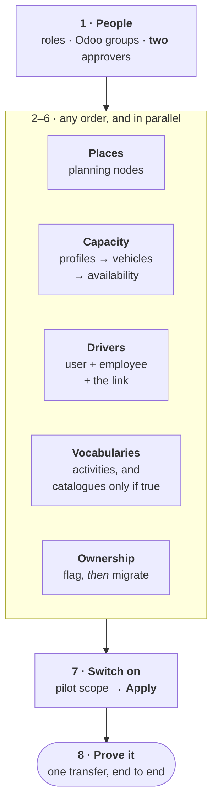

import DocumentInfo from '@site/src/components/DocumentInfo';

# بناء البيانات الأساس

<DocumentInfo
  category="دليل المستخدم"
  audience={['عمليات', 'تخطيط', 'إدارة', 'اختبار قبول المستخدم']}
  status="Draft"
  version="1.0"
  owner="فريق المنتج"
  updated="أغسطس 2026"
  readingTime="9 دقائق"
/>

:::info[هذه الصفحة هي الترتيب. وبقية الفصل هي التفصيل]

كل صفحة أخرى في هذا الفصل تصف **كائناً واحداً**. ولا واحدة منها تقول لك ما الذي يجب أن يوجد قبل ماذا — والاعتماديات ليست محلية، فالترتيب لا يمكن تخمينه من الصفحات المنفردة.

اقرأ هذه مرةً قبل أن تضبط أي شيء، ثم استخدم الصفحات الأخرى مرجعاً.

:::

**الأدوار**
مسؤول النظام يبني معظمها. والمخطِّط يصون الإتاحة. والإدارة تُجري البوابة الأخيرة.

## لماذا يهم الترتيب

ثلاث من الخطوات أدناه تكون خاطئةً إن نُفِّذت بترتيب خاطئ، واثنتان منها تُخفقان **في صمت** — فلا خطأ يظهر، بل لا نتيجة:

| تنفيذ هذا أولاً | يُنتج |
| --- | --- |
| ترحيل الملكية قبل وسم شركاء الأمانة | المالك الخطأ، مطبَّقاً على نطاق واسع، وبلا ما يخبرك |
| تطبيق نطاق التجربة قبل وجود العقد | كومةً من التحويلات المتخطّاة تعود لإعادة حفظها |
| توليد خطة قبل تسجيل إتاحة المركبات | خطةً مبنيةً حول مركبة في الورشة |

## ترتيب البناء



والخطوات من 2 إلى 6 مستقلة بعضها عن بعض ويمكن تنفيذها بالتوازي بأشخاص مختلفين. **أما الخطوة 1 فتأتي أولاً والخطوة 7 تأتي أخيراً** — وهاتان هما اللتان عليهما قيد ترتيب حقيقي.

---

## 1 · الأشخاص والصلاحيات

**الدور** مسؤول النظام · **أين** إعدادات Odoo ← المستخدمون

| # | افعل | لماذا |
| --- | --- | --- |
| 1 | امنح كل شخص دور SCOP **واحداً** بالضبط | الأدوار سُلَّم لا قائمة اختيار |
| 2 | امنح المخطِّط مجموعات Odoo الثلاث التي يحتاجها | التخطيط يقرأ أسطول Odoo وموظفيه وحجوزاته |
| 3 | أكّد أن **شخصين** يستطيعان اعتماد الخطط | `BR-PLN-001` يرفض مؤلف الخطة نفسه |

ومجموعات Odoo الثلاث للمخطِّط، وهي معتمَدة ويجب ألّا تُضيَّق:

| المجموعة | بدونها |
| --- | --- |
| **Fleet → Administrator** | `Access Error` على `Vehicle` عند توليد خطة |
| **Employees → Officer** | حقل **Driver** لا ينتهي من التحميل أبداً |
| **Inventory → User** | **Validate** يُخفق — فاشتقاق الملكية يقرأ حجوزات Odoo |

:::danger[المتطلب الذي يوقف التجربة الفردية]

`BR-PLN-001` يرفض اعتماد من أنشأ الخطة — **ومنهم مسؤول النظام**، وهو يحمل كل مجموعة. ففصل المهام ليس صلاحيةً تستطيع منحها لنفسك.

والتجربة بمدير عمليات واحد يبني الخطط كذلك **لا تستطيع إكمال دورة واحدة**. رتّب المعتمِد الثاني الآن لا يوم التنفيذ.

:::

**البوابة** — سجّل الدخول بصفة المخطِّط وافتح `SCOP → Planning → Generate a Plan`. فإن كانت قائمة المركبات ممتلئة وحقل Driver يُحمَّل، فالخطوة 1 تمّت.

→ [مرجع الصلاحيات](../roles/permissions-reference.mdx) · [حوكمة الخطة](../planning/plan-governance.mdx)

---

## 2 · الأماكن — عُقَد التخطيط

**الدور** مسؤول النظام · **أين** `SCOP → Master Data → Locations`

هذه هي الخطوة التي تجعل الطلب ممكناً أصلاً. فالتحويل الذي يُحَل منشؤه **أو** وجهته إلى لا عقدة يُنتج **لا طلب**.

وكل عقدة تحتاج السبعة كلها:

| # | الحقل | بدونه |
| --- | --- | --- |
| 1 | **Name** و**Location Type** | لا يمكن حفظها |
| 2 | رابط **الشريك** أو **المستودع** أو **موقع المخزون** | لا تُحَل التحويلات إليها أبداً |
| 3 | **Latitude** و**Longitude** | لا معنى للمسارات |
| 4 | **Timezone** | كل نافذة تُفسَّر بساعات خاطئة |
| 5 | **نافذة فتح** واحدة على الأقل | لا يمكن جدولة شيء هنا أبداً |
| 6 | **مدة الخدمة** | توقيت المسار خاطئ |
| 7 | أي **قيود وصول** | سترسَل مركبات لا تستطيع خدمتها |

:::warning[العقدة الناقصة تُخفق على نحو مختلف عن المفقودة]

العقدة **المفقودة** لا تُنتج طلباً، وتسجّل حدث `DemandGenerationSkipped` يسمّي بالضبط ما يجب ربطه.

أما **الناقصة** فتتيح إنشاء الطلب ثم تجعله **غير قابل للتخطيط** — فيعود بـ*Missing required data* أو *Customer location unavailable*. وتلك بلا حدث تجده، فهي الخطأ الأغلى.

أكمِل السبعة كلها قبل المضيّ.

:::

وللتجربة بفروع عملاء كثيرة، `Master Data → Import Locations` أسرع من إنشاء كلٍّ يدوياً.

**البوابة** — `Is Geocoded` صحيح على كل عقدة، ولكل عقدة نافذة واحدة على الأقل.

→ [عُقَد التخطيط](./planning-nodes.mdx) · [تشخيص العقدة المفقودة](./missing-node-diagnostics.mdx)

---

## 3 · السعة، ثم المركبات، ثم الإتاحة

**الأدوار** مسؤول النظام يبني، والمخطِّط يصون الإتاحة

بهذا الترتيب، لأن كلاً يعتمد على ما قبله:

| # | ابنِ | أين |
| --- | --- | --- |
| 1 | **ملفات السعة** — الأبعاد وحدودها | `Master Data → Capacity Profiles` |
| 2 | اربط واحداً بـ**كل مركبة**، مع الموقع الأصلي ومتوسط السرعة وقدرات المناولة ومعدلات التكلفة | Odoo Fleet ← حقول SCOP على المركبة |
| 3 | سجّل **الإتاحة** — المناوبات والصيانة والحجوب | `Master Data → Vehicle Availability` |

:::danger[المركبة بلا ملف سعة غير مرئية للتخطيط]

يُرشِّح مزوّد التخطيط على المركبات التي **تعلن ملف سعة**. والمركبة بلا ملف لا يُنظَر فيها ثم تُرفض — بل لا يُنظَر فيها إطلاقاً.

فإن عاد *كل* طلب في التشغيلة بـ**No feasible vehicle**، فالجواب نادراً جداً أن الأسطول صغير. بل هو هذا.

:::

:::note[سجّل الصيانة قبل التخطيط لا بعده]

المركبة المحجوزة للورشة الثلاثاء القادم يجب أن تُسجَّل غير متاحة **قبل** توليد خطة الثلاثاء. فلا سبيل آخر للتخطيط إلى معرفة ذلك، والخطة المبنية حول مركبة غائبة لا بد أن تُعاد.

:::

**البوابة** — **Planning Ready** صحيح على كل مركبة تنوي استخدامها.

→ [الأسطول والمركبات](./fleet-and-vehicles.mdx) · [الفهارس](./catalogues.mdx)

---

## 4 · السائقون — ثلاثة سجلات لا واحد

**الدور** مسؤول النظام · **أين** Odoo Employees، ثم `SCOP → Master Data → Driver …`

السائق ثلاثة أشياء مترابطة، ولا بد من وجودها جميعاً:

```text
Odoo User          ← كيف يسجّل الدخول، حاملاً دور Driver ولا شيء غيره
    ↕ مربوط
Odoo Employee      ← بعلامة "Is Driver"
    ↕ مخصَّص
SCOP Trip          ← العمل
```

:::danger[ربط الموظف بالمستخدم هو ما يفوت الناس]

قواعدُ السجلات التي تمنح السائق رحلاته تطابق على **حساب المستخدم المربوط بالموظف**، لا على سجل الموظف وحده.

فالموظف الموسوم سائقاً و**غير المربوط بمستخدم** يمكن أن تُخصَّص له رحلة **لن يراها أحد أبداً**. ولا شيء يرفض ذلك. والعَرَض يظهر بعد أيام، حين يبلّغ سائق أن **My Trips** فارغة.

:::

ثم سجّل المؤهلات والمناوبات، واضبط الموقع الأصلي وحدّ القيادة اليومي.

:::warning[لا تُضِف SCOP User إلى سائق أبداً]

`SCOP User` يمنح قراءةً عبر العملية كلها. وتظل قواعد السجلات تضيّق رحلات السائق، لكن كل ما عداها ينفتح — ويُنقَض نموذج أمن السائق في صمت.

:::

**البوابة** — سجّل الدخول بصفة السائق وأكّد ظهور **My Work**. فهذا الفحص المفرد يغطي السجلات الثلاثة معاً.

→ [السائقون](./drivers.mdx) · [نموذج أمن السائق](../execution/driver-security-model.mdx)

---

## 5 · المفردات — لا تبنِ إلا ما هو صحيح

**الدور** مسؤول النظام

| الفهرس | ابنِه حين | مطلوب؟ |
| --- | --- | --- |
| **Stop Activities** | دائماً — Delivery وPickup، وربما Collection | **نعم** |
| **Capacity Profiles** | دائماً — مُغطّى في الخطوة 3 | **نعم** |
| **Handling Profiles** | تختلف البضائع فعلاً في كيفية حملها | عندئذٍ فقط |
| **Compatibility Groups** | بعض البضائع فعلاً لا يجوز أن تسافر معاً | عندئذٍ فقط |
| **Shelf-Life Profiles** | مدة الصلاحية تهمّ تشغيلياً | عندئذٍ فقط |
| **Routes** | الجولة تتكرر فعلاً | عندئذٍ فقط |

:::warning[الفهرس الفارغ ليس ثغرة]

أربعة من هذه اختيارية. وملؤها «طلباً للاكتمال» يضيف قيوداً يجب أن يستوفيها التخطيط، و**كل قيد لا لزوم له طلبٌ يعود غير مخطَّط**.

والأمر نفسه في أنشطة المحطات: فكل نشاط متمايز سببٌ في أن يصير متطلبان عند عنوان واحد زيارتين. لا تُنشئ *Delivery — Morning* و*Delivery — Afternoon*؛ فتعهُّد الخدمة يعبّر عن ذلك الفرق تعبيراً صحيحاً بالفعل.

:::

**البوابة** — رموز الأسباب وقواعد العمل وفئات الاستثناءات وملف الأهداف تُشحَن مضبوطة. فأنت لا تبنيها. أكّد وجودها بدل إنشائها.

→ [الفهارس](./catalogues.mdx) · [المسارات وأنشطة المحطات](./routes-and-stop-activities.mdx)

---

## 6 · الملكية — سِم أولاً، ثم رحّل

**الدور** مسؤول النظام · **أين** `SCOP → Master Data → Onboarding`

**والترتيب هنا ليس اختيارياً:**

| # | الخطوة | المعالج |
| --- | --- | --- |
| 1 | سِم الشركاء الذين تحتفظ بمخزونهم ولا تملكه | **1 · Consignment Partners** |
| 2 | رحّل الملكية إلى المخزون القائم | **2 · Inventory Ownership** |

:::danger[تنفيذ الخطوة 2 أولاً يعطي الجواب الخطأ على نطاق واسع]

علامة الأمانة هي ما يمنع SCOP من تطبيق افتراض الشركة المحكوم على بضائع تخصّ غيرها. فالترحيل قبل الوسم يُسنِد إلى الشركة ملكية مخزون لا تملكه — عبر كل سطر متأثر دفعةً واحدة، وبلا ما يخبرك.

:::

:::warning[الوسم ليس بأثر رجعي]

فالملكية المحلولة سلفاً على طلبات قائمة لا يُعاد كتابتها. سِم الشركاء، ثم أعِد اشتقاق الطلبات المتأثرة بـ**Resolve Ownership**.

:::

**البوابة** — `Reporting → Ownership Data Quality`، مُجمَّعاً بالحلّ. فمعظمه محلول يعني أنه نجح. وتركّز غير المحلول على شريك واحد يعني في أغلب الأحيان أن ذلك الشريك كان يحتاج العلامة.

→ [التهيئة والترحيل](./onboarding-and-migration.mdx) · [ملكية المخزون](../ownership/inventory-ownership.mdx)

---

## 7 · شغّلها — أخيراً لا أولاً

**الدور** مسؤول النظام · **أين** `SCOP → Technical → Pilot Scope`

| # | افعل |
| --- | --- |
| 1 | اضبط المستودع |
| 2 | أضِف أنواع العمليات التي ينبغي أن تُولّد طلباً |
| 3 | اضبط لحظة **الإطلاق** |
| 4 | اضغط **Apply** |

:::warning[سجل النطاق في Draft لا يفعل شيئاً إطلاقاً]

ضبط أنواع العمليات لا يكفي. فـ**Apply** هو ما يُشغِّل SCOP.

والتجربة التي «أُعدَّت ولم يحدث شيء» غالباً ما تكون سجل نطاق ما زال قابعاً في **Draft**.

:::

:::note[لا يوجد ملء رجعي للتاريخ، عن قصد]

فالتحويلات المُنشأة قبل الإطلاق لا تُنتج شيئاً، عمداً. توقّع أن تكون [OTIF](../reporting/otif.mdx) و[تغطية الخطة](../reporting/plan-coverage.mdx) بلا معنى في الدورة الأولى وصادقتين من الثانية.

:::

**البوابة** — الحالة **Applied**، وأنواع العمليات التي تقصدها مُدرَجة.

→ [نطاق التجربة](./pilot-scope.mdx)

---

## 8 · أثبِتها بتحويل واحد

الضبط لا ينتهي حين توجد السجلات. بل ينتهي حين يقطع متطلبٌ واحد الطريق كله.

| # | الخطوة | توقّع |
| --- | --- | --- |
| 1 | أنشئ تسليماً واحداً في Odoo | يظهر طلب في `Operations → Demands` |
| 2 | **Validate** | لا رفض من `BR-INV-002` |
| 3 | **Mark Eligible** | تتكوّن شحنة |
| 4 | جهّزها | الجاهزية **Ready** |
| 5 | ولِّد خطة | رحلة واحدة، ممكنة سعوياً |
| 6 | **شخصٌ ثانٍ** يعتمد ويُطلق | توجد مهام تحميل |
| 7 | حمّل وغادِر وصِل | السائق يرى العمل |
| 8 | تحقّق من التحويل في Odoo | SCOP تقرأ الكميات |
| 9 | أغلِق المحطة | يبلغ الطلب **Completed** |

**البوابة** — انسخ **Correlation Reference** للطلب إلى [الخط الزمني للعملية](../reporting/operation-timeline.mdx). كل خطوة، بالترتيب، بمن فعلها. وذلك أفضل دليل مفرد على سلامة البيانات الأساس.

→ [تسليم كامل قياسي](../scenarios/standard-full-delivery.mdx)

---

## الحد الأدنى الصالح للعمل

أصغر بيانات أساس تتيح إكمال دورة واحدة:

| الكائن | الحد الأدنى |
| --- | --- |
| أدوار SCOP مخصَّصة | دور لكل شخص، و**اثنان** قادران على الاعتماد |
| مجموعات Odoo للمخطِّط | الثلاث كلها |
| عُقَد التخطيط | **اثنتان** — مستودع ووجهة — كلتاهما مكتملة |
| ملفات السعة | **واحد** |
| مركبات تحمل ذلك الملف | **واحدة**، متاحة في اليوم |
| السائقون | **واحد**، برابط الموظف بالمستخدم |
| أنشطة المحطات | **Delivery**، و**Pickup** إن كنت تستلم |
| الملكية | شركاء الأمانة موسومون، والترحيل نُفِّذ |
| نطاق التجربة | **Applied**، بنوع عملية واحد على الأقل |
| المناولة والتوافق ومدة الصلاحية والمسارات | **لا شيء مطلوب** |

## ست طرق لبناء بيانات أساس لا تُنتج شيئاً في صمت

كلٌّ من هذه يبدو مكتملاً على الشاشة ولا يُخرج خطأً:

| # | الخطأ | العَرَض |
| --- | --- | --- |
| 1 | نطاق التجربة مُترَك في **Draft** | لا طلبات إطلاقاً، و**لا أحداث كذلك** |
| 2 | وجهة بلا عقدة تخطيط | لا طلب لذلك العميل، مع حدث تخطٍّ تجده |
| 3 | مركبة بلا ملف سعة | **كل** طلب يعود *No feasible vehicle* |
| 4 | موظف غير مربوط بمستخدم | رحلة لا يراها أحد، و**My Trips** فارغة |
| 5 | شخص واحد فقط يستطيع الاعتماد | تتوقف الدورة تماماً عند الاعتماد |
| 6 | عقدة بلا منطقة زمنية أو بلا نافذة | تظهر الطلبات ثم لا تُخطَّط أبداً |

:::info[الإشارة الفارقة هي وجود حدث من عدمه]

**لا حدث إطلاقاً** — لم تنظر SCOP في التحويل: خارج النطاق، أو قبل الإطلاق.
**حدث تخطٍّ** — نظرت فيه وامتنعت عمداً: عقدة مفقودة.
**حدث فاشل** — حاولت وساء شيء: اقرأ [الإسقاطات الفاشلة](../reporting/data-quality-reports.mdx).

وهذا السؤال الواحد يفصل معظم مشكلات الضبط بعضها عن بعض في ثوانٍ.

:::

## إبقاؤها سليمة

البيانات الأساس ليست عملاً لمرة واحدة. وثلاثة أشياء تحتاج مالكاً بعد الإطلاق:

| ماذا | كم مرة | لماذا |
| --- | --- | --- |
| عقدة تخطيط لكل فرع عميل جديد | عند تسجيل العميل | إنشاء عميل في Odoo **لا** يُنشئ عقدة |
| إتاحة المركبات والسائقين | قبل كل دورة تخطيط | لا سبيل للتخطيط إلى معرفة الإجازات ولا الورشة |
| تواريخ انتهاء المؤهلات | شهرياً | المؤهل المنتهي قيدٌ لا تنبيه |

:::danger[إنشاء العقدة ينتمي إلى تسجيل العملاء لا إلى طابور الحوادث]

فإن ظهر عملاء جدد بانتظام ولم يُنشئ أحد عقدتهم، لم يُنتج أول تسليم لهم شيئاً في صمت. اجعلها جزءاً من العملية الآن.

:::

## التحقق

| افحص | أين | توقّع |
| --- | --- | --- |
| أن نطاق التجربة حيّ | `Technical → Pilot Scope` | **Applied** |
| أن العقد مكتملة | `Master Data → Locations` | محدَّدة إحداثياً، بنوافذ |
| أن المركبات صالحة للاستخدام | حقول SCOP على المركبة | **Planning Ready** صحيح |
| أن السائقين يرون العمل | سجّل الدخول بصفة أحدهم | تظهر **My Work** |
| أن الملكية تُحَل | `Reporting → Ownership Data Quality` | معظمها محلول |
| ألّا شيء تُخطّي | `Technical → Domain Events` | لا `DemandGenerationSkipped` غير معالَج |
| ألّا شيء أخفق | `Reporting → Failed Projections` | فارغ |
| أن شخصين يستطيعان الاعتماد | `Governance → Approval Authorities` | اثنان على الأقل |
| أن دورةً واحدة اكتملت | `Reporting → Operation Timeline` | كل خطوة، بالترتيب |

## صفحات ذات صلة

- [التهيئة والترحيل](./onboarding-and-migration.mdx) — معالجات الإطلاق الثلاثة
- [عُقَد التخطيط](./planning-nodes.mdx)
- [الأسطول والمركبات](./fleet-and-vehicles.mdx)
- [السائقون](./drivers.mdx)
- [نطاق التجربة](./pilot-scope.mdx)
- [تسليم كامل قياسي](../scenarios/standard-full-delivery.mdx)

## التالي

[عُقَد التخطيط](./planning-nodes.mdx).
