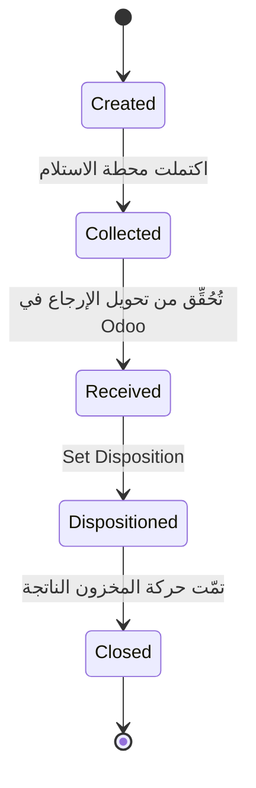

import DocumentInfo from '@site/src/components/DocumentInfo';

# استكمال الطلب

<DocumentInfo
  category="دليل المستخدم"
  audience={['تخطيط', 'عمليات', 'مستودعات', 'اختبار قبول المستخدم']}
  status="Draft"
  version="1.0"
  owner="فريق المنتج"
  updated="أغسطس 2026"
  readingTime="6 دقائق"
/>

**الدور**
لا أحد يضغط زراً. تُغلق SCOP الطلب على ما تحرك فعلاً.

## الغرض

ينتهي الطلب بإحدى ثلاث طرق بالضبط، وأيّها **حساب** لا حكم.

## النتائج الثلاث

```text
المُلبّى == 0                ←  Failed
0 < المُلبّى < المطلوب      ←  Partially Completed
المتبقي == 0                ←  Completed
```

| النتيجة | المعنى | نهائية؟ |
| --- | --- | --- |
| **Completed** | سُلِّم كل ما طُلب | نعم |
| **Partially Completed** | سُلِّم بعضه وبقي بعضه | **لا** — قد تُكمله متابعة |
| **Failed** | لم يُسلَّم شيء | نعم |

:::info[لا يوجد عمداً زر «علّم كمكتمل»]

تقسيم هذا إلى ثلاثة أزرار سيتيح لمشغّل تسجيل اكتمال تناقضه الكميات. فالكميات تقرّر، والكميات تأتي من Odoo.

:::

## من أين تأتي الكميات

:::warning[الكمية المُلبّاة تُقرأ من تحويل Odoo بعد التحقق منه]

لا أحد يكتبها. لا السائق ولا المخطِّط ولا المستودع — في SCOP.

فيتحقق المستودع من تحويل Odoo بما تحرك فعلاً، وتقرأ SCOP ذلك وتنقله إلى سطر المحطة وسطر الطلب.

→ [التحقق من التسليم في Odoo](../execution/odoo-delivery-validation.mdx)

:::

ولهذا قد يبقى طلب يبدو مُسلَّماً في **In Execution**: فالبضائع عند العميل، لكن التحويل لم يُتحقَّق منه بعد، فلا شيء تحرك بنظر النظام.

## الاستكمال الجزئي وطلبات المتابعة

حين يكون التسليم ناقصاً:

| # | ما يحدث | أين |
| --- | --- | --- |
| 1 | يتحقق المستودع من التحويل بالكمية التي تحركت فعلاً | **Odoo** |
| 2 | يُنشئ Odoo **طلباً مؤجَّلاً** للباقي | **Odoo** |
| 3 | تصبح نتيجة المحطة **Partially Completed** | SCOP |
| 4 | يصبح الطلب **Partially Completed** | SCOP — **يُخفق حين يتحقق مستخدم مستودع**، انظر أدناه |
| 5 | *ينبغي* أن يُنشأ **طلب متابعة** للباقي | SCOP — **لا يُنشأ أبداً**. والطلب المؤجَّل يحمل الباقي بدلاً منه |

:::danger[عيبٌ مُتحقَّق منه — الطلب لا يتقدّم حين يتحقق **المستودع**]

الخطوتان 4 و5 صحيحتان بالتصميم، والخطوة 4 تعمل — **لكن ليس حين يضغط مستخدم مستودع Validate**، وهو بالضبط من يقول له الدليل أن يضغطه.

فدور المستودع له **قراءة لا كتابة** على `scop.demand`، فيثير الإسقاطُ الذي يُقدِّم الطلبَ خطأَ وصول. والتوليد غير حاجب، فيُبتلَع الخطأ في `Reporting → Failed Projections` ويُحفَظ التحويل مع ذلك:

```text
PickingDone   failed   You are not allowed to modify 'SCOP Demand' (scop.demand) records.
```

وعلى `b2b` هذه **13 إسقاطاً فاشلاً مقابل 13 معالَجاً** — نصف السجل.

**والفخّ:** الكميات تظهر مع ذلك، لأن **Fulfilled** محسوب من حركات Odoo. و**حالة** الطلب وحدها هي العالقة. فلا شيء على الشاشة يبدو خاطئاً.

**والمنطق نفسه سليم.** فتنفيذ الخطوة نفسها بصفة مخطِّط يُقدِّم الطلب فوراً — `DMD-2026-000010` (6 من 10) إلى **Partially Completed**، و`DMD-2026-000013` (0 من 5) إلى **Failed**.

**إلى أن يُصلَح:** راقب `Reporting → Failed Projections` يومياً وليضغط مسؤول النظام **Retry**. فإعادة المحاولة تتطلب SCOP/Administrator؛ ولا أحد دونه يستطيع تفريغ الطابور.

والخطوة 5 منفصلة: **لا يُنشأ طلب متابعة أبداً**. وهذا لا يكلّف شيئاً في التسليم الجزئي، لأن **الطلب المؤجَّل** في Odoo يحمل الباقي على *الطلب نفسه* — مُتحقَّق منه من طرف إلى طرف أدناه. أما في **الإخفاق الكامل** فلا طلب مؤجَّل، ولا شيء يحمل المتطلب.

:::

وبالتصميم تحمل السلسلةَ إلى الأصل ثلاثةُ حقول. وهي موجودة، وتبويب **Follow-Up and Returns** يعرضها — لكن **لا شيء يملؤها في الإصدار الأول**، لأن لا طلب متابعة يُنشأ. وفي التسليم الجزئي يؤدي الطلب المؤجَّل في Odoo ذلك الدور على الطلب نفسه:

| الحقل | المعنى | الإصدار الأول |
| --- | --- | --- |
| **Parent Demand** | الطلب الذي يتابعه هذا | فارغ دائماً |
| **Is Follow-Up** | يُضبط على الطلب الجديد | لا يُضبَط أبداً |
| **Root Demand** | المتطلب الأصلي في رأس السلسلة | فارغ دائماً |

:::info[الطلب الأصلي لا يُستبدَل]

يبقى `DMD-2026-000010` متطلب العميل الأصلي. وبالتصميم لا يبلغ **Completed** إلا حين تُكمل المتابعة الباقي.

وهذا ما يُبقي الوعد قابلاً للقياس: فـ OTIF تسأل هل وُفِّي بالمتطلب *الأصلي*، لا هل وصل آخر طلب مؤجَّل في النهاية.

**ومُتحقَّق منه على `b2b`:** ذلك الانتقال يعمل، و**الطلب المؤجَّل** هو ما يُطلقه. فقد تُحُقِّق من `DMD-2026-000010` بـ6 من 10 ← **Partially Completed**؛ ثم تُحُقِّق من الطلب المؤجَّل بالـ4 الباقية ← **Completed**، مُلبًّى 10 من 10 عبر **تحويلين**. ولم يُستبدَل الطلب الأصلي قط، فتظل OTIF تقيس الوعد الأصلي.

:::

→ [التسليم الجزئي والطلبات المؤجَّلة](../execution/partial-deliveries-and-backorders.mdx)

## الفشل

بالتصميم يبلغ الطلب **Failed** حين لا يُسلَّم شيء إطلاقاً، ويُنشأ طلب متابعة كي لا يضيع المتطلب. و**Failed** نهائية لذلك الطلب، والمتابعة هي موضع المحاولة الثانية.

:::danger[عيبٌ مُتحقَّق منه — الإخفاق الكامل لا يترك وراءه شيئاً]

يُبلَغ **Failed** صحيحاً متى نجح الإسقاط. لكن لا **طلب مؤجَّل** وراء تسليم فاشل و**لا يُنشأ طلب متابعة**، فلا شيء يحمل المتطلب إلى الأمام ولا أحد يُبلَّغ.

وعلى `b2b`، `DMD-2026-000013` **Failed** نهائي بمتبقٍّ 5.0 وتحويله ملغى. ولن تُسلَّم تلك الوحدات أبداً ما لم ينتبه أحد.

**ارفع الطلب البديل يدوياً.** و`Operations → Demands` مُرشَّحاً على **Failed** بكمية متبقية هي القائمة التي تُعمَل.

:::

:::warning[الكمية الصفرية ليست فشلاً دائماً]

إن لم يُتحقَّق من تحويل Odoo بعد، كانت الكمية المُلبّاة صفراً — ولم يفشل شيء. فقد يكون التسليم تم على أكمل وجه والأوراق متأخرة.

التمييز بين الحالتين مشروح في [التسليم الفاشل](../execution/failed-delivery.mdx).

:::

## نتائج مختلطة في محطة واحدة

قد تتشارك عدة طلبات زيارة فعلية واحدة. **ولا تتشارك مصيراً.**

ولأن كل سطر محطة يُتتبَّع إلى سطر شحنته ومنه إلى طلبه وتحويله الخاص، ففي وصول واحد:

```text
الطلب أ  →  Completed            (تُحُقِّق من تحويله بالكامل)
الطلب ب  →  Partially Completed  (تُحُقِّق من تحويله ناقصاً، وأُنشئ طلب مؤجَّل)
```

→ [الزيارة الفعلية](../shipments/the-physical-visit.mdx)

## إعادة التخطيط قبل التنفيذ

يمكن إرجاع الطلب في **Released** إلى **Planned** بـ**Replan**، لتغيير مُصرَّح به قبل مغادرة الرحلة.

وبعد المغادرة وصيرورة الطلب **In Execution** لا تعود إعادة التخطيط متاحة — فالبضائع على مركبة.

## نزع الطلب من الخطة

إن أُلغيت خطة أو نُزع منها طلب، عاد الطلب من **Planned** إلى **Eligible for Planning**، وكُتب صف **طلب غير مخطَّط** يسجّل عودته إلى المجموعة.

→ [الطلب غير المخطَّط](../planning/unplanned-demand.mdx)

## دورة الإرجاع الفرعية

يحمل الطلب من نوع **Return** حالة ثانية بجانب دورة الحياة الرئيسية.



| الحالة | تُبلَغ حين |
| --- | --- |
| **Created** | يُولَّد طلب الإرجاع |
| **Collected** | تبلغ محطة الاستلام نتيجة **Completed** |
| **Received** | يبلغ تحويل الإرجاع **Done** في Odoo |
| **Dispositioned** | يختار أحدهم مصير البضائع |
| **Closed** | تتم حركة المخزون الناتجة |

و**Set Disposition** هي الخطوة اليدوية الوحيدة، وهي **تشترط مصيراً**:

| المصير | المعنى |
| --- | --- |
| **Restock** | إعادة إلى المخزون القابل للبيع |
| **Scrap** | إعدام |
| **Return to Supplier** | إعادة إلى أعلى السلسلة |
| **Customer Credit** | إشعار دائن بدل الاستبدال |
| **Pending Decision** | لم يُقرَّر بعد |

## التحقق من طلب مكتمل

| تحقّق | أين |
| --- | --- |
| الحالة **Completed** | شريط حالة الطلب |
| المُلبّى يساوي المطلوب | تبويب **Lines** |
| تحويلات Odoo متوافقة | زر **Transfers** |
| يظهر في OTIF | `SCOP → Reporting → OTIF` |
| السلسلة سليمة | تبويب **Follow-Up and Returns** |

## إذا لم يكتمل الطلب

| العَرَض | السبب | العلاج |
| --- | --- | --- |
| عالق في **In Execution** والمُلبّى صفر | لم يُتحقَّق من تحويل Odoo | تحقّق منه |
| عالق في **In Execution** والرحلة انتهت | لم تُغلَق المحطة أبداً | أغلِق المحطة |
| **In Execution** بعد إغلاق رحلته | أخفق إسقاط `PickingDone` — انظر `Reporting → Failed Projections` | يضغط مسؤول النظام **Retry** |
| **Completed** لكنه غائب عن OTIF | لا يحمل التزاماً | راجع [OTIF](../reporting/otif.mdx) |
| طلب قديم جداً عالق في المنتصف | السجلات التي تركها إصدار سابق لا يُعاد كتابتها | راجع [نطاق الإصدار الأول](../about/release-1-scope.mdx) |

المعالجة الكاملة: [الطلب لا يكتمل](../troubleshooting/demand-problems.mdx).

## صفحات ذات صلة

- [دورة حياة الطلب](./demand-lifecycle.mdx)
- [التحقق من التسليم في Odoo](../execution/odoo-delivery-validation.mdx)
- [التسليم الجزئي والطلبات المؤجَّلة](../execution/partial-deliveries-and-backorders.mdx)
- [OTIF](../reporting/otif.mdx)

## التالي

[تشخيص الطلب](./demand-diagnostics.mdx).
