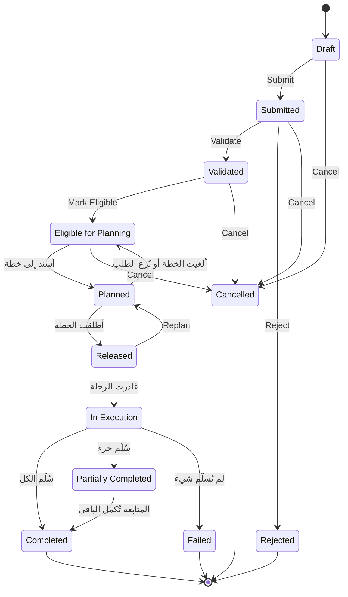

import DocumentInfo from '@site/src/components/DocumentInfo';
import Screenshot from '@site/src/components/Screenshot';

# دورة حياة الطلب

<DocumentInfo
  category="دليل المستخدم"
  audience={['تخطيط', 'عمليات', 'اختبار قبول المستخدم']}
  status="Draft"
  version="1.0"
  owner="فريق المنتج"
  updated="أغسطس 2026"
  readingTime="8 دقائق"
/>

**الدور**
المخطِّط ينفّذ الانتقالات اليدوية. والبقية تحدث من تلقاء نفسها.

**انتقل إلى**
`SCOP → Operations → Demands`

## دورة الحياة



## الحالات الاثنتا عشرة

| الحالة | المعنى | من يخرجها |
| --- | --- | --- |
| **Draft** | أُنشئ للتو من تحويل Odoo. وما زال قابلاً للتعديل | المخطِّط |
| **Submitted** | قُدِّم كمتطلب | المخطِّط |
| **Validated** | فُحص. والملكية محلولة على كل سطر | المخطِّط |
| **Eligible for Planning** | متاح وجاهز بما يكفي للتخطيط. **وشحنته موجودة الآن** | التخطيط |
| **Planned** | وُضع على خطة يومية لم تُطلَق بعد | إطلاق الخطة |
| **Released** | على خطة مُصرَّح بها. مُلتزَم به لليوم | مغادرة الرحلة |
| **In Execution** | على مركبة غادرت | قراءة الكميات |
| **Partially Completed** | سُلِّم بعضه وبقي بعضه | طلب متابعة |
| **Completed** | سُلِّم كل شيء. **نهائية** | — |
| **Failed** | لم يُسلَّم شيء. **نهائية** | — |
| **Rejected** | رُفض كمتطلب. **نهائية** | — |
| **Cancelled** | سُحب. **نهائية** | — |

:::note[لا تستطيع ضبط حالة مباشرةً]

يتحرك الطلب عبر أزرار ترويسته وحدها. فكتابة حالة يدوياً ستتخطى الفحوص الخاصة بالانتقال، و SCOP ترفض ذلك.

:::

## الانتقالات اليدوية

### Submit

| | |
| --- | --- |
| **من ← إلى** | Draft ← Submitted |
| **الدور** | المخطِّط |
| **الفحوص** | لا شيء |
| **استخدمه حين** | يكون المتطلب صحيحاً وجاهزاً للفحص |

وما دام الطلب في **Draft** يمكنك تصحيح الجهة الطالبة ونوع الطلب ونوع المصدر والأولوية. وبعد Submit تستقر هذه.

### Validate

| | |
| --- | --- |
| **من ← إلى** | Submitted ← Validated |
| **الدور** | المخطِّط |
| **البوابة** | `demand_validate` |
| **القاعدة** | `BR-INV-002` — الملكية محلولة ومتسقة |

**وما تفعله SCOP أولاً:** تعيد **استنتاج الملكية** على كل سطر قبل تقييم القاعدة. ففي وقت التوليد لم يكن للتحويل غالباً سطور حركة يُقرأ منها مالك؛ وعند التحقق يكون محجوزاً غالباً والمالك متاحاً.

وإعادة الاستنتاج هذه هي كل سبب كون الملكية غير المحلولة حالة *عابرة* لا حكماً دائماً.

:::danger[إن رفض BR-INV-002]

تسمّي النافذة السطور التي تعذّر إثبات مالكها بالضبط. والملكية **لا تُفترض للشركة أبداً** — فالمالك الغائب لا يؤكّد شيئاً في هذا التنصيب، والتخمين سيجعل SCOP خاطئة باتساق بدل أن تكون متوقفة بصدق.

**الرسالة كما ظهرت على `b2b`:**

```text
This action is blocked by 1 business rule(s):
• BR-INV-002 v1.0: required input is missing:
  scop.demand.line.ownership_source on
  [QS-DEMO-01] QS Demo Chilled Box 10kg, [QS-DEMO-02] QS Demo Dry Goods Carton
```

→ [ملكية المخزون](../ownership/inventory-ownership.mdx)

:::

<Screenshot
  src="quick-start/05-ownership-block-validate.png"
  alt="نافذة رفض على نموذج الطلب في SCOP تفيد بوجوب حلّ الملكية قبل التحقق، وتسمّي السطور المتأثرة."
  caption="BR-INV-002 يرفض التحقق. تسمّي النافذة القاعدة والسياسة والسطور المخالفة."
/>

### Reject

| | |
| --- | --- |
| **من ← إلى** | Submitted ← Rejected |
| **الدور** | المخطِّط |
| **الفحوص** | **سبب رفض مطلوب** |

استخدمه حين يكون المتطلب نفسه خاطئاً — لا حين يكون محجوباً فقط. فالطلب المحجوب يُصلَح لا يُرفض.

و**Rejected** نهائية. فإن عاد المتطلب، عاد كتحويل جديد وطلب جديد.

### Mark Eligible

| | |
| --- | --- |
| **من ← إلى** | Validated ← Eligible for Planning |
| **الدور** | المخطِّط |
| **البوابة** | `demand_eligible` |
| **الفحوص** | الجاهزية **Ready** أو **Conditionally Ready** أو **Partially Ready** |

وتحدث ثلاثة أمور بالترتيب:

1. تُقيَّم البوابة.
2. **يُحدَّث التخصيص** مقابل حجوزات Odoo الحالية.
3. يصبح الطلب مؤهَّلاً — **وتُكوَّن شحنته تلقائياً.**

:::info[تكوين الشحنة ليس خطوة بشرية منفصلة]

مسار التكوين في المخطط نفسه هو *طلب مُتحقَّق منه ← تخصيص المخزون ← إنشاء شحنة*، والتخصيص هو تحديداً ما يُحدِّثه هذا الزر. فهذه هي اللحظة التي تظهر فيها الشحنة.

ويبقى **Create Shipment** على النموذج كإعادة تشغيل لحالة استثنائية. والضغط عليه في الحالة الطبيعية يعيد الشحنة الموجودة أصلاً.

→ [التكوين والتجميع](../shipments/formation-and-consolidation.mdx)

:::

→ التفصيل الكامل: [أهلية التخطيط](./planning-eligibility.mdx)

### Cancel

| | |
| --- | --- |
| **من ← إلى** | Draft أو Submitted أو Validated أو Eligible ← Cancelled |
| **الدور** | المخطِّط *(صلاحية اعتماد: `scop.demand` / cancel)* |

ويُعرض Cancel حتى يبلغ الطلب حالة نهائية. ولا يُعرض متى صار Completed أو Cancelled أو Rejected أو Failed.

وإلغاء الطلب لا يلغي تحويل Odoo. فإن كانت الحركة لن تحدث فعلاً، ألغِ التحويل في Odoo أيضاً.

### Replan

| | |
| --- | --- |
| **من ← إلى** | Released ← Planned |
| **الدور** | المخطِّط *(صلاحية اعتماد: `scop.demand` / replan)* |
| **استخدمه حين** | يلزم تغيير مُصرَّح به **قبل بدء التنفيذ** |

وبعد مغادرة الرحلة وصيرورة الطلب **In Execution** لا تعود إعادة التخطيط متاحة — فالبضائع على مركبة.

### Resolve Ownership

ليس انتقال حالة. متاح متى كانت الملكية غير محلولة، في أي نقطة من دورة الحياة. ويعيد استنتاج المالك من المصادر الخمسة المعتمدة.

→ [تصحيح الملكية](../ownership/correcting-ownership.mdx)

## الانتقالات التلقائية

تحدث هذه لأن شيئاً آخر حدث. ولا أحد يضغط زراً.

| الانتقال | يُطلقه |
| --- | --- |
| Eligible ← **Planned** | إسناد الطلب إلى خطة يومية |
| Planned ← **Eligible** | إلغاء الخطة أو نزع الطلب. **ويُكتب صف طلب غير مخطَّط** |
| Planned ← **Released** | إطلاق الخطة |
| Released ← **In Execution** | مغادرة الرحلة |
| In Execution ← **Completed** | تسليم كل ما طُلب |
| In Execution ← **Partially Completed** | تسليم بعضه. **ويُنشأ طلب متابعة** |
| In Execution ← **Failed** | عدم تسليم شيء. **ويُنشأ طلب متابعة** |
| Partially Completed ← **Completed** | متابعة تُكمل الباقي |

:::info[النتيجة النهائية حساب لا حكم]

تُقرَّر Completed وPartially Completed وFailed بالكميات وحدها:

```text
المُلبّى == 0              ←  Failed
0 < المُلبّى < المطلوب    ←  Partially Completed
المتبقي == 0              ←  Completed
```

ولا يوجد عمداً زر يتيح لمشغّل تسجيل اكتمال تناقضه الكميات.

:::

→ [استكمال الطلب](./demand-completion.mdx)

## دورة الإرجاع الفرعية

يحمل الطلب من نوع **Return** حالة ثانية مستقلة.

| الحالة | تُبلَغ حين |
| --- | --- |
| **Created** | يُولَّد طلب الإرجاع |
| **Collected** | تكتمل محطة الاستلام |
| **Received** | يُتحقَّق من تحويل الإرجاع في Odoo |
| **Dispositioned** | يُختار مصير — **إلزامي** |
| **Closed** | تتم حركة المخزون الناتجة. **نهائية** |

والمصائر المتاحة: **Restock** و**Scrap** و**Return to Supplier** و**Customer Credit** و**Pending Decision**.

وتستمر دورة الحياة الرئيسية بالتوازي؛ وحالة الإرجاع تتتبّع البضائع العائدة.

## أي زر يظهر متى

| الحالة | الأزرار المعروضة |
| --- | --- |
| **Draft** | Submit · Cancel · *(Resolve Ownership إن كانت غير محلولة)* |
| **Submitted** | Validate · Reject · Cancel · *(Resolve Ownership)* |
| **Validated** | Mark Eligible · Cancel · *(Resolve Ownership)* |
| **Eligible for Planning** | Create Shipment · Cancel |
| **Planned** و**Released** | Cancel |
| **In Execution** | Cancel |
| **Completed** و**Failed** و**Rejected** و**Cancelled** | لا شيء |

والزر الغائب يعني عادةً أن الطلب ليس في الحالة التي تعرضه. والسبب الثاني الأشيع أنك لست مخطِّطاً.

:::note[الإجراءات الجماعية ذرّية]

**مُتحقَّق منه على `b2b`:** محاولة التحقق من ثلاثة طلبات دفعةً واحدة، وأحدها في حالة لا تسمح بالانتقال، رُفضت كلها برسالة تسمّي السجل المخالف. فأصلِح الحالات أولاً ثم أعِد الإجراء الجماعي.

:::

## صفحات ذات صلة

- [إدارة الطلب](./demand-management.mdx)
- [أهلية التخطيط](./planning-eligibility.mdx)
- [استكمال الطلب](./demand-completion.mdx)
- [مرجع دورات الحياة](../reference/lifecycle-reference.mdx)
- [قواعد العمل](../reference/business-rules.mdx)

## التالي

[أهلية التخطيط](./planning-eligibility.mdx).
