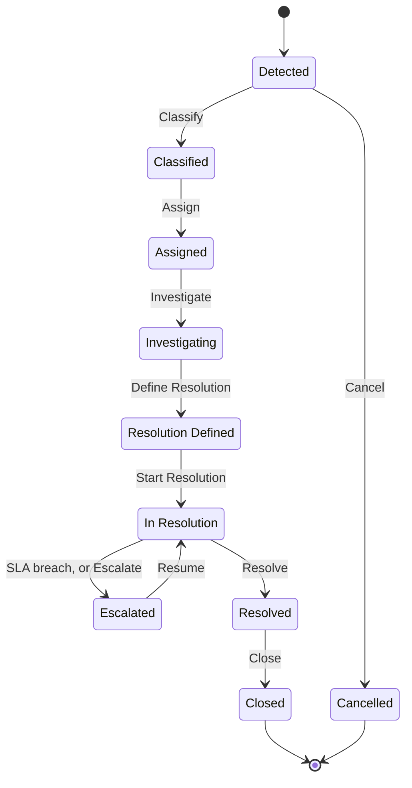

import DocumentInfo from '@site/src/components/DocumentInfo';
import Screenshot from '@site/src/components/Screenshot';

# إدارة الاستثناءات

<DocumentInfo
  category="دليل المستخدم"
  audience={['عمليات', 'إدارة', 'تخطيط', 'مستودعات', 'اختبار قبول المستخدم']}
  status="Draft"
  version="1.0"
  owner="فريق المنتج"
  updated="أغسطس 2026"
  readingTime="8 دقائق"
/>

**الدور**
مدير العمليات يملك الطابور. وأي مستخدم في SCOP يستطيع رفع استثناء والعمل عليه.

**انتقل إلى**
`SCOP → Operations → Exceptions`

## ما الاستثناء

**مشكلة تشغيلية مُسجَّلة تحتاج من يملكها ويعالجها.**

وليس سطراً في سجل ولا رسالة خطأ. فله مالك، وموعد نهائي، وخطة معالجة، ودورة حياة تنتهي بأن يؤكّد أحدهم أن المشكلة زالت فعلاً.

## ما ليس باستثناء

| ليس استثناءً | بل هو |
| --- | --- |
| تسليم فاشل | **نتيجة** محطة، بسبب. وقد *يؤدي* إلى استثناء |
| طلب غير مخطَّط | **نتيجة** تخطيط، بسبب |
| رفض قاعدة عمل | [تقييم قاعدة](../concepts/the-governance-model.mdx) |
| خطأ نظام | [إسقاط فاشل](../reporting/data-quality-reports.mdx) |

:::info[الاستثناءات تُرفع عمداً]

لا تحوّل SCOP كل عثرة تشغيلية إلى استثناء. فالتسليم الناقص بسبب واقعة مُسجَّلة؛ ويصبح استثناءً حين يحتاج **من يملكه** — نزاعَ عميل، أو بضائع تالفة، أو مركبة تعطّلت في منتصف المسار.

:::

## من أين تأتي

| المصدر | كيف |
| --- | --- |
| رحلة | **Raise Exception**، متاح في Loading أو Ready to Depart أو In Progress |
| قاعدة عمل | فشل قاعدة حرجة قد يرفع استثناءً |
| شخص | يُنشأ مباشرةً في قائمة الاستثناءات |

وتنتقل الرحلة إلى **Exception** وتنتظر حتى تُعالج المشكلة أو تكتمل الرحلة أو تُلغى.

→ [دورة حياة الرحلة](../execution/trip-lifecycle.mdx)

## القائمة

`SCOP → Operations → Exceptions` تفتح مُرشَّحةً على الاستثناءات **المفتوحة**.

<Screenshot
  src="user-manual/11-exceptions-list.png"
  alt="قائمة الاستثناءات في SCOP تعرض خمسة استثناءات مفتوحة بفئتها وشدّتها ومالكها وموعدها النهائي وعدد تصعيداتها وحالتها."
  caption="الطابور المفتوح على b2b. ولاحظ EXC-2026-000006 وهو ما زال في Detected ويحمل موعداً نهائياً بالفعل."
/>

| العمود | المعنى |
| --- | --- |
| **Title** | ما المشكلة |
| **Category** | أيٌّ من الأنواع الاثني عشر |
| **Severity** | Information · Warning · Approval Required · Blocking · Critical |
| **Origin** | السجل الذي تخصّه |
| **Owner** | من يعالجها |
| **Detected At** | متى رُفعت |
| **SLA Deadline** | متى ينبغي أن تُعالَج |
| **Overdue** | هل تجاوزت الموعد |
| **Escalation Count** | كم مرة صُعِّدت |
| **Status** | أين هي في دورة حياتها |

## الحالات العشر

| # | الحالة | ما تحتاجه للمغادرة |
| --- | --- | --- |
| 1 | **Detected** | تأكيد الفئة والشدّة اللتين أُنشئ بهما |
| 2 | **Classified** | مالك |
| 3 | **Assigned** | من يبدأ النظر فيه |
| 4 | **Investigating** | إجراء معالجة واحد على الأقل |
| 5 | **Resolution Defined** | من يبدأ تنفيذه |
| 6 | **In Resolution** | إنجاز كل إجراءات المعالجة |
| 7 | **Escalated** | من يستأنفه |
| 8 | **Resolved** | تأكيد |
| 9 | **Closed** | **نهائية** |
| 10 | **Cancelled** | **نهائية** |

<Screenshot
  src="user-manual/84-exception-form-closed.png"
  alt="استثناء مغلق في SCOP يعرض فئته وسببه الجذري ومالكه وإجراءات معالجته ووقتَي المعالجة والإغلاق."
  caption="استثناء مغلق على b2b، بإجراءَي معالجته منجزين ونتيجة مُسجَّلة على كل منهما."
/>

## العمل على استثناء

### Classify

| | |
| --- | --- |
| **يتطلب** | **فئة** و**شدّة** |
| **الأثر** | ينقل الاستثناء إلى **Classified** |

:::info[ساعة اتفاقية مستوى الخدمة تبدأ عند الكشف لا عند التصنيف]

**الفئة مطلوبة لإنشاء الاستثناء أصلاً**، ويُحسَب الموعد النهائي من **Detected At** مضافاً إليه ساعات اتفاقية تلك الفئة لحظة وجود السجل.

فالاستثناء القابع في **Detected** له موعد نهائي بالفعل وهو يتقادم بالفعل. **مُتحقَّق منه على `b2b`:** `EXC-2026-000006` وهو ما زال في **Detected** يحمل موعداً بعد 24 ساعة من وقت كشفه، لأن فئته — *Supplier delay* — اتفاقيتها 24 ساعة.

ويظل التصنيف مهماً: فهو الإقرار بأن أحداً نظر في الاستثناء ووافق على تصنيفه. وتغيير **الفئة** عندئذٍ يعيد حساب الموعد.

:::

### Assign

| | |
| --- | --- |
| **يتطلب** | **مالكاً** |
| **الأثر** | يُنشئ **نشاطاً** لذلك الشخص فيصل إلى قائمة أنشطته |

وهذا الموضع الوحيد الذي تُنشئ فيه SCOP نشاطاً تلقائياً.

### Investigate

بلا متطلب. ويسجّل أن أحداً بدأ النظر فيه.

### Define Resolution

| | |
| --- | --- |
| **يتطلب** | **إجراء معالجة واحداً على الأقل** |

وإجراء المعالجة خطوة ملموسة:

| الحقل | المعنى |
| --- | --- |
| **Name** | ماذا سيُفعل |
| **Description** | التفصيل |
| **Action Type** | أيٌّ من إحدى عشرة خطوة تشغيلية — انظر أدناه |
| **Owner** | من سيفعله |
| **Status** | Planned · In Progress · Done · Abandoned |
| **Done At** | متى أُنجز |
| **Outcome** | ماذا حدث |

:::info[لا تستطيع معالجة استثناء بلا خطة]

اشتراط إجراء واحد على الأقل هو ما يمنع إغلاق استثناء بكلمة *«حُلَّت»* دون سجل لما فُعِل فعلاً. **مُتحقَّق منه على `b2b`:** يرفض **Define Resolution** بالرسالة *"…needs at least one resolution action before its resolution can be defined."*

:::

#### أنواع الإجراءات الأحد عشر

إجراء المعالجة ليس نصاً حراً — بل يسمّي إحدى إحدى عشرة خطوة تشغيلية ملموسة:

| نوع الإجراء | المعنى |
| --- | --- |
| **Replace the vehicle** | استبدال المركبة على الرحلة |
| **Replace the driver** | استبدال السائق |
| **Split the trip** | تقسيم رحلة إلى رحلتين |
| **Reassign the shipment** | نقل شحنة إلى رحلة أخرى |
| **Change the stop sequence** | إعادة ترتيب المسار |
| **Return products to a warehouse** | إعادة البضائع |
| **Transfer products to another vehicle** | نقل الحمولة إلى مركبة أخرى |
| **Reschedule the stop** | إعطاء الزيارة موعداً آخر |
| **Create follow-up demand** | رفع المتطلب المتبقي |
| **Cancel part of the movement** | إسقاط جزء من الحمولة |
| **Escalate for management approval** | رفع القرار إلى الأعلى |

ولأن القائمة مغلقة، صار سؤال *«ما الذي نفعله فعلاً بمشكلات كهذه»* تقريراً لا تمريناً في القراءة.

### Start Resolution

يسجّل أن الخطة قيد التنفيذ.

### Resolve

| | |
| --- | --- |
| **يتطلب** | **إنجاز كل إجراءات المعالجة** |
| **يسجّل** | **Resolved At** |

### Close

| | |
| --- | --- |
| **يتطلب** | صلاحية الإغلاق |
| **يسجّل** | **Closed At**. **نهائية** |

## التصعيد

الاستثناء في **In Resolution** يُصعَّد حين تُخرَق اتفاقية مستوى خدمته، أو حين يضغط أحدهم **Escalate**.

| الأثر | التفصيل |
| --- | --- |
| تصبح الحالة **Escalated** | |
| يزيد **Escalation Count** | |
| يُسجَّل **Escalated At** | |
| تُبلَّغ **المجموعة المسؤولة** | من الفئة |

و**Resume** يعيده إلى **In Resolution** متى تحرّك من جديد.

<Screenshot
  src="user-manual/47-exception-form-escalated.png"
  alt="نموذج استثناء في SCOP بحالة Escalated يعرض فئته وشدّته ومالكه وموعده النهائي وعدد تصعيداته."
  caption="استثناء حرج مُصعَّد. وعدد التصعيدات ولحظة التصعيد كلاهما مُسجَّل."
/>

:::note[التصعيد هو الإشعار التلقائي الوحيد في الإصدار الأول]

وكل ما عداه يصلك بمتابعة سجل أو بقراءة تقرير. فلا توجد تنبيهات تشغيلية آلية للرحلات المتأخرة ولا للطلبات غير المخطَّطة.

:::

## الفئات الاثنتا عشرة

كل فئة تحمل شدّةً افتراضية واتفاقية مستوى خدمة بالساعات.

| الفئة | الشدّة الافتراضية | الاتفاقية |
| --- | --- | --- |
| **Vehicle breakdown** | Critical | **ساعتان** |
| **Critical rule failure** | Critical | 4 س |
| **Unauthorized configuration** | Critical | 4 س |
| **Inventory shortage** | Blocking | 4 س |
| **No feasible plan** | Blocking | 4 س |
| **Picking delay** | Warning | 4 س |
| **Invalid shipment composition** | Blocking | 8 س |
| **Customer time-window change** | Warning | 8 س |
| **Delivery rejection** | Warning | 8 س |
| **Route restriction** | Warning | 8 س |
| **Supplier delay** | Warning | 24 س |
| **Invalid KPI result** | Information | 48 س |

وتحمل كل فئة كذلك فترة **تذكير** قبل الموعد، وفترة **تصعيد بعده**، و**المجموعة المسؤولة** التي تُبلَّغ.

تُضبَط في `SCOP → Governance → Exception Categories` *(مسؤول النظام)*.

## السبب الجذري

`Root Cause` يسجّل **لماذا** حدث، من أحد عشر سبباً منضبطاً:

| السبب الجذري |
| --- |
| Supplier delay |
| Customer time-window change |
| Inventory shortage |
| Picking delay |
| Invalid shipment composition |
| Vehicle breakdown |
| Route restriction |
| No feasible plan |
| Delivery rejection |
| Invalid KPI result |
| Unauthorized configuration |

:::info[السبب الجذري هو ما يجعل الطابور قابلاً للتحليل]

شهرٌ من الاستثناءات بأسباب جذرية مُسجَّلة يجيب عن *«ما الذي يظل يسوء»*. وشهرٌ من الأوصاف الحرة لا يجيب.

→ [رموز الأسباب](../reference/reason-codes.mdx)

:::

## التقادم والاتفاقية

`SCOP → Reporting → Exception Ageing` يقرأ الطابور بالعمر مقابل الموعد النهائي.

| المقياس | المعنى |
| --- | --- |
| **Age (hours)** | منذ الكشف |
| **Hours Past Deadline** | السالب يعني أنه ما زال في الوقت |
| **Is Overdue** | تجاوز الموعد |
| **Age Bucket** | نطاقات مُجمَّعة تبدأ بأقل من 4 ساعات |
| **Escalation Count** | كم مرة صُعِّد |

→ [تقادم الاستثناءات](../reporting/exception-ageing.mdx)

## التحقق

| تحقّق | أين | توقّع |
| --- | --- | --- |
| وجود الاستثناء | `Operations → Exceptions` | في القائمة المفتوحة |
| أنه مُصنَّف | **Category** و**Severity** | كلاهما مضبوط |
| أن له موعداً | **SLA Deadline** | محسوباً من الفئة |
| أن له مالكاً | **Owner** | شخص، مع نشاط |
| أن له خطة | تبويب **Resolution Actions** | إجراء واحد على الأقل |
| أنه عولج | **Resolved At** | ختم زمني |
| أن الرحلة استأنفت | حالة الرحلة | **In Progress** |

## إذا لم ينجح

| العَرَض | السبب |
| --- | --- |
| **Classify** يُرفض | لم تُختَر فئة أو شدّة |
| **Assign** يُرفض | لم يُختَر مالك |
| **Define Resolution** يُرفض | لم يُضَف إجراء معالجة |
| **Resolve** يُرفض | ما زال إجراء معالجة مفتوحاً |
| لا موعد نهائي | فئته بلا ساعات اتفاقية مضبوطة |
| لا يظهر متأخراً أبداً | موعده ما زال في المستقبل فعلاً |
| الرحلة لا تستأنف | استثناؤها الأصلي لم يُعالَج ولم يُغلَق |
| القائمة تبدو فارغة | تفتح مُرشَّحةً على المفتوحة — أزِل المُرشِّح |

## صفحات ذات صلة

- [دورة حياة الرحلة](../execution/trip-lifecycle.mdx)
- [تقادم الاستثناءات](../reporting/exception-ageing.mdx)
- [رموز الأسباب](../reference/reason-codes.mdx)
- [مدير العمليات](../roles/operations-manager.mdx)
- [التسليم الفاشل](../execution/failed-delivery.mdx)

## التالي

[عُقَد التخطيط](../configuration/planning-nodes.mdx).
