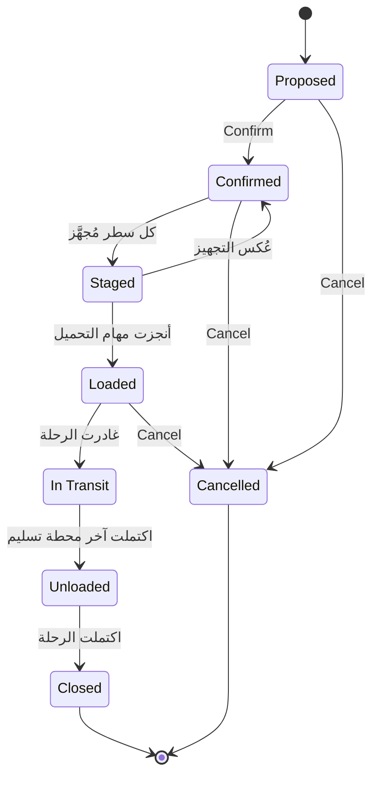

import DocumentInfo from '@site/src/components/DocumentInfo';
import Screenshot from '@site/src/components/Screenshot';

# عمليات التحميل

<DocumentInfo
  category="دليل المستخدم"
  audience={['مستودعات', 'عمليات', 'تخطيط', 'اختبار قبول المستخدم']}
  status="Draft"
  version="1.0"
  owner="فريق المنتج"
  updated="أغسطس 2026"
  readingTime="7 دقائق"
/>

**الدور**
المستودع

**انتقل إلى**
`SCOP → Operations → Loading Tasks`

## ما هي مهمة التحميل

مهمة وضع **شحنة واحدة** على **مركبة واحدة**.

:::info[مهمة تحميل واحدة لكل شحنة على الرحلة]

الرحلة التي تحمل ثلاث شحنات تحصل على ثلاث مهام تحميل. وتُنجَز كل واحدة مستقلةً، و**لا تستطيع المركبة المغادرة حتى تُنجَز كلها**.

:::

## من أين تأتي

تُنشأ مهام التحميل **تلقائياً عند إطلاق الرحلة**. ولا أحد يُنشئ واحدة.

## القائمة

<Screenshot
  src="user-manual/05-loading-tasks.png"
  alt="قائمة مهام التحميل في SCOP تعرض مهمة لكل شحنة بحالتها ومدتها المخطَّطة والفعلية وزرَّي Start وDone."
  caption="يعمل فريق المستودع على هذا الطابور من القائمة مباشرةً."
/>

| العمود | المعنى |
| --- | --- |
| **Reference** | معرِّف المهمة |
| **Trip** | أي رحلة تخصّها |
| **Shipment** | أي شحنة تُحمِّل |
| **Vehicle** | على أي مركبة تُحمَّل |
| **Location** | أين يجري التحميل |
| **Assigned To** | من ينفّذها |
| **Sequence** | الترتيب الذي ينبغي تنفيذها به |
| **Planned Duration (min)** | التقدير |
| **Actual Duration (min)** | ما استغرقته |
| **Started At** / **Completed At** | الطوابع الزمنية |
| **Status** | Pending · In Progress · Done · Cancelled |

و**Start** و**Done** متاحان من القائمة مباشرةً، فيعمل فريق المستودع على الطابور دون فتح أي شيء.

## الحالات الأربع

```text
Pending  →  In Progress  →  Done
                ↓
            Cancelled
```

| الحالة | المعنى |
| --- | --- |
| **Pending** | أُنشئت ولم تبدأ |
| **In Progress** | بدأ التحميل. و**Started At** مختوم |
| **Done** | انتهى التحميل. و**Completed At** و**Actual Duration** مختومان |
| **Cancelled** | لن تحدث |

:::note[هذه حالة لا دورة حياة محكومة]

خلافاً للطلبات والخطط والرحلات، تحمل مهمة التحميل حقل حالة عادياً لا آلة حالات محكومة. وتتحرك عبر **Start** و**Done**، ولا بوابة عليها.

:::

## ماذا يفعل Start وDone بالرحلة

هذه هي بوابة المغادرة، وهي المقصد كله من مهام التحميل.

| الإجراء | الأثر على الرحلة |
| --- | --- |
| **Start** لـ**أول** مهمة | تنتقل الرحلة Released ← **Loading** |
| **Done** لـ**آخر** مهمة | تنتقل الرحلة Loading ← **Ready to Depart**، وتصبح حمولاتها **Loaded** |
| بقاء أي مهمة **Pending** أو **In Progress** | تبقى الرحلة في **Loading**. **ولا يُعرض Depart** |

<Screenshot
  src="user-manual/82-loading-tasks-in-progress.png"
  alt="قائمة مهام التحميل في SCOP تعرض مهمتين لرحلة واحدة، الأولى In Progress والثانية ما زالت Pending."
  caption="شحنتان على رحلة واحدة تعنيان مهمتين. والثانية ما زالت Pending، وهي ما يحتجز المركبة عند البوابة."
/>

:::warning[مهمة التحميل المفتوحة تحتجز المركبة عند البوابة]

إن أبلغ سائق بأن **Depart** غير موجود، فأول ما يُفحص مهام تحميل الرحلة. إحداها ليست **Done**.

وهذه هي البوابة تعمل بشكل صحيح.

:::

**مُتحقَّق منه على `b2b`.** أُطلقت `TRP-2026-000006` بشحنتين، وجُرِّبت المغادرة عند نقطتين:

| حاولت من | النتيجة |
| --- | --- |
| **Released** — قبل بدء التحميل | `TRP-2026-000006 cannot move from Released to In Progress.` |
| **Loading** — بدأت الأولى والثانية معلَّقة | `TRP-2026-000006 cannot move from Loading to In Progress.` |

وبدء أول مهمة نقل الرحلة من **Released** إلى **Loading** وحده، دون أن يلمس أحد سجل الرحلة.

:::note[إنجاز المهمة يحتاج Odoo Inventory → User]

**Done** يقرأ حركات المخزون الأساسية، فيتطلب مجموعة **Inventory → User** في Odoo. ومدير العمليات الذي لا يملكها يحصل على:

```text
You are not allowed to access 'Stock Move' (stock.move) records.
```

وهذا صحيح — فإنجاز مهمة التحميل عمل مستودع. راجع [مرجع الصلاحيات](../roles/permissions-reference.mdx).

:::

## مدة التحميل المقاسة

| الحقل | من أين تأتي |
| --- | --- |
| **Planned Duration** | مُقدَّرة عند إنشاء المهمة |
| **Actual Duration** | محسوبة من **Started At** إلى **Completed At** |

<Screenshot
  src="user-manual/94-loading-tasks-done.png"
  alt="قائمة مهام التحميل في SCOP تعرض المهمتين Done بأوقات البدء والإنجاز والمدد الفعلية مقابل خطة 30 دقيقة."
  caption="المهمتان مُنجَزتان على b2b. والمدة الفعلية محسوبة من الطابعين الزمنيين — ولهذا يجب الضغط على Start حين يبدأ التحميل فعلاً."
/>

وتظهر المقارنة في [المخطَّط مقابل الفعلي للرحلة](../reporting/trip-planned-vs-actual.mdx)، وهي من الأزمنة التشغيلية القليلة المقاسة فعلاً في الإصدار الأول.

:::note[اضغط Start حين تبدأ، لا حين تتذكّر]

المدة الفعلية لا معنى لها إلا إذا ضُغط **Start** لحظة بدء التحميل. فبدء المهام الثلاث دفعةً وإنجازها لاحقاً يُنتج قياساً لا شيء — كما أنه يفتح البوابة قبل إنجاز العمل.

:::

## إسناد المهام

يسمّي **Assigned To** من ينفّذ العمل. وهو اختياري — يمكن العمل على المهمة بدونه — لكن إسناد المهام هو ما يحوّل القائمة إلى طابور عمل لوردية.

## الحمولات

`SCOP → Operations → Loads`

**الحمولة** هي ما على المركبة فعلياً. وهي وثيقة الصلة بمهام التحميل لكنها تجيب عن سؤال مختلف:

| الكائن | السؤال |
| --- | --- |
| **مهمة التحميل** | هل أُنجز عمل المستودع؟ |
| **الحمولة** | ما على المركبة، وأين هي في رحلتها؟ |

وتتحرك الحمولات أساساً من تلقاء نفسها، مدفوعةً بأحداث الرحلة والتحميل. ولا يفتحها معظم مستخدمي المستودع أبداً.

:::note[المخطِّط الأساسي لا يُنشئ حمولات]

**مُتحقَّق منه على `b2b`:** الرحلة التي ينتجها المزوّد الأساسي الحتمي تُطلَق بمهام تحميلها لكن **بلا سجلات حمولة**. فدورة حياة الحمولة موجودة ومفروضة حيث تُنشأ الحمولات، لكن لا شيء في مسار تخطيط الإصدار الأول يُنشئها تلقائياً.

فتوقّع أن يكون `SCOP → Operations → Loads` فارغاً في تجربة قياسية. وهذا ليس خللاً، وبوابة المغادرة لا تعتمد عليه.

:::

### حالات الحمولة الثماني



| الحالة | تُبلَغ حين |
| --- | --- |
| **Proposed** | تقترح الخطة هذه الحمولة |
| **Confirmed** | السعة ممكنة عند كل نقطة من التسلسل |
| **Staged** | كل سطر شحنة على الحمولة مُجهَّز |
| **Loaded** | سُجِّلت الكميات المُحمَّلة الفعلية على كل سطر حمولة |
| **In Transit** | غادرت الرحلة |
| **Unloaded** | اكتملت آخر محطة تسليم |
| **Closed** | اكتملت الرحلة. **نهائية** |
| **Cancelled** | **نهائية** |

:::info[تأكيد الحمولة يُجري BR-RTE-001]

يُقيّم التأكيد جدوى السعة عند كل نقطة من التسلسل — القاعدة نفسها التي تحكم اعتماد الرحلة وإطلاقها.

→ [الرحلات](./trips.mdx)

:::

و**Cancel** على الحمولة متاح لـ**مستخدم المستودع** وما دامت الرحلة لم تغادر.

## التحقق

| تحقّق | أين | توقّع |
| --- | --- | --- |
| وجود المهام لرحلة مُطلَقة | `Operations → Loading Tasks` | واحدة لكل شحنة |
| أن الرحلة انتقلت إلى **Loading** | حالة الرحلة | بعد أول **Start** |
| أن الرحلة **Ready to Depart** | حالة الرحلة | بعد آخر **Done** |
| أن المدة قِيست | **Actual Duration** للمهمة | رقم معقول |
| أن الحمولات بلغت **Loaded** | `Operations → Loads` | الحالة **Loaded**، إن وُجدت حمولات |

## إذا لم ينجح

| العَرَض | السبب | العلاج |
| --- | --- | --- |
| لا مهام تحميل لرحلة مُطلَقة | الرحلة بلا شحنات، أو لم يكتمل الإطلاق | افحص تبويبَي **Stops** و**Loading** في الرحلة |
| **Start** غير معروض | المهمة ليست **Pending** | — |
| **Done** غير معروض | المهمة ليست **In Progress** | اضغط **Start** أولاً |
| **Done** يرفع خطأ وصول على `Stock Move` | تنقصك **Inventory → User** في Odoo | هذا عمل مستودع |
| الرحلة لا تصبح **Ready to Depart** | مهمة ما زالت مفتوحة | أنجِز كل مهمة |
| **Depart** مفقود لدى السائق | السبب نفسه | أنجِز كل مهمة |
| المدة الفعلية عبثية | ضُغط **Start** قبل بدء التحميل بوقت طويل | اضغطه في اللحظة الصحيحة |
| حمولة عالقة في **Confirmed** | ليست كل سطور الشحنة مُجهَّزة | [جاهزية المستودع](../readiness/warehouse-readiness.mdx) |
| حمولة لا تُؤكَّد | `BR-RTE-001` — السعة متجاوَزة | [الرحلات](./trips.mdx) |

## صفحات ذات صلة

- [دورة حياة الرحلة](./trip-lifecycle.mdx)
- [جاهزية المستودع](../readiness/warehouse-readiness.mdx)
- [تسليم السائق](./driver-delivery.mdx)
- [سيناريو تأخّر التحميل](../scenarios/loading-delay-scenario.mdx)

## التالي

[المحطات](./stops.mdx).
