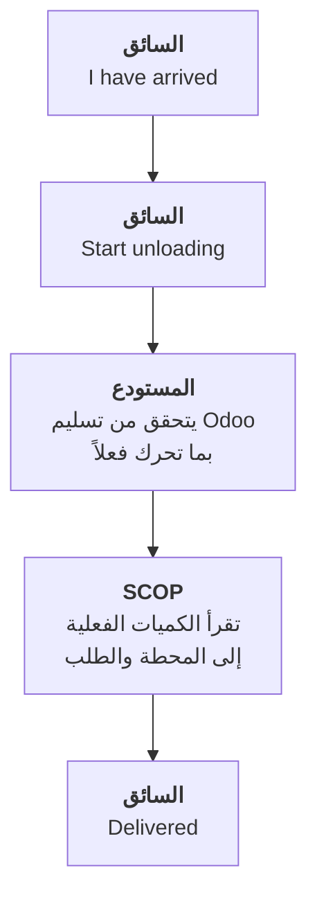

import DocumentInfo from '@site/src/components/DocumentInfo';
import Screenshot from '@site/src/components/Screenshot';

# التحقق من التسليم في Odoo

<DocumentInfo
  category="دليل المستخدم"
  audience={['مستودعات', 'سائقون', 'عمليات', 'تخطيط', 'اختبار قبول المستخدم']}
  status="Draft"
  version="1.0"
  owner="فريق المنتج"
  updated="أغسطس 2026"
  readingTime="6 دقائق"
/>

:::info[هذه هي الصفحة المرجعية لصلاحية الكميات]

كل فصل آخر يحيل إلى هنا بدل إعادة الشرح.

:::

**الأدوار**
السائق يبلّغ. **والمستودع يتحقق.** و SCOP تقرأ.

## القاعدة الواحدة

:::danger[Odoo هو المرجع لكميات المخزون الفعلية]

**لا يوجد في SCOP أي موضع يكتب فيه مستخدم مقدار ما سُلِّم.**

لا السائق. ولا المخطِّط. ولا المستودع. ولا مسؤول النظام.

فالكميات الفعلية تأتي من **تحويل Odoo بعد التحقق منه**، وتقرؤها SCOP وتنقلها إلى سطر المحطة وسطر الطلب.

:::

### لماذا

لو حملت SCOP حقل كمية خاصاً بها، لما استطاع أحد عند اختلافهما أن يقول أيهما الصحيح — ولحُسِب المخزون والفوترة و OTIF كلها من رقم لم يطابقه أحد.

رقم واحد. ومالك واحد. وكل ما عداه يقرؤه.

## مسار العمل في الإصدار الأول



| # | من | أين | ماذا |
| --- | --- | --- | --- |
| 1 | السائق | `My Work → My Stops` | **I have arrived** |
| 2 | السائق | نفسه | **Start unloading** |
| 3 | **المستودع** | **Odoo** | التحقق من التحويل بالكمية التي تحركت فعلاً |
| 4 | SCOP | — | تقرأ الكميات تلقائياً |
| 5 | السائق | `My Work → My Stops` | **Delivered** |

:::warning[الخطوة 3 تقع بين إجراءَي السائق]

وهذا ما يفوت الناس. فلا يستطيع السائق إغلاق المحطة حتى يتحقق المستودع، لأن لا شيء يُغلقها عليه قبل ذلك.

والترتيب غير قابل للتفاوض وليس التفافاً — بل هو التصميم.

**مُتحقَّق منه على `b2b`:** ضغط السائق **Delivered** قبل تحقق المستودع فرُفض بالرسالة التي تشرح كلا المسارين.

:::

## ما يفعله المستودع

<Screenshot
  src="quick-start/37-odoo-transfer-before-validate.png"
  alt="أمر تسليم في Odoo بحالة جاهز، بأعمدة الكمية المطلوبة والمنجزة ظاهرة."
  caption="قبل التحقق. وعمود Done هو ما سيصبح الكمية الفعلية في SCOP."
/>

| تتحقق بـ | يفعل Odoo | تقرأ SCOP |
| --- | --- | --- |
| الكمية **الكاملة** | يغلق التحويل | الطلب ← **Completed** |
| **أقل** من المطلوب | يُنشئ **طلباً مؤجَّلاً** للباقي | الطلب ← **Partially Completed**، ويُنشأ طلب متابعة |
| **لا شيء** | — | يجب إفشال المحطة بسبب |

<Screenshot
  src="quick-start/38-odoo-transfer-validated.png"
  alt="أمر التسليم نفسه في Odoo بعد التحقق، بحالة Done."
  caption="تُحُقِّق منه. وصار لدى SCOP كمية فعلية تقرؤها."
/>

:::note[تحقّق بما تحرك فعلاً لا بما طُلب]

دقّة قياس SCOP كلها تقوم على هذا. فالتحقق بالكمية المطلوبة حين سُلِّم أقل يُنتج طلباً مكتملاً و OTIF نظيفاً وعميلاً لم يستلم بضاعته.

:::

## ما تفعله SCOP بها

| تقرؤها إلى | الحقل |
| --- | --- |
| سطر المحطة | **Actual Qty** |
| سطر الطلب | **Fulfilled** و**Remaining** |
| المحطة | **النتيجة** المستنتَجة |
| الطلب | حالته النهائية |

والنتيجة **مستنتَجة** لا مختارة:

```text
المُلبّى == 0                ←  Failed
0 < المُلبّى < المطلوب      ←  Partially Completed
المتبقي == 0                ←  Completed
```

## قراءة الكميات لا تحتاج صلاحيات Odoo

:::info[شاشات SCOP تقرأ الكميات نيابةً عن السجل]

فتح طلب أو شاشة محطة السائق **لا** يتطلب مجموعة **Inventory → User** في Odoo. فتلك الشاشات تقرأ الكميات المسلَّمة نيابةً عن السجل.

وهذا ما يتيح للسائق — الذي يجب ألّا يقرأ كل تحويل في الشركة — رؤية ما سُلِّم في محطته هو.

ويظل المخطِّط يحتاج **Inventory → User** لـ*تشغيل* الطلب، ويحتاجها من يتحقق من تحويل لأن ذلك عمل Odoo نفسه. **وكذلك من يُنهي مهمة تحميل**، فهي تقرأ حركات المخزون.

→ [مرجع الصلاحيات](../roles/permissions-reference.mdx)

:::

## الطلب غير مرتبط بتحويل واحد

لا يوجد عمداً ربط واحد-لواحد بين الطلب والتحويل. فالرابط على مستوى **الحركة**.

```text
التحويل الواحد  →  قد يحمل عدة طلبات
الطلب الواحد    →  قد تُلبّيه عدة تحويلات
                   (الأصلي، وكل طلب مؤجَّل)
```

وهذا ما يتيح للطلب المؤجَّل أن يرتبط بالطلب الذي جاء منه دون أن يعيد أحد إدخال شيء — ولماذا يكون عدد **Transfers** على طلب أكبر من واحد أمراً طبيعياً.

→ [التسليم الجزئي والطلبات المؤجَّلة](./partial-deliveries-and-backorders.mdx)

## عدة طلبات في محطة واحدة

كل سطر محطة يسمّي سطر شحنته، وهو يسمّي طلبه وتحويله. فداخل وصول واحد:

| الطلب | تحويله تُحُقِّق منه | النتيجة |
| --- | --- | --- |
| `الطلب أ` | بالكامل | **Completed** |
| `الطلب ب` | ناقصاً، وأُنشئ طلب مؤجَّل | **Partially Completed** |

ونتيجة محطة واحدة لا تُجبر كل طلب على الحالة نفسها.

→ [الزيارة الفعلية](../shipments/the-physical-visit.mdx)

## ماذا يحدث إن تأخّر التحقق

لا شيء ينكسر. فحال العالم ببساطة أن البضائع عند العميل والنظام لا يعرف بعد.

| العاقبة | التفصيل |
| --- | --- |
| تُظهر الكميات الفعلية **صفراً** | لم يُقرأ شيء |
| **Delivered** **يُرفض** | برسالة تقول ذلك بالضبط |
| يبقى الطلب **In Execution** | |
| لا تستطيع الرحلة الإغلاق | فآخر محطة بلا نتيجة |

<Screenshot
  src="user-manual/D04-driver-stop-servicing.png"
  alt="نموذج محطة السائق بحالة Servicing، وتبويب Goods يعرض الكميات المخطَّطة مقابل كميات فعلية صفرية."
  caption="شاشة السائق على b2b: الكمية المخطَّطة 6 و4 و3، والفعلية 0.00 على كل سطر — لأن التحويل لم يُتحقَّق منه بعد."
  device="mobile"
/>

:::danger[لا تسجّل فشلاً لأن التحقق تأخّر]

الرسالة تميّز بين الحالتين عمداً. فالفشل المُسجَّل هنا سيتعيّن نزعه من كل مقياس خدمة بعد ذلك.

→ [التسليم الفاشل](./failed-delivery.mdx)

:::

## التحقق

| تحقّق | أين | توقّع |
| --- | --- | --- |
| أن التحويل مُتحقَّق منه | Odoo، أو زر **Transfers** في الطلب | الحالة **Done** |
| أن الكمية هي ما تحرك | عمود **Done** في التحويل | الواقع |
| أن SCOP قرأتها | تبويب **Quantities** في المحطة | الفعلي ممتلئ |
| أن الطلب تبع | تبويب **Lines** في الطلب | **Fulfilled** ممتلئ |
| حالة الطلب | شريط حالته | Completed أو Partially Completed أو Failed |
| وجود طلب مؤجَّل، إن كان ناقصاً | Odoo | تحويل جديد |

## إذا لم ينجح

| العَرَض | السبب | العلاج |
| --- | --- | --- |
| الكميات الفعلية صفر | لم يُتحقَّق من التحويل | تحقّق منه |
| **Delivered** يُرفض | السبب نفسه | نفسه |
| الطلب Completed والعميل استلم أقل | تُحُقِّق من التحويل بالكمية **المطلوبة** | صحّحه في Odoo |
| الطلب يبقى **In Execution** | كان ناقصاً — **ولا يتحرك من تلقاء نفسه في الإصدار الأول** | ارفع الباقي يدوياً |
| الطلب يُظهر عدة تحويلات | طبيعي — طلبات مؤجَّلة | لا شيء |
| الكميات صحيحة والمحطة لا تُغلق | شيء ناقص بلا سبب | `BR-EXE-001` — أعطِ سبباً |

## صفحات ذات صلة

- [التسليم الجزئي والطلبات المؤجَّلة](./partial-deliveries-and-backorders.mdx)
- [التسليم الفاشل](./failed-delivery.mdx)
- [استكمال الطلب](../demand/demand-completion.mdx)
- [SCOP و Odoo](../about/scop-and-odoo.mdx)
- [المحطات](./stops.mdx)

## التالي

[التسليم الجزئي والطلبات المؤجَّلة](./partial-deliveries-and-backorders.mdx).
