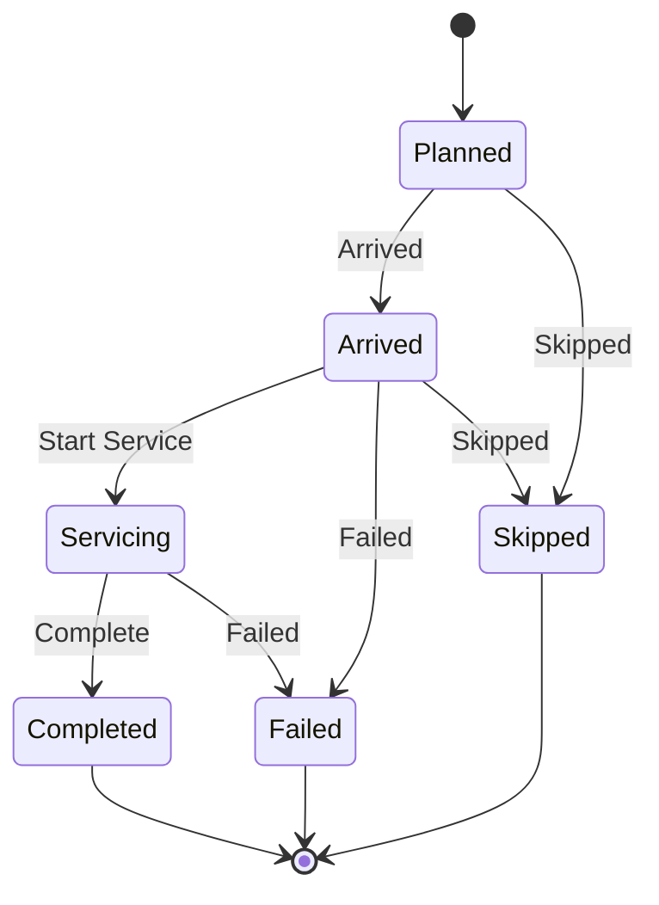

import DocumentInfo from '@site/src/components/DocumentInfo';
import Screenshot from '@site/src/components/Screenshot';

# المحطات

<DocumentInfo
  category="دليل المستخدم"
  audience={['تخطيط', 'عمليات', 'سائقون', 'اختبار قبول المستخدم']}
  status="Draft"
  version="1.0"
  owner="فريق المنتج"
  updated="أغسطس 2026"
  readingTime="7 دقائق"
/>

**الدور**
المخطِّط يقرأ النموذج الكامل. والسائق يستخدم المبسَّط في [My Work](./driver-delivery.mdx).

**انتقل إلى**
`SCOP → Operations → Stops`، أو تبويب **Stops** في الرحلة

## ما هي المحطة

**زيارة فعلية** واحدة: وصول واحد، وفترة خدمة واحدة، ومغادرة واحدة، وإثبات تسليم واحد.

وهي ليست «عميلاً واحداً» ولا «أمراً واحداً» — راجع [الزيارة الفعلية](../shipments/the-physical-visit.mdx).

## نموذج المحطة

<Screenshot
  src="user-manual/08-stops-list.png"
  alt="قائمة المحطات في SCOP تعرض المحطات بترتيبها وموقعها ونشاطها ووصولها المخطَّط والفعلي وحالتها ونتيجتها."
  caption="الحالة والنتيجة عمودان منفصلان، لأنهما يجيبان عن سؤالين مختلفين."
/>

| الحقل | المعنى |
| --- | --- |
| **Trip** | أي رحلة |
| **Sequence** | أين في المسار. فريد لكل رحلة |
| **Location** | عقدة التخطيط المزارة |
| **Activity** | نوع العمل — تسليم أو استلام |
| **Partner** | الجهة المخدومة |
| **Planned / Actual Arrival** | |
| **Planned / Actual Departure** | |
| **Planned / Actual Service (min)** | |
| **Arrival Variance (min)** | الفعلي مقابل المخطَّط |
| **Status** | إلى أين وصلت الزيارة |
| **Outcome** | كيف انتهت |
| **Outcome Reason** | لماذا، حيث لم تكن النتيجة تسليماً نظيفاً |

وتبويبان: **Goods** (أو **Quantities**) و**Proof of Delivery**.

## الحالة والنتيجة أمران مختلفان

هذا يُربك الناس، فيستحق التصريح.

| الحقل | يجيب عن | القيم |
| --- | --- | --- |
| **Status** | إلى أين وصلت الزيارة؟ | Planned · Arrived · Servicing · Completed · Failed · Skipped |
| **Outcome** | كيف انتهت؟ | Completed · Partially Completed · Failed · Skipped · Rescheduled |

فالمحطة بحالة **Completed** قد تحمل نتيجة **Partially Completed** — انتهت الزيارة، لكن لم يُسلَّم كل شيء.

## الحالات الست



| الحالة | المعنى | تسجّل |
| --- | --- | --- |
| **Planned** | لم تُزَر بعد | — |
| **Arrived** | المركبة هناك | **Actual Arrival**، وحدث تنفيذ |
| **Servicing** | بدأ التفريغ أو التحميل | **Actual Service Start**، وحدث تنفيذ |
| **Completed** | انتهت الزيارة. **نهائية** | **Actual Departure** والنتيجة وحدث تنفيذ |
| **Failed** | لم تحقّق الزيارة شيئاً. **نهائية** | النتيجة. **والسبب إلزامي** |
| **Skipped** | لم تُحاوَل. **نهائية** | النتيجة. **والسبب إلزامي** |

## النتائج الخمس

| النتيجة | المعنى |
| --- | --- |
| **Completed** | سُلِّم كل ما خُطِّط |
| **Partially Completed** | سُلِّم بعضه |
| **Failed** | لم يُسلَّم شيء |
| **Skipped** | لم تُحاوَل الزيارة |
| **Rescheduled** | نُقلت إلى مناسبة أخرى |

:::info[النتيجة مستنتَجة لا مختارة]

حين تكتمل المحطة، **تستنتج** SCOP النتيجة من الكميات التي تحركت فعلاً.

فالسائق الذي سلّم ثلاث كراتين من خمس قد سجّل ذلك على تحويل Odoo أصلاً. ومطالبته بتصنيف الزيارة *أيضاً* ستدعو الجوابين للتناقض — والكميات هي ما يستطيع العميل التحقق منه.

:::

## تبويب الكميات

سطر لكل منتج في هذه المحطة.

| العمود | المعنى | المصدر |
| --- | --- | --- |
| **Product** | ما يُسلَّم أو يُستلم | سطر الشحنة |
| **Planned Qty** | ما ينبغي أن يتحرك | سطر الشحنة |
| **Actual Qty** | ما تحرك فعلاً | **تحويل Odoo بعد التحقق منه** |
| **Qty Variance** | الفعلي ناقص المخطَّط | محسوب |
| **Shipment Line** | السطر الذي جاء منه — **ومنه الطلب** | رابط التتبّع |
| **Inventory Owner** | من يملك هذه البضائع | منسوخ من سطر الشحنة |
| **Ownership Source** | كيف ثبتت الملكية | منسوخ من سطر الشحنة |

:::note[الطلب يُبلَغ عبر سطر الشحنة لا مباشرةً]

سطر المحطة يسمّي **سطر شحنته**، وسطر الشحنة يسمّي **طلبه**. فالسلسلة أطول بخطوة مما تبدو، وهي ما يُبقي الزيارة المشتركة متتبَّعة:

```text
سطر المحطة  →  سطر الشحنة  →  الطلب  →  تحويل Odoo
```

**مُتحقَّق منه على `b2b`:** لا يوجد حقل طلب مباشر على سطر المحطة.

:::

:::warning[الكمية الفعلية لا تُكتب أبداً]

تُقرأ من تحويل Odoo بعد التحقق منه. ولا يوجد أي حقل في SCOP يُدخل فيه شخص كمية مسلَّمة.

→ [التحقق من التسليم في Odoo](./odoo-delivery-validation.mdx)

:::

## الإجراءات

| الزر | من ← إلى | يشترط |
| --- | --- | --- |
| **Arrived** | Planned ← Arrived | — |
| **Start Service** | Arrived ← Servicing | — |
| **Complete** | Servicing ← Completed | كميات فعلية من التحويل؛ وسبباً إن لم يكن تسليماً نظيفاً |
| **Failed** | Arrived أو Servicing ← Failed | **سبب نتيجة** |
| **Skipped** | Planned أو Arrived ← Skipped | **سبب نتيجة** |

وتعرض شاشة السائق الإجراءات نفسها بكلمات أبسط — **I have arrived** و**Start unloading** و**Delivered** و**Could not deliver**.

## إكمال محطة

**Complete** يُرفض في حالتين، والرسالة تخبرك بأيهما.

### لم يُتحقَّق من التحويل بعد

> Stop 1 has no delivered quantity recorded yet. The warehouse validates the transfer in Odoo, and SCOP reads the result — wait for that, then close the stop. If the delivery genuinely failed, use 'Could not deliver' and give the reason.

:::warning[هذا ليس تسليماً فاشلاً]

لم يحدث خطأ. فقد تكون البضائع عند العميل والأوراق متأخرة فقط.

وتسجيل فشل هنا سيضع فشلاً لم يحدث في كل مقياس خدمة لاحق، وسيتعيّن نزعه من كل واحد منها.

→ [التسليم الفاشل](./failed-delivery.mdx)

:::

### كان شيء ناقصاً ولم يُعطَ سبب

> Stop 2 did not deliver everything planned, so it needs a reason before it can be closed.

وهذا `BR-EXE-001`، يُسأل في اللحظة التي يستطيع فيها الشخص الإجابة.

## إكمال المحطة مُحايد التكرار

المحطة التي صارت Completed أو Failed أو Skipped **تبقى مغلقة**. والضغط على **Complete** ثانيةً لا يفعل شيئاً.

:::note[لماذا يهم ذلك]

الضغطة المزدوجة، أو هاتف يعيد الاتصال ويكرّر الطلب، كانا سيعيدان ختم وقت المغادرة ويعيدان كتابة قياس لشيء حدث مرة واحدة بصمت.

:::

## حين تُغلق آخر محطة

إغلاق المحطة الأخيرة يُغلق الرحلة من تلقاء نفسه:

| إذا كانت نتيجة كل محطة | تصبح الرحلة |
| --- | --- |
| **Completed** | **Completed** |
| أي شيء آخر | **Partially Completed** |

ومن هناك تتبع الشحنات والطلبات. ولا أحد يدفعها.

→ [دورة حياة الرحلة](./trip-lifecycle.mdx)

## المخطَّط مقابل الفعلي

| المقياس | المعنى |
| --- | --- |
| **Arrival Variance (min)** | الوصول الفعلي مقابل المخطَّط |
| **Actual Service (min)** | من الوصول إلى المغادرة |

وكلاهما يغذّي [المخطَّط مقابل الفعلي للرحلة](../reporting/trip-planned-vs-actual.mdx)، والوصول هو ما تقيس [OTIF](../reporting/otif.mdx) الالتزام بالوقت مقابله.

## التحقق

| تحقّق | أين |
| --- | --- |
| حالة المحطة ونتيجتها | نموذج المحطة |
| أن الكميات الفعلية قُرئت | تبويب **Quantities** |
| أن كل سطر يسمّي سطر شحنته | التبويب نفسه |
| أن إثبات التسليم التُقط | تبويب **Proof of Delivery** |
| أن الرحلة أُغلقت | حالة الرحلة |
| أن الطلبات تبعت | `Operations → Demands` |

## إذا لم ينجح

| العَرَض | السبب |
| --- | --- |
| **Complete** يُرفض بـ«no delivered quantity recorded yet» | لم يُتحقَّق من تحويل Odoo |
| **Complete** يُرفض بـ«needs a reason» | كان شيء ناقصاً — `BR-EXE-001` |
| **Failed** يُرفض | لم يُختَر سبب نتيجة |
| الكميات الفعلية كلها صفر | لم يُتحقَّق من التحويل |
| المحطة Completed والطلب ليس كذلك | قد يكون تحويل الطلب نفسه ما زال مفتوحاً |
| الرحلة لم تُغلق بعد آخر محطة | محطة بلا نتيجة — افحص كل واحدة |
| محطتان حيث توقعت واحدة | اختلاف العقدة أو النشاط أو التاريخ أو النافذة |

## صفحات ذات صلة

- [الزيارة الفعلية](../shipments/the-physical-visit.mdx)
- [تسليم السائق](./driver-delivery.mdx)
- [التحقق من التسليم في Odoo](./odoo-delivery-validation.mdx)
- [التسليم الفاشل](./failed-delivery.mdx)
- [إثبات التسليم](./proof-of-delivery.mdx)

## التالي

[تسليم السائق](./driver-delivery.mdx).
