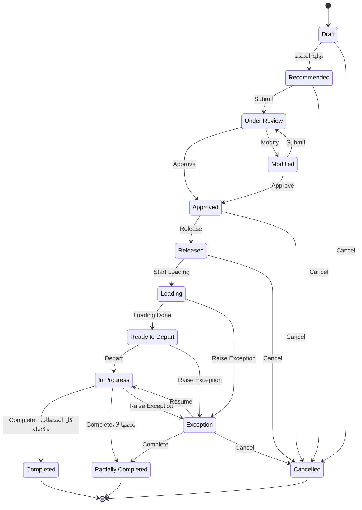

import DocumentInfo from '@site/src/components/DocumentInfo';
import Screenshot from '@site/src/components/Screenshot';

# دورة حياة الرحلة

<DocumentInfo
  category="دليل المستخدم"
  audience={['تخطيط', 'عمليات', 'مستودعات', 'سائقون', 'اختبار قبول المستخدم']}
  status="Draft"
  version="1.0"
  owner="فريق المنتج"
  updated="أغسطس 2026"
  readingTime="8 دقائق"
/>

**الدور**
تملك أدوار مختلفة أجزاءً مختلفة — والجدول أدناه يحدّد أيها.

## دورة الحياة



## الحالات الثلاث عشرة

| الحالة | المعنى | يملكها |
| --- | --- | --- |
| **Draft** | أُنشئت ولم تصبح جزءاً من توصية بعد | — |
| **Recommended** | اقترحتها دورة تخطيط | المخطِّط |
| **Under Review** | مرفوعة للتصريح | مدير العمليات |
| **Modified** | غُيِّرت بعد بدء المراجعة | المخطِّط |
| **Approved** | مُصرَّح بها | مدير العمليات |
| **Released** | عمل حقيقي. مرئية للسائق. **ومهام التحميل موجودة** | المستودع |
| **Loading** | بدأ التحميل | المستودع |
| **Ready to Depart** | انتهى التحميل. ويجوز للمركبة الذهاب | **السائق** |
| **In Progress** | غادرت المركبة | السائق |
| **Exception** | قاطعتها مشكلة | مدير العمليات |
| **Completed** | اكتملت كل محطة. **نهائية** | — |
| **Partially Completed** | لكل محطة نتيجة، وليست كلها مكتملة. **نهائية** | — |
| **Cancelled** | سُحبت. **نهائية** | — |

## الخطة تقود الحالات الست الأولى

لا تتحرك الرحلة عبر حالات المراجعة وحدها. **فإطلاق الخطة اليومية يُطلق رحلاتها.**

| تفعل الخطة | تصبح الرحلات |
| --- | --- |
| Generated | **Recommended** |
| Submitted | **Under Review** |
| Approved | **Approved** |
| **Released** | **Released** |

وأزرار **Submit** و**Approve** و**Release** على الرحلة نفسها موجودة لمعالجة رحلة واحدة منفصلةً — مثلاً بعد إصلاح رحلة حجبت خطتها تحت `BR-PLN-002`.

→ [الخطة اليومية](../planning/the-daily-plan.mdx)

## ماذا يفعل الإطلاق

| الأثر | التفصيل |
| --- | --- |
| تصبح الرحلة مرئية لسائقها | في `My Work → My Trips` |
| إسنادات الموارد تصبح **committed** | تُحجَز المركبة والسائق تشغيلياً |
| **تُنشأ مهام التحميل** | **واحدة لكل شحنة** على الرحلة |

:::warning[الإطلاق يشترط نافذة مخطَّطة]

الرحلة بلا بداية ونهاية مخطَّطتين لا تستطيع حجز مواردها، ويُرفض إطلاقها.

:::

<Screenshot
  src="quick-start/22-loading-tasks.png"
  alt="قائمة مهام التحميل في SCOP تعرض مهمة لكل شحنة على رحلة مُطلَقة."
  caption="الإطلاق أنشأ مهام التحميل — واحدة لكل شحنة على الرحلة."
/>

**مُتحقَّق منه على `b2b`:** أنتج إطلاق رحلة تحمل شحنتين **مهمتَي تحميل** بالضبط، وإسناد مركبة **committed**.

## التحميل وبوابة المغادرة

| الانتقال | المُطلِق | الأثر |
| --- | --- | --- |
| Released ← **Loading** | بدء **أول** مهمة تحميل | — |
| Loading ← **Ready to Depart** | إنهاء **آخر** مهمة تحميل | تصبح الحمولات **Loaded** |

:::info[مهمة التحميل المفتوحة تحتجز المركبة عند البوابة]

لا يُعرض **Depart** إلا في **Ready to Depart**. وحتى تُنجَز كل مهام التحميل، تبقى الرحلة في **Loading** ولا تذهب المركبة.

وهذه هي البوابة تعمل، لا خللاً.

:::

<Screenshot
  src="user-manual/81-trip-loading.png"
  alt="نموذج رحلة في SCOP بحالة Loading يعرض محطاتها ومركبتها وسائقها المُسنَدين وتبويب التحميل."
  caption="الرحلة نفسها بينما ما زال التحميل جارياً. وDepart غير معروض هنا، ولن يُعرض حتى تُنجَز آخر مهمة."
/>

**مُتحقَّق منه على `b2b`** — جُرِّبت المغادرة عند نقطتين:

| حاولت من | النتيجة |
| --- | --- |
| **Released** — قبل بدء التحميل | `TRP-2026-000006 cannot move from Released to In Progress.` |
| **Loading** — بدأت الأولى والثانية معلَّقة | `TRP-2026-000006 cannot move from Loading to In Progress.` |

وبدء أول مهمة نقل الرحلة من **Released** إلى **Loading** وحده، دون أن يلمس أحد سجل الرحلة.

<Screenshot
  src="user-manual/95-trip-ready-to-depart.png"
  alt="نموذج رحلة في SCOP بحالة Ready to Depart بمركبتها وسائقها المُسنَدين."
  caption="TRP-2026-000006 لحظة إنجاز آخر مهمة تحميل. لم يلمس أحد الرحلة — إنجاز المهمة هو ما حرّكها."
/>

→ [عمليات التحميل](./loading-operations.mdx)

## المغادرة

<Screenshot
  src="quick-start/24-trip-ready-to-depart.png"
  alt="نموذج الرحلة في SCOP بحالة Ready to Depart."
  caption="Ready to Depart. انتهى التحميل وللسائق أن يمضي."
/>


| | |
| --- | --- |
| **من ← إلى** | Ready to Depart ← In Progress |
| **من** | **السائق المُسنَد**، أو مخطِّط / مُوزِّع |

**ما تفعله SCOP**

| الأثر | التفصيل |
| --- | --- |
| تسجّل **Actual Start** | لحظة المغادرة |
| الحمولات ← **In Transit** | |
| الشحنات ← **In Execution** | كل شحنة مخطَّطة على الرحلة |
| الطلبات ← **In Execution** | كل طلب مُطلَق خلفها |

:::info[التتالي يجري نيابةً عن النظام]

المغادرة فعل السائق. أما نقل الشحنات والطلبات إلى التنفيذ فهو النظام **يسجّل النتيجة** — فالشحنة على مركبة غادرت *هي* في التنفيذ.

ولا يكتسب السائق أي وصول إلى الشحنات أو الطلبات بفعله ذلك. فالبديل كان منح أضيق دور في النظام موطئ قدم على سجل الطلبات لتعمل أثراً محاسبياً.

→ [نموذج أمان السائق](./driver-security-model.mdx)

:::

## الاكتمال

**Complete** متاح في **In Progress** أو **Exception**، ويشترط أن يكون **لكل محطة نتيجة**.

| إذا كانت كل النتائج | تصبح الرحلة |
| --- | --- |
| **Completed** | **Completed** |
| أي شيء آخر | **Partially Completed** |

**ما تفعله SCOP**

| الأثر | التفصيل |
| --- | --- |
| تسجّل **Actual End** | |
| إسنادات الموارد ← **closed** | تُحرَّر المركبة والسائق |
| الحمولات ← **closed** | |
| **إنشاء طلبات متابعة** | بالتصميم، واحد لكل سطر فاشل. **ولا تُنشأ في الإصدار الأول** — انظر [استكمال الطلب](../demand/demand-completion.mdx) |

:::danger[BR-EXE-001 يُطلَق هنا]

`BR-EXE-001` — *يجب أن تحمل المحطة الفاشلة أو الجزئية سبب نتيجة* — يُقيَّم عند `trip_complete`. فالرحلة التي عليها محطة فاشلة أو جزئية بلا تفسير لا تُغلَق.

ويُطلب السبب عادةً قبل ذلك بكثير، لحظة إغلاق السائق للمحطة، لأن ذلك حين يستطيع الإجابة.

→ [التسليم الفاشل](./failed-delivery.mdx)

:::

وتُغلق الرحلة عادةً **من تلقاء نفسها** حين تبلغ آخر محطة نتيجةً. و**Complete** موجود للحالات التي لا يحدث فيها ذلك.

## Exception

| | |
| --- | --- |
| **من** | Loading أو Ready to Depart أو In Progress |
| **الزر** | **Raise Exception** |
| **ما يفعله** | يُنشئ استثناءً تشغيلياً وينقل الرحلة إلى **Exception** |

| الخروج | الشرط |
| --- | --- |
| **Resume** ← In Progress | الاستثناء الأصلي مُعالَج أو مُغلَق |
| **Complete** ← Partially Completed | لكل محطة نتيجة |
| **Cancel** ← Cancelled | |

→ [إدارة الاستثناءات](../exceptions/exception-management.mdx)

## الإلغاء

| | |
| --- | --- |
| **متاح في** | Draft وRecommended وApproved وReleased وException |
| **غير متاح في** | Loading وReady to Depart وIn Progress |
| **الدور** | المخطِّط *(صلاحية اعتماد: `scop.trip` / cancel)* |
| **الأثر** | إسنادات الموارد ← **cancelled** |

والرحلة التي تُحمَّل أو تتحرك لا يمكن إلغاؤها. ارفع استثناءً بدلاً من ذلك.

## ما يتدفق لاحقاً

```text
أُطلقت الخطة      →  أُطلقت الرحلات        →  أُنشئت مهام التحميل
بدأ التحميل        →  الرحلة Loading
انتهى التحميل      →  الرحلة Ready to Depart →  الحمولات Loaded
المغادرة           →  الحمولات In Transit    →  الشحنات والطلبات In Execution
أُغلقت آخر محطة    →  تُغلق الرحلة           →  الشحنات Completed
                                             →  الطلبات Completed / Partially / Failed
                                             →  تُحرَّر الموارد
                                             →  تُنشأ طلبات متابعة لما فشل
```

:::info[السلسلة تُغلق نفسها]

لا أحد يدفع الشحنات أو الطلبات عبر حالاتها يدوياً. فإطلاق الخطة والمغادرة ونتيجة آخر محطة تحمل السلسلة كلها إلى الاكتمال.

وإن كان شيء عالقاً، فالسبب أعلى السلسلة غالباً — وأشيعه **تحويل Odoo لم يُتحقَّق منه**.

:::

## التحقق

| تحقّق | أين |
| --- | --- |
| أن الرحلة بلغت الحالة المتوقعة | شريط الحالة |
| من حرّكها ومتى | سجل المحادثة |
| البداية والنهاية الفعليتان | الترويسة |
| المخطَّط مقابل الفعلي | تبويب **Planned vs Actual** |
| أن شحناتها تبعت | `Operations → Shipments` |
| أن طلباتها تبعت | `Operations → Demands` |

## إذا لم ينجح

| العَرَض | السبب |
| --- | --- |
| عالقة في **Released** | لم يبدأ التحميل |
| عالقة في **Loading** | مهمة تحميل ما زالت مفتوحة |
| **Depart** غير معروض | ليست في **Ready to Depart**، أو لست السائق ولا المُوزِّع |
| عالقة في **In Progress** وكل المحطات منتهية | محطة بلا نتيجة. افحص كل واحدة |
| **Complete** يُرفض | `BR-EXE-001` — محطة فاشلة أو جزئية بلا سبب |
| أُغلقت **Partially Completed** بلا توقّع | محطة فشلت أو تُخطّيت. اقرأ نتيجتها |
| الطلبات ما زالت **In Execution** بعد إغلاق الرحلة | لم يُتحقَّق من تحويل Odoo |

## صفحات ذات صلة

- [الرحلات](./trips.mdx)
- [عمليات التحميل](./loading-operations.mdx)
- [تسليم السائق](./driver-delivery.mdx)
- [مرجع دورات الحياة](../reference/lifecycle-reference.mdx)

## التالي

[عمليات التحميل](./loading-operations.mdx).
