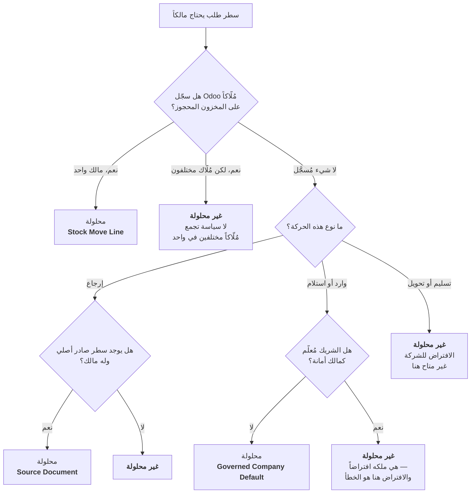

import DocumentInfo from '@site/src/components/DocumentInfo';
import Screenshot from '@site/src/components/Screenshot';

# ملكية المخزون

<DocumentInfo
  category="دليل المستخدم"
  audience={['تخطيط', 'عمليات', 'مستودعات', 'إدارة', 'اختبار قبول المستخدم']}
  status="Draft"
  version="1.0"
  owner="فريق المنتج"
  updated="أغسطس 2026"
  readingTime="9 دقائق"
/>

:::info[هذه هي الصفحة المرجعية للملكية و`BR-INV-002`]

تحيل الفصول الأخرى إلى هنا بدل إعادة الشرح.

:::

**الدور**
المخطِّط يحلّها. والمستودع والإدارة يحتاجان فهمها.

## لماذا تهم الملكية

SCOP تنقل بضائع. ونقل بضائع يملكها غيرك، دون معرفة أنها كذلك، ليس خطأ مخزون — بل خطأ **قانوني**.

فهذا المستودع يحتفظ بمخزون ليس ملك الشركة. ومخزون الأمانة يقيم في مواقع الشركة جنباً إلى جنب مع مخزونها، ويبدو مطابقاً له على الرف.

ولذلك تسأل SCOP سؤالاً واحداً عن كل سطر من كل طلب: **من يملك هذه البضائع؟** وترفض تخطيط حركة تعجز عن الإجابة عنه.

## القاعدة الوحيدة التي تهم

:::warning[الملكية لا تُستنتج من الموقع أبداً]

الموضع الفعلي ليس دليلاً على الملكية. فمخزون العملاء يقيم في مستودعات الشركة اليوم، وسيظل يقيم فيها غداً.

وأي منطق يقرأ الموقع ليقرّر المالك سيكون يخترع حقائق قانونية.

:::

## لماذا «لا مالك مُسجَّل» ليس «الشركة تملكها»

هذا هو الجزء الذي يفاجئ الناس، ويستحق الدقة.

في Odoo القياسي، حقل المالك الفارغ على المخزون **هو** تأكيد إيجابي لملكية الشركة — فهكذا صُمِّمت الأمانة هناك.

وفي **هذا** التنصيب لم تملأ أي وحدة ذلك الحقل قط. ففراغه لا يؤكّد شيئاً إطلاقاً.

| لو قرأت SCOP المالك الغائب على أنه «الشركة» | النتيجة |
| --- | --- |
| كل كرتونة مملوكة لعميل في المبنى | ستُنسب إلى الشركة |
| `BR-INV-002` | سيؤكّد بعدها اتساق السلسلة داخلياً — **لأنها ستكون متسقة** |
| النظام | سيكون **خاطئاً باتساق** |

والخطأ المتسق أسوأ من التوقف بصدق. ولذلك يسقط المالك الغائب إلى سياسة لكل مصدر، و**مصدران فقط لهما سياسة معتمدة تحلّه**.

## مصادر الملكية الخمسة

حين تثبت ملكية سطر طلب، تسجّل SCOP **كيف** ثبتت.

| المصدر | يعني | موثوق لأن |
| --- | --- | --- |
| **Stock Move Line** | Odoo سجّل مالكاً فعلياً على المخزون المحجوز | حقيقة مُسجَّلة لا استنتاج |
| **Source Document** | مُورَّث من السطر الصادر الذي شحن البضائع أصلاً — يُستخدم لل**إرجاعات** | رابط Odoo نفسه إلى الحركة الأصلية |
| **Customer Commitment** | ثبتت باتفاق مع العميل | اتفاق معتمد |
| **Explicit on the Demand** | ضبطها شخص عمداً | تحمّل أحدهم المسؤولية |
| **Governed Company Default** | سياسة معتمدة: البضائع التي **اشترتها** الشركة ملكها | تسري على **الإيصالات فقط**، ولا من شريك أمانة مُعلَّم |

ولا توجد عمداً **قيمة سادسة تعني «غير محلول»**. فعدم الحل هو *غياب* المصدر. والقيمة المُسمّاة ستُقرأ كأنها حلّ.

## كيف تقرّر SCOP، خطوةً خطوة



### قراءة النتائج الثلاث

| حالة Odoo | تقرؤها SCOP | لماذا يهم التمييز |
| --- | --- | --- |
| لا سطور حركة بعد | *لم ننظر* | إعادة الاستنتاج قد تنجح لاحقاً |
| سطور موجودة، كلها بمالك فارغ | *نظرنا، و Odoo لا يقول شيئاً* | تسقط إلى سياسة المصدر |
| سطور بمُلّاك **مختلفين** | *مختلط — ارفض* | اختيار أحدهم رمي عملة بعواقب قانونية |

وجمع أيّ اثنتين منها هو تحديداً كيف تتسرّب الملكية.

## لماذا لا تستخدم التسليمات الافتراض للشركة

للتسليم أو التحويل الداخلي، لا توجد سياسة معتمدة تحلّ المالك الغائب. ولا حتى لشريك غير مُعلَّم.

فعلامة الأمانة تسجّل **من نعلم أنه مالك أمانة** — لا من قد يكون. والشريك غير المُعلَّم ليس دليلاً على ملكية الشركة؛ بل هو غياب دليل في الاتجاهين.

ولهذا يكون كل رفض ملكية تصادفه عملياً تقريباً على حركة صادرة.

## عدم الحل عند الإنشاء طبيعي

:::note[العلامة الحمراء على طلب جديد متوقَّعة]

في لحظة إنشاء Odoo لتحويل، لا تكون له غالباً **سطور حركة** — فلا شيء محجوز بعد، ولا مالك يُقرأ.

وتُعاد الملكية استنتاجاً **عند التحقق من الطلب**، وعندها يكون التحويل محجوزاً عادةً والمالك متاحاً.

**مُتحقَّق منه على `b2b`:** وُلِّدت ثلاثة طلبات كلها بملكية غير محلولة. وبعد حجز المخزون، حُلَّت الثلاثة بمصدر `stock_move_line`.

:::

## BR-INV-002

| | |
| --- | --- |
| **الرمز** | `BR-INV-002` |
| **الاسم** | يجب أن تكون الملكية محلولة ومتسقة |
| **الشدّة** | **حاجبة** |
| **الموضوع** | الطلب |
| **تُطلَق عند** | `demand_validate` |
| **إن تعذّر تقييمها** | **حجب** |

### ما تفحصه

أمران:

1. **محلولة** — كل سطر له مالك ومصدر ملكية مُسجَّل.
2. **متسقة** — لا يخالف مالك أي سطر ما سجّله Odoo على المخزون المحجوز.

والسطر الذي يكون مالكه المُسجَّل فارغاً **لا** يُعَد مخالفة: فالفراغ هناك حقل Odoo غير المملوء، لا ادّعاء يناقض ادّعاءنا.

### ما تراه

<Screenshot
  src="quick-start/05-ownership-block-validate.png"
  alt="نافذة رفض على نموذج الطلب في SCOP تفيد بوجوب حلّ الملكية قبل التحقق، وتسمّي السطور المتأثرة."
  caption="BR-INV-002 يرفض التحقق. تسمّي النافذة القاعدة وتذكر السياسة وتسرد السطور المخالفة بالضبط."
/>

**والرسالة كما ظهرت على `b2b`:**

```text
This action is blocked by 1 business rule(s):
• BR-INV-002 v1.0: required input is missing:
  scop.demand.line.ownership_source on
  [QS-DEMO-01] QS Demo Chilled Box 10kg, [QS-DEMO-02] QS Demo Dry Goods Carton
```

لاحظ أنها تسمّي **القاعدة وإصدارها**، و**الحقل الناقص**، و**كل منتج مخالف**. فلا تُترك تبحث أبداً.

:::info[حاجبة حتى لو تعذّر تقييمها]

إن تعذّر إجراء الفحص نفسه، حجب `BR-INV-002` على أي حال. فعدم معرفة مالك البضائع يُعامَل تماماً كمعرفة أن الملكية خاطئة.

:::

## أين تظهر الملكية

| الشاشة | ما تعرضه |
| --- | --- |
| نموذج الطلب — الشريط الأعلى | تحذيراً ما دام أي سطر غير محلول |
| نموذج الطلب — تبويب **Lines** | **Inventory Owner** و**Ownership Source** لكل سطر |
| قائمة الطلبات — عمود **Ownership** | هل كل سطر محلول |
| قائمة الطلبات — **صف أحمر** | غير محلول، وتجاوز Draft |
| جاهزية المستودع | **Blocked**، مع تسمية المنتجات غير المحلولة |
| `Reporting → Ownership Data Quality` | المحلول مقابل غير المحلول عبر السجل كله |

## الجاهزية تعاملها كحاجب لا كدرجة

الشحنة التي ملكيتها غير محلولة **Blocked** — لا *«جاهزة جزئياً»*.

وتُفحص **Blocked** **أولاً**، قبل أي نسبة تجهيز، كيلا تحجب منصّة مُجهَّزة جيداً مشكلةً قانونية.

→ [جاهزية المستودع](../readiness/warehouse-readiness.mdx)

## ملكية الأمانة

البضائع الواردة من شريك مُعلَّم كـ**مالك أمانة** هي ملكه افتراضاً. ولذلك ترفض SCOP تطبيق افتراض الشركة عليها، وتنتظر تسجيل المالك كما ينبغي.

وتعليم الشركاء مهمة مسؤول النظام، تُنفَّذ مرة عند التهيئة:

```text
SCOP → Master Data → Onboarding → 1 · Consignment Partners
```

:::note[شروط الأمانة على أمر الشراء غير مُنمذَجة في الإصدار الأول]

ملكية الأمانة تأتي من **شريك مُعلَّم**، لا من شروط أمر شراء. وشرط الأمانة لكل أمر إصدار لاحق.

:::

→ [التهيئة والترحيل](../configuration/onboarding-and-migration.mdx)

## ما ليست الملكية

| ليست | لأن |
| --- | --- |
| سجلاً تُنشئه | هي **مستنتَجة** على سطر الطلب |
| شيئاً تفترضه | المالك الغائب لا يؤكّد شيئاً في هذا التنصيب |
| مستنتَجة من الموقع | الموضع الفعلي ليس دليل ملكية |
| محلولة لكل طلب | تُحَل **لكل سطر** — فالطلب الواحد قد يخلط مُلّاكاً بشكل مشروع |
| شيئاً يمكن تجاهل تحذيره | `BR-INV-002` حاجبة |

## صفحات ذات صلة

- [تصحيح الملكية](./correcting-ownership.mdx) — ما تفعله حين تكون غير محلولة
- [أهلية التخطيط](../demand/planning-eligibility.mdx)
- [جاهزية المستودع](../readiness/warehouse-readiness.mdx)
- [قواعد العمل](../reference/business-rules.mdx)
- [تقارير جودة البيانات](../reporting/data-quality-reports.mdx)

## التالي

[تصحيح الملكية](./correcting-ownership.mdx).
