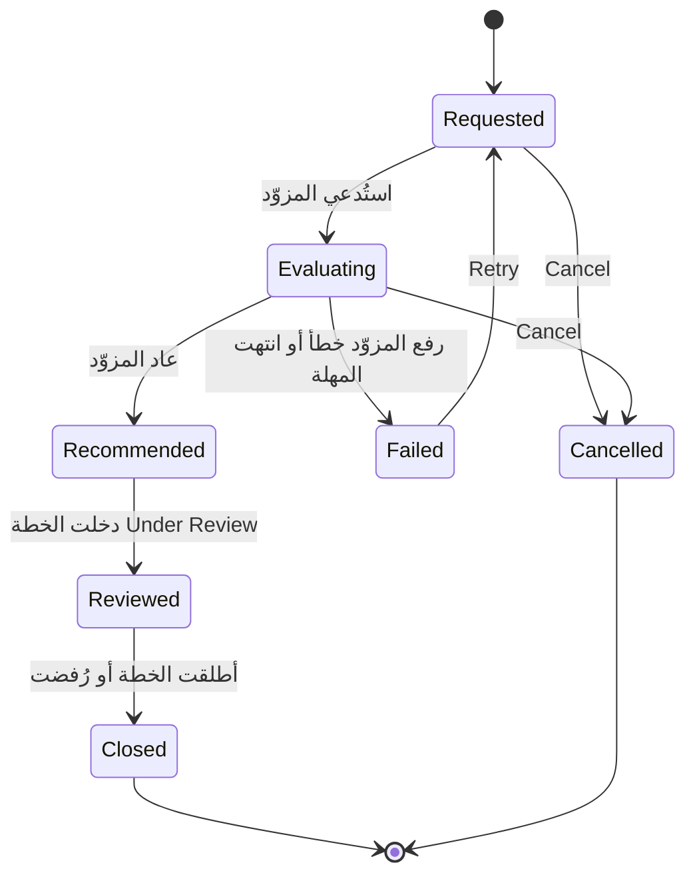

import DocumentInfo from '@site/src/components/DocumentInfo';
import Screenshot from '@site/src/components/Screenshot';

# دورات التخطيط

<DocumentInfo
  category="دليل المستخدم"
  audience={['تخطيط', 'عمليات', 'اختبار قبول المستخدم']}
  status="Draft"
  version="1.0"
  owner="فريق المنتج"
  updated="أغسطس 2026"
  readingTime="6 دقائق"
/>

**الدور**
المخطِّط. و**Replay Request** لمسؤول النظام وحده.

**انتقل إلى**
`SCOP → Planning → Planning Runs`

## ما هي دورة التخطيط

**محاولة** واحدة لبناء خطة، مع حفظ كل شيء عنها:

```text
ماذا سُئل   →   من سُئل   →   ماذا عاد   →   كم استغرق
```

فالخطة اليومية هي *ما قررنا فعله*. ودورة التخطيط هي *كيف وصلنا إلى ذلك القرار*.

:::info[لماذا يُحفظ الدليل]

بعد ستة أسابيع، يسأل أحدهم لماذا لم يُخدَم عميل في 25 أغسطس.

فبلا الدورة، الجواب الصادق هو «لا نعرف — فقد تغيّرت البيانات الرئيسية منذ ذلك الحين». ومعها، ترى بالضبط أي الطلبات عُرضت، وأي المركبات كانت متاحة، وما كانت سعاتها، وما قاله المزوّد عن كل واحد.

والطلب **حامل للقيم**: فالسعات والنوافذ والمسافات والمعدلات محلولة داخله قبل استدعاء المزوّد. فإعادة تشغيل دورة تستخدم المدخلات التي كانت لديها فعلاً، لا مدخلات اليوم.

:::

## القائمة

<Screenshot
  src="quick-start/14-planning-runs.png"
  alt="قائمة دورات التخطيط في SCOP تعرض الدورات بمزوّدها وحالتها وتوقيتها."
  caption="صف واحد لكل محاولة."
/>

| العمود | المعنى |
| --- | --- |
| **Reference** | معرِّف الدورة |
| **Plan Date** | اليوم الذي كانت تخطّط له |
| **Provider** | أساسي أو يدوي |
| **Provider Version** | أي إصدار أجاب |
| **Status** | إلى أين وصلت الدورة |
| **Duration** | كم استغرق المزوّد |
| **Plan** | الخطة التي أنتجتها |

## الحالات السبع



| الحالة | المعنى |
| --- | --- |
| **Requested** | الدورة موجودة؛ ولم يُستدعَ المزوّد بعد |
| **Evaluating** | المزوّد يعمل. والطلب وغلافه مُسجَّلان |
| **Recommended** | عاد جواب. والجواب مُسجَّل وأُنشئت خطة |
| **Reviewed** | دخلت الخطة الناتجة Under Review |
| **Failed** | رفع المزوّد خطأ أو انتهت مهلته |
| **Closed** | أُطلقت الخطة الناتجة أو رُفضت. **نهائية** |
| **Cancelled** | سُحبت. **نهائية** |

وحالة الدورة تتبع حالة الخطة. فأنت لا تدفعها.

## النموذج

<Screenshot
  src="user-manual/45-planning-run-form.png"
  alt="نموذج دورة تخطيط في SCOP يعرض المزوّد وإصداره والتوقيت وتبويبات الطلب والجواب والقواعد السارية."
  caption="دورة تخطيط على b2b: المزوّد الأساسي بإصدار 1.0.0، مع الاحتفاظ بطلبها وجوابها والقواعد التي كانت سارية."
/>

| التبويب | يحتوي |
| --- | --- |
| **Request** | ما سُئل عنه المزوّد بالضبط، كما خُزِّن |
| **Response** | ما عاد بالضبط |
| **Rules In Force** | أي قواعد عمل كانت سارية حين شُغِّلت هذه الدورة |

إضافةً إلى الترويسة: المزوّد وإصداره والتوقيت، وإن فشل فصنف الخطأ ورسالته.

:::info[Rules In Force هو ما يُنسى]

قواعد العمل مُصدَّرة. و*«لماذا سُمح بهذا في مارس ويُرفض الآن؟»* يُجاب عنه بمقارنة هذا التبويب بين دورتين، لا بالجدال حوله.

→ [نموذج الحوكمة](../concepts/the-governance-model.mdx)

:::

## الإجراءات

### Retry

| | |
| --- | --- |
| **متاح حين** | الدورة **Failed** |
| **الدور** | المخطِّط |
| **ما يفعله** | يعيد الدورة إلى **Requested** لتُحاوَل من جديد |

أصلِح السبب أولاً. فإعادة محاولة دورة لم تتغير تُعيد الإخفاق نفسه.

### Replay Request

| | |
| --- | --- |
| **متاح** | دائماً |
| **الدور** | **مسؤول النظام وحده** |
| **ما يفعله** | يعيد تنفيذ الطلب المخزَّن مقابل المزوّد |

وهذه أداة تشخيص، للإجابة عن *«هل سيفعل الشيء نفسه ثانيةً؟»* — لا وسيلة لإعادة توليد خطة. ولإعادة التخطيط استخدم المعالج.

### Cancel

| | |
| --- | --- |
| **متاح حين** | الدورة **Requested** أو **Evaluating** |
| **الدور** | المخطِّط |

## حين تفشل دورة

تتوقف الدورة عند **Failed** وتسجّل:

| الحقل | الاستخدام |
| --- | --- |
| **Error Class** | نوع الإخفاق |
| **Error Message** | التفصيل |

| نوع الخطأ | السبب المعتاد | العلاج |
| --- | --- | --- |
| خطأ وصول | نقص **Fleet → Administrator** أو **Employees → Officer** في Odoo | [مرجع الصلاحيات](../roles/permissions-reference.mdx) |
| انتهاء المهلة | المهلة قصيرة، أو الدورة كبيرة جداً | ارفع المهلة، أو خطّط طلبات أقل |
| خطأ بيانات | عقدة أو مركبة تنقصها بيانات مطلوبة | [عقد التخطيط](../configuration/planning-nodes.mdx) |

:::note[الدورة الفاشلة لا تُنشئ خطة]

لم يُقرَّر شيء، فلا شيء يُراجَع. وتبقى الطلبات **Eligible for Planning** ويمكن إدراجها في المحاولة التالية.

:::

## دورتان لليوم الواحد

أمر طبيعي تماماً. فكل محاولة دورتها الخاصة، وتُرقَّم الخطط تبعاً لذلك — `PLN-2026-09-01-01` ثم `-02`.

ولا تُكتب الدورات فوق بعضها أبداً. وهذا هو مقصد حفظها.

**مُتحقَّق منه على `b2b`:** أُنتجت دورتان لليوم نفسه، الأولى بمركبة صغيرة والثانية بمركبة بلا ملف سعة — فأعطت الأولى *Capacity shortage* والثانية *No feasible vehicle*، وكلتاهما محفوظتان جنباً إلى جنب.

## التحقق

| تحقّق | أين |
| --- | --- |
| أن الدورة سجّلت طلبها | تبويب **Request** |
| أنها سجّلت جواباً | تبويب **Response** |
| أنها أنتجت خطة | حقل **Plan** |
| أي قواعد كانت سارية | تبويب **Rules In Force** |
| كم استغرق المزوّد | المدة في الترويسة |

## إذا لم ينجح

| العَرَض | تحقّق من |
| --- | --- |
| الدورة عالقة في **Evaluating** | انتهت مهلتها غالباً. ابحث عن حالة **Failed** بعد انقضاء المهلة |
| **Retry** غير معروض | الدورة ليست في **Failed** |
| **Replay Request** غير معروض | لست مسؤول نظام |
| الجواب فارغ | لم يمكن تخطيط شيء. اقرأ الطلب غير المخطَّط |
| نجحت الدورة ولا توجد خطة | غير معتاد — راجع تبويب **Response** وأبلِغ عنه |

## صفحات ذات صلة

- [توليد خطة](./generate-a-plan.mdx)
- [الخطة اليومية](./the-daily-plan.mdx)
- [الطلب غير المخطَّط](./unplanned-demand.mdx)
- [جودة القرار](../reporting/decision-quality.mdx)

## التالي

[الخطة اليومية](./the-daily-plan.mdx).
