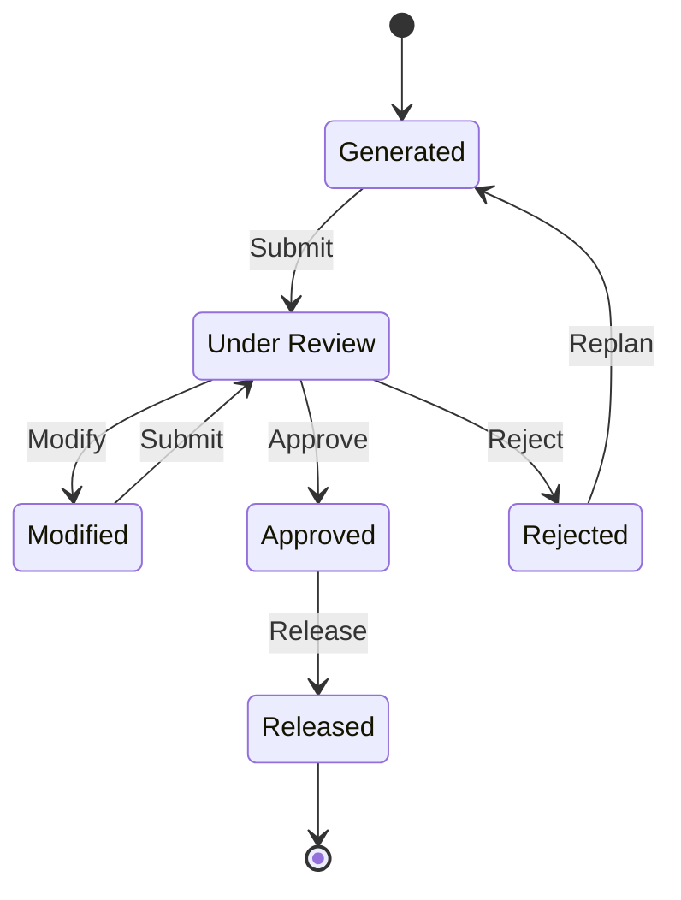

import DocumentInfo from '@site/src/components/DocumentInfo';
import Screenshot from '@site/src/components/Screenshot';

# الخطة اليومية

<DocumentInfo
  category="دليل المستخدم"
  audience={['تخطيط', 'عمليات', 'اختبار قبول المستخدم']}
  status="Draft"
  version="1.0"
  owner="فريق المنتج"
  updated="أغسطس 2026"
  readingTime="8 دقائق"
/>

**الدور**
المخطِّط يقترح ويعدّل. و**مدير العمليات يعتمد ويُطلق.**

**انتقل إلى**
`SCOP → Planning → Daily Plans`

## ما هي الخطة اليومية

خطة التشغيل المقترحة لـ**يوم واحد**: مجموعة رحلات، والطلبات التي تحملها، والطلبات التي لا تحملها.

ويحمل معرِّفها التاريخ الذي تخطّط له — فـ`PLN-2026-09-01-01` هي أول خطة بُنيت ليوم 1 سبتمبر 2026.

## الحالات الست

| الحالة | المعنى | من يحرّكها |
| --- | --- | --- |
| **Generated** | أنتجتها دورة. ولم ينظر فيها أحد بعد | المخطِّط |
| **Under Review** | مرفوعة للتصريح | مدير العمليات |
| **Modified** | غيّر مخطِّط التوصية. **وكان السبب إلزامياً** | المخطِّط |
| **Approved** | مُصرَّح بها. **ومُجمَّدة** | مدير العمليات |
| **Rejected** | مرفوضة. وكان السبب إلزامياً | المخطِّط |
| **Released** | عمل حقيقي. **نهائية** | — |

:::note[Released نهائية]

لا توجد حالة بعد **Released**. ومن تلك النقطة تعيش العملية في رحلاتها.

:::

## النموذج

<Screenshot
  src="quick-start/16-daily-plan-form.png"
  alt="نموذج الخطة اليومية في SCOP يعرض شريط الحالة وتاريخ الخطة وعدد الرحلات وعدد غير المخطَّط وتبويب Trips."
  caption="نموذج الخطة. وأعداد الرأس أسرع قراءة لجودة الخطة."
/>

<Screenshot
  src="user-manual/44-daily-plan-form.png"
  alt="نموذج الخطة اليومية في SCOP يعرض شريط الحالة وعدد الرحلات وعدد غير المخطَّط وتبويبات الرحلات وغير المخطَّط والاعتمادات والتوصية."
  caption="PLN-2026-09-01-01 على b2b: رحلة واحدة وطلب واحد غير مخطَّط. اقرأ عدد غير المخطَّط قبل الرحلات."
/>

### الترويسة

| الحقل | المعنى |
| --- | --- |
| **Reference** | `PLN-2026-09-01-01` |
| **Plan Date** | اليوم المُخطَّط له |
| **Objective Profile** | ما خُطِّطت تجاهه |
| **Planning Run** | المحاولة التي أنتجتها |
| **Trip Count** | كم رحلة |
| **Unplanned Count** | **كم طلباً لم يتّسع** |
| **Was Modified** و**Modification Count** و**Modified By** | سجل التغيير |
| **Created By** و**Approved By** و**Approved At** | سجل التصريح |

:::info[اقرأ عدد غير المخطَّط أولاً]

الخطة ذات أربع رحلات وأحد عشر طلباً غير مخطَّط ليست خطة جيدة، مهما بدت الرحلات مرتَّبة.

:::

### التبويبات الأربعة

| التبويب | يحتوي | اقرأه للإجابة عن |
| --- | --- | --- |
| **Trips** | كل رحلة، بمركبتها وسائقها وعدد محطاتها وجدواها | هل هذا اليوم قابل للتنفيذ فعلاً؟ |
| **Unplanned Demand** | ما لم يتّسع، ولماذا | ما الذي نختار ألّا نفعله؟ |
| **Approvals** | من اعتمد ومتى | من صرّح بهذا؟ |
| **Recommendation** | التوصية الأصلية، محفوظة | ماذا غيّر المخطِّط، ولماذا؟ |

:::info[التوصية محفوظة حتى بعد التعديل]

حين يعدّل مخطِّط خطة، تُحفظ التوصية الأصلية بجانب التغيير. وهذا ما تقيسه [جودة القرار](../reporting/decision-quality.mdx).

والغرض ليس مراقبة المخطِّطين، بل إظهار المواضع التي تكون فيها التوصية خاطئة باستمرار، فتُحسَّن.

:::

## مراجعة خطة

قبل فعل أي شيء، اقرأ ثلاثة أمور بهذا الترتيب:

| # | اقرأ | السؤال |
| --- | --- | --- |
| 1 | تبويب **Unplanned Demand** | ما الذي لا نفعله اليوم، وهل فيه عاجل؟ |
| 2 | تبويب **Trips** | هل هناك رحلة غير ممكنة السعة؟ |
| 3 | تبويب **Recommendation** | هل غيّر مخطِّط هذا، وبأي سبب مُعلَن؟ |

## Submit

| | |
| --- | --- |
| **من ← إلى** | Generated أو Modified ← Under Review |
| **الدور** | المخطِّط |
| **الفحوص** | لا شيء |

<Screenshot
  src="quick-start/18-plan-under-review.png"
  alt="خطة يومية في SCOP بحالة Under Review بانتظار الاعتماد."
  caption="Under Review. الخطة تنتظر الآن مدير عمليات لم يُنشئها."
/>

## Modify

| | |
| --- | --- |
| **من ← إلى** | Under Review ← Modified |
| **الدور** | المخطِّط |
| **الفحوص** | **سبب تجاوز إلزامي** |

**ما تفعله SCOP**

| الأثر | التفصيل |
| --- | --- |
| تسجّل السبب | من رموز أسباب التجاوز التسعة |
| تزيد عدّاد التعديل | مرئي على الخطة وفي جودة القرار |
| تسجّل من عدّل | **Modified By** |
| **تحفظ التوصية** | الأصل محفوظ لا مكتوب فوقه |

### أسباب التجاوز التسعة

| السبب | استخدمه حين |
| --- | --- |
| Operational information unavailable to the engine | تعرف شيئاً لا يعرفه النظام |
| Customer instruction | طلب العميل ذلك |
| Management instruction | تعليمات من أعلى |
| Incorrect master data | البيانات خاطئة ويجري إصلاحها |
| Unexpected warehouse condition | تغيّر شيء على الأرض |
| Driver or vehicle issue | قيد نقل |
| Local route knowledge | تعرف الأرض |
| Service-risk judgment | حكم خدمة متعمَّد |
| Emergency requirement | حالة طارئة |

:::note[اختر السبب الصحيح]

هذه تُجمَّع وتُحسب. فالمخطِّط الذي يختار دائماً *Local route knowledge* يُنتج تقريراً يقول إن نموذج المسارات خاطئ، بينما كان الجواب الحقيقي ربما *Incorrect master data* — وهو ما كان يمكن لأحد إصلاحه.

:::

وبعد التعديل، اضغط **Submit** ثانيةً لإعادتها للمراجعة.

## Reject

| | |
| --- | --- |
| **من ← إلى** | Under Review ← Rejected |
| **الدور** | مدير العمليات |
| **الفحوص** | **سبب رفض إلزامي** |

استخدمه حين تكون الخطة خاطئة بما لا يُصلحه التعديل. ثم يضغط المخطِّط **Replan**.

## Replan

<Screenshot
  src="quick-start/21-plan-released.png"
  alt="الخطة اليومية في SCOP بحالة Released."
  caption="Released. ومن هنا تعيش العملية في الرحلات."
/>

| | |
| --- | --- |
| **من ← إلى** | Rejected ← Generated |
| **الدور** | المخطِّط |
| **ما يفعله** | يطلب **دورة تخطيط جديدة** |

## Approve وRelease

كلاهما لمدير العمليات، وكلاهما يحكمه `BR-PLN-001`.

:::danger[مؤلف الخطة لا يستطيع اعتمادها ولا إطلاقها]

بما في ذلك مسؤول النظام. وهذا فصل مهام يعلو على كل صلاحية إدارية في النظام.

**مُتحقَّق منه على `b2b`:** رُفض اعتماد مسؤول النظام لخطته، ثم اعتمدها مدير عمليات لم يُنشئها ونجح.

→ [حوكمة الخطة](./plan-governance.mdx)

:::

<Screenshot
  src="quick-start/20-plan-approved.png"
  alt="خطة يومية في SCOP بحالة Approved تعرض من اعتمدها ووقت الاعتماد."
  caption="معتمَدة. الخطة مُجمَّدة وتسجّل من صرّح بها."
/>

### ماذا يفعل الإطلاق

<Screenshot
  src="user-manual/80-plan-approved-released.png"
  alt="خطة يومية في SCOP بحالة Released تعرض Approved By وApproved At والرحلة التي أُطلقت."
  caption="PLN-2026-09-01-01 بعد اعتماد مدير العمليات وإطلاقه. Approved By يسمّي شخصاً مختلفاً عن Created By — وهذا BR-PLN-001 مُستوفى لا متجاوَز."
/>

| الأثر | النتيجة |
| --- | --- |
| الرحلات ← **Released** | تصبح مرئية لسائقيها في **My Trips** |
| الطلبات ← **Released** | مُلتزَم بها لليوم |
| إسنادات الموارد ← **committed** | تُحجَز المركبات والسائقون |
| **إنشاء مهام التحميل** | واحدة لكل شحنة على كل رحلة |

والأخيرة هي اللحظة التي يحصل فيها المستودع على عمله. راجع [عمليات التحميل](../execution/loading-operations.mdx).

## الخطة المعتمَدة مُجمَّدة

بعد الاعتماد يصبح محتوى الخطة **نسخة اليوم المُصرَّح بها**. ولا تُعدَّل بعد ذلك.

وإن تغيّر اليوم بعد الاعتماد، أُجري التغيير على **الرحلة**، وهي تحمل اعتمادها الخاص وسجلها الخاص لما حدث.

## التحقق

| تحقّق | أين | توقّع |
| --- | --- | --- |
| أن الخطة مُطلَقة | شريط الحالة | **Released** |
| من اعتمدها | **Approved By** و**Approved At** | شخص ليس المؤلف |
| أن الرحلات مُطلَقة | تبويب **Trips** | الحالة **Released** |
| أن الطلبات مُطلَقة | `Operations → Demands` | الحالة **Released** |
| وجود مهام التحميل | `Operations → Loading Tasks` | واحدة لكل شحنة على كل رحلة |
| أن المركبات محجوزة | `Operations → Resource Assignments` | الحالة **committed** |

## إذا لم ينجح

| العَرَض | السبب |
| --- | --- |
| **Approve** غير معروض | الخطة ليست **Under Review** |
| **Approve** يُرفض برسالة فصل مهام | أنت أنشأت هذه الخطة |
| **Approve** يُرفض لسبب آخر | لست مدير عمليات |
| **Modify** يُرفض | لم تختر سبب تجاوز |
| **Reject** يُرفض | لم تختر سبب رفض |
| **Release** يُرفض | رحلة تحمل نتيجة حاجبة — `BR-PLN-002` |
| مُطلَقة بلا مهام تحميل | راجع [مهام التحميل مفقودة](../troubleshooting/execution-problems.mdx) |
| مُطلَقة والسائق لا يرى شيئاً | لا سائق مُسنَد للرحلة |

## صفحات ذات صلة

- [حوكمة الخطة](./plan-governance.mdx)
- [دورات التخطيط](./planning-runs.mdx)
- [الطلب غير المخطَّط](./unplanned-demand.mdx)
- [الرحلات](../execution/trips.mdx)
- [جودة القرار](../reporting/decision-quality.mdx)

## التالي

[حوكمة الخطة](./plan-governance.mdx).
