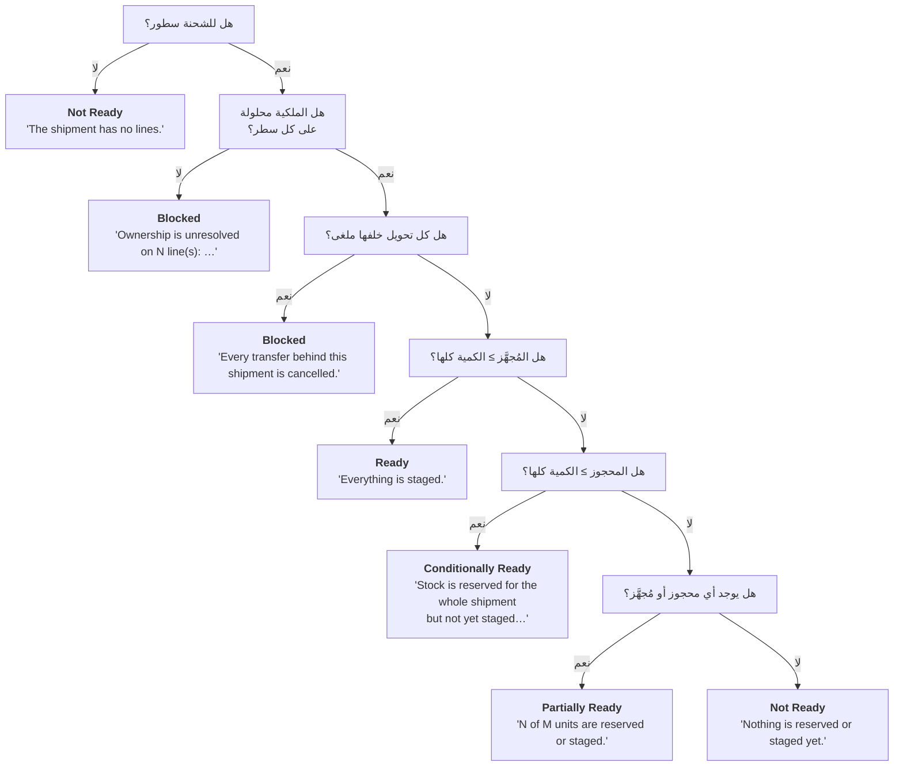

import DocumentInfo from '@site/src/components/DocumentInfo';
import Screenshot from '@site/src/components/Screenshot';

# جاهزية المستودع

<DocumentInfo
  category="دليل المستخدم"
  audience={['مستودعات', 'تخطيط', 'عمليات', 'اختبار قبول المستخدم']}
  status="Draft"
  version="1.0"
  owner="فريق المنتج"
  updated="أغسطس 2026"
  readingTime="9 دقائق"
/>

:::info[هذه هي الصفحة المرجعية لحالات الجاهزية الخمس]

تحيل الفصول الأخرى إلى هنا بدل إعادة الشرح.

:::

**الدور**
المستودع يملكها. والمخطِّط يعتمد عليها.

**انتقل إلى**
`SCOP → Operations → Warehouse Readiness`

## ما تجيب عنه الجاهزية

سؤال واحد: **هل تستطيع هذه الشحنة التحرك فعلاً، ولماذا؟**

وتحمل تعليلها **بالكلمات** دائماً، فيجد المخطِّط الذي يسأل *«لماذا هذه ليست جاهزة»* جواباً دون أن يسأل أحداً.

## محسوبة لا مكتوبة

الجاهزية جواب سؤال تعرفه قاعدة البيانات أصلاً: هل التحويلات محجوزة، وهل المخزون مُخصَّص، وهل جُهِّز، وهل الملكية محلولة.

:::warning[لا يوجد حقل جاهزية تملؤه]

قيمة الجاهزية التي يكتبها مشغّل تصبح قديمة في لحظة تحرّك أي شيء. والجاهزية تقع على الحدّ بين المستودع والتخطيط، والقيمة القديمة هناك تُرسل مركبة لاستلام بضائع ليست موجودة.

والاستثناء الوحيد **تجاوز المشرف**، وهو مُسجَّل ومنسوب ومعروض بجانب الحساب لا بديلاً عنه.

:::

## الحالات الخمس

| الجاهزية | المعنى | قابلة للتخطيط؟ |
| --- | --- | --- |
| **Ready** | كل شيء مُجهَّز | **نعم** |
| **Conditionally Ready** | المخزون محجوز لكامل الشحنة لكنه لم يُجهَّز بعد، فيُتوقَّع توفّره قبل التنفيذ | **نعم** |
| **Partially Ready** | جزء فقط من الشحنة يمكن تغطيته | لا |
| **Not Ready** | البضائع غير مُجهَّزة، أو الشحنة بلا سطور | لا |
| **Blocked** | يجب إصلاح شيء أولاً | لا |

<Screenshot
  src="user-manual/97-readiness-all-states.png"
  alt="قائمة جاهزية المستودع في SCOP تعرض شحنات Ready و Conditionally Ready و Partially Ready و Blocked بعمود Is Plannable."
  caption="أربع حالات جنباً إلى جنب على b2b. و«Is Plannable» غير مؤشَّر لـ Partially Ready و Blocked، ومؤشَّر للأخريين — القاعدة كلها في عمود واحد."
/>

وقد أُعيد إنتاج الخمس كلها على `b2b` لأجل هذا الدليل، كلٌّ بالدليل الذي كتبته:

| الحالة | الدليل حرفياً | قابلة للتخطيط |
| --- | --- | --- |
| **Ready** | *"Everything is staged."* | **نعم** |
| **Conditionally Ready** | *"Stock is reserved for the whole shipment but not yet staged, so it is expected to be available before execution."* | **نعم** |
| **Partially Ready** | *"4.0 of 10.0 units are reserved or staged."* | لا |
| **Not Ready** | *"Nothing is reserved or staged yet."* | لا |
| **Blocked** — الملكية | *"Ownership is unresolved on 1 line(s): [QS-DEMO-01] QS Demo Chilled Box 10kg."* | لا |
| **Blocked** — الإلغاء | *"Every transfer behind this shipment is cancelled."* | لا |

:::info[لماذا تُعَد Conditionally Ready قابلة للتخطيط]

لأن هذا ما تعنيه القيمة — يُتوقَّع توفّرها قبل التنفيذ. واستبعادها سيجعل التصنيف زخرفياً، وسيمنع مستودعاً من تخطيط عمل ينوي تجهيزه تماماً.

:::

<Screenshot
  src="user-manual/98-readiness-blocked-form.png"
  alt="سجل جاهزية مستودع محجوب في SCOP يعرض الحالة المحسوبة وجملة الدليل ومربع Is Plannable غير المؤشَّر وقسم التجاوز الفارغ."
  caption="سجل Blocked على b2b. والدليل يسمّي السبب، والمحادثة أسفله تسجّل تحرّك الجاهزية في الاتجاهين بتغيّر الأدلة."
/>

<Screenshot
  src="user-manual/99-readiness-partial-form.png"
  alt="سجل جاهزية مستودع جاهز جزئياً في SCOP يعرض جملة الدليل تعدّ الوحدات المحجوزة مقابل الإجمالي."
  caption="Partially Ready تعدّ الوحدات. و«Is Plannable» غير مؤشَّر — فالطلب يمكن أن يكون مؤهَّلاً بينما شحنته غير قابلة للتخطيط."
/>

## الترتيب الذي تُجرى به الفحوص

**الترتيب أهم من الفحوص المفردة.** تُقيّم SCOP من الأعلى إلى الأسفل وتتوقف عند أول تطابق.

:::warning[Blocked تُفحص قبل أي كمية]

الشحنة التي مالكها غير محلول **ليست** «جاهزة جزئياً» — بل غير قابلة للتخطيط إطلاقاً.

وفحص الملكية أولاً هو ما يمنع منصّة مُجهَّزة جيداً من حجب مشكلة قانونية.

:::

## قراءة الدليل

يذكر حقل **Evidence** تعليل الحساب حرفياً. وهذه هي الرسائل بالضبط:

| نص الدليل | الحالة | ما تفعله |
| --- | --- | --- |
| *"The shipment has no lines."* | Not Ready | تحقّق لماذا الشحنة فارغة |
| *"Ownership is unresolved on N line(s): …"* | **Blocked** | [صحّح الملكية](../ownership/correcting-ownership.mdx). المنتجات مُسمّاة |
| *"Every transfer behind this shipment is cancelled."* | **Blocked** | الحركة لن تحدث. ألغِ الشحنة |
| *"Everything is staged."* | Ready | لا شيء |
| *"Stock is reserved for the whole shipment but not yet staged…"* | Conditionally Ready | جهّزها متى ناسبك. يمكن تخطيطها أصلاً |
| *"N of M units are reserved or staged."* | Partially Ready | احجز أو جهّز الباقي |
| *"Nothing is reserved or staged yet."* | Not Ready | احجز المخزون في Odoo |

## من أين يُقرأ «المحجوز»

تقرأ الجاهزية **سطور حركة Odoo مباشرةً** — ما حجزه المستودع فعلاً الآن.

:::note[الجاهزية والتخصيص يقرآن أشياء مختلفة]

**التخصيص** إسقاط، يُحدَّث فقط عند التحقق من الطلب أو تأهيله.

**والجاهزية** تقرأ Odoo الآن. فلو سألت الإسقاط لكانت تقيس متى شُغِّل الإسقاط آخر مرة لا ما في المستودع.

فتغيير حجز في Odoo يحرّك الجاهزية فوراً، والتخصيص لا يتحرك حتى البوابة التالية.

:::

## قائمة الجاهزية ونموذجها

<Screenshot
  src="user-manual/04-warehouse-readiness-list.png"
  alt="قائمة جاهزية المستودع في SCOP تعرض الحالة المحسوبة والتجاوز والجاهزية السارية وعلم القابلية للتخطيط."
  caption="سطر لكل شحنة، بالقيمة المحسوبة وأي تجاوز معروضين جنباً إلى جنب."
/>

<Screenshot
  src="quick-start/11-warehouse-readiness-list.png"
  alt="قائمة جاهزية المستودع في SCOP تعرض شحنةً واحدة بجاهزية Ready."
  caption="سطر لكل شحنة، بحالة الجاهزية والعقدة التي تُهيِّئ البضائع."
/>

<Screenshot
  src="quick-start/12-warehouse-readiness-form.png"
  alt="نموذج جاهزية المستودع في SCOP يعرض الحالة المحسوبة وحالة التجاوز ونص الدليل وعلم القابلية للتخطيط."
  caption="سجل الجاهزية. والدليل يشرح الحساب بكلمات واضحة."
/>

<Screenshot
  src="user-manual/91-readiness-ready-and-conditional.png"
  alt="قائمة جاهزية المستودع في SCOP تعرض شحنة Ready وأخرى Conditionally Ready، ولكلٍّ دليلها."
  caption="حالتا جاهزية جنباً إلى جنب على b2b. كلتاهما قابلة للتخطيط؛ والفرق هل جُهِّزت البضائع بعد."
/>

| العمود | المعنى |
| --- | --- |
| **Shipment** | أي شحنة تخصّها هذه الجاهزية |
| **Location** | العقدة التي تجهّز البضائع |
| **Computed** | ما يقوله الدليل |
| **Override** | ما قاله مشرف بدلاً منه، إن وُجد |
| **Readiness** | القيمة الفعلية — التجاوز إن وُجد، وإلا المحسوبة |
| **Plannable** | هل يجوز للتخطيط استخدامها |

<Screenshot
  src="user-manual/92-readiness-form-ready.png"
  alt="نموذج جاهزية المستودع في SCOP يعرض الحالة المحسوبة وحالة التجاوز ونص الدليل وعلامة القابلية للتخطيط."
  caption="سجل الجاهزية. ويشرح الدليل الحساب بكلمات واضحة."
/>

ولكل شحنة سجل جاهزية **واحد** بالضبط.

## التجهيز

**الدور** المستودع
**انتقل إلى** `SCOP → Operations → Shipments` ← افتح الشحنة
**ما يجب فعله** اضغط **Stage Everything**

استخدمه حين تكون بضائع **الشحنة كاملةً** مُنتقاة فعلياً وواقفة في منطقة التجهيز جاهزة للتحميل. فهو اختصار للتأكيد سطراً سطراً — فلا تستخدمه إلا حين يكون ذلك صحيحاً فعلاً.

| ما تفعله SCOP | النتيجة |
| --- | --- |
| تعلّم كل سطر شحنة مُجهَّزاً | الكمية المُجهَّزة تساوي كمية الشحنة |
| تعيد حساب الجاهزية | عادةً **Ready**، والدليل *"Everything is staged."* |

<Screenshot
  src="user-manual/93-shipment-staged.png"
  alt="نموذج الشحنة في SCOP بعد التجهيز، ويعرض الجاهزية Ready."
  caption="بعد Stage Everything: الجاهزية Ready. والشحنة قابلة للتخطيط بثبات الآن."
/>

ولا يمكنك تجهيز أكثر مما تطلبه الشحنة. ترفض SCOP ذلك.

:::note[التجهيز حالة لا مستند]

أنت تسجّل أن البضائع مُهيّأة. ولا يُنشأ سجل جديد.

:::

### Refresh Readiness

يعيد **Refresh Readiness** الحساب من الأدلة الحالية دون تغيير شيء. استخدمه حين تكون قد غيّرت شيئاً في Odoo وتريد رؤية الأثر.

وهو متاح دائماً لكل من يستطيع فتح الشحنة.

## تجاوز المشرف

المشرف الواقف في المستودع يرى ما لا تراه قاعدة البيانات — منصّة على الرصيف لم يلحق بها Odoo بعد، أو عميلاً رفض تسليماً للتو.

| الحقل | الغرض |
| --- | --- |
| **Override Readiness** | الحالة التي تؤكّدها بدلاً منها |
| **Override Reason** | **إلزامي.** يُختار من رموز أسباب التجاوز |
| **Override By** / **Override At** | يُسجَّلان تلقائياً |

### تطبيقه

1. افتح سجل الجاهزية.
2. اضبط **Override Readiness** على الحالة التي تؤكّدها.
3. اختر **Override Reason**.
4. اضغط **Apply Override**.

والحقلان إلزاميان. فترفض SCOP تجاوزاً بلا حالة — وترفض تجاوزاً بلا سبب، لأنه يعلو على الدليل فوجب أن يقول لماذا.

### مسحه

اضغط **Clear Override**. فتعود الجاهزية إلى القيمة المحسوبة فوراً.

:::info[التجاوز لا يخفي ما تجاوزه أبداً]

تبقى القيمة المحسوبة مرئية بجانب التجاوز. فالتجاوز الذي يخفي الحساب سيجعل الحساب غير قابل للتدقيق، وهو أسوأ من عدم وجوده أصلاً.

:::

### أسباب التجاوز التسعة

| السبب | الاستخدام المعتاد |
| --- | --- |
| Operational information unavailable to the engine | النظام لا يعرف ما تراه أنت |
| Unexpected warehouse condition | تغيّر شيء على الأرض |
| Incorrect master data | البيانات خاطئة ويجري إصلاحها |
| Customer instruction | طلب العميل ذلك |
| Management instruction | تعليمات من أعلى |
| Driver or vehicle issue | مشكلة نقل |
| Local route knowledge | تعرف الأرض |
| Service-risk judgment | حكم خدمة متعمَّد |
| Emergency requirement | حالة طارئة |

:::warning[التجاوز قابل للتدقيق ومنسوب]

من طبّقه ومتى ولماذا كلها مُسجَّلة ومتتبَّعة. استخدمه حين تعرف فعلاً أكثر من الدليل — لا لتجاوز حجب ينبغي إصلاحه.

وبخاصة: تجاوز جاهزية **Blocked** بسبب ملكية غير محلولة **لا يحلّ الملكية**. وسيظل `BR-INV-002` يرفض التحقق من الطلب.

:::

## ما تتحكم فيه الجاهزية

| الجاهزية | الأثر |
| --- | --- |
| **Ready** أو **Conditionally Ready** | الشحنة **قابلة للتخطيط**. وحالتها قد تبلغ **Ready** |
| **Partially Ready** | يستطيع الطلب أن يصبح **Eligible for Planning**، لكن الشحنة **غير قابلة للتخطيط** |
| **Not Ready** أو **Blocked** | لا يستطيع الطلب أن يصبح مؤهَّلاً أصلاً |

:::warning[Partially Ready هي المربكة]

تتيح للطلب أن يصبح مؤهَّلاً، لكنها **لا** تجعل الشحنة قابلة للتخطيط.

والطلب الجالس في **Eligible for Planning** الذي لا يظهر في خطة أبداً هو هذا في الغالب. افحص جاهزية الشحنة، لا حالة الطلب.

:::

## التحقق

| تحقّق | أين | توقّع |
| --- | --- | --- |
| حالة الجاهزية | `Operations → Warehouse Readiness` | القيمة التي تتوقعها |
| لماذا | حقل **Evidence** | جملة تشرحها |
| هل يجوز للتخطيط استخدامها | علامة **Plannable** | صحيحة لـ Ready وConditionally Ready |
| الأثر على الشحنة | حالة الشحنة | **Ready** متى صارت قابلة للتخطيط |

## إذا لم ينجح

| العَرَض | تحقّق من |
| --- | --- |
| تبقى **Blocked** | ملكية غير محلولة على سطر أو أكثر — الدليل يسمّي المنتجات |
| تبقى **Blocked** والملكية تبدو سليمة | كل تحويل خلف الشحنة ملغى |
| تبقى **Not Ready** | الشحنة بلا سطور، أو لا شيء محجوز في Odoo |
| عالقة في **Partially Ready** | جزء فقط من الكمية محجوز أو مُجهَّز |
| **Stage Everything** بلا أثر ظاهر | اضغط **Refresh Readiness** |
| **Stage Everything** غير معروض | لست مستخدم مستودع، أو الشحنة تجاوزت **Ready** |
| التجهيز مرفوض | لا يمكنك تجهيز أكثر مما تطلبه الشحنة |
| الجاهزية **تراجعت** | صحيح — أُلغي حجز أو أُلغي تحويل |
| Staged % يُظهر `10000%` | خلل عرض معروف — راجع [نطاق الإصدار الأول](../about/release-1-scope.mdx) |

## صفحات ذات صلة

- [إدارة الشحنات](../shipments/shipment-management.mdx)
- [ملكية المخزون](../ownership/inventory-ownership.mdx)
- [أهلية التخطيط](../demand/planning-eligibility.mdx)
- [مشكلات الجاهزية والشحنات](../troubleshooting/readiness-and-shipment-problems.mdx)

## التالي

[نظرة عامة على التخطيط](../planning/planning-overview.mdx).
