import DocumentInfo from '@site/src/components/DocumentInfo';

# مرجع دورات الحياة

<DocumentInfo
  category="دليل المستخدم"
  audience={['عمليات', 'تخطيط', 'مستودعات', 'إدارة', 'اختبار قبول المستخدم']}
  status="Draft"
  version="1.0"
  owner="فريق المنتج"
  updated="أغسطس 2026"
  readingTime="10 دقائق"
/>

## ما في هذه الصفحة

كل **دورة حياة محكومة** في الإصدار الأول من SCOP، في مكان واحد. اثنتا عشرة آلة حالات عبر عشرة كائنات.

:::info[هذه الرسوم تأتي من المواصفة التي يفرضها النظام]

تحتفظ SCOP بمواصفة مرجعية واحدة لكل دورة حياة، والشيفرة العاملة تُختبَر مقابلها. فالانتقال غير الموجود في المواصفة لا يمكن تنفيذه، والانتقال الذي تسمح به الشيفرة ولا تسمح به المواصفة يُفشِل البناء.

فهذه الرسوم ليست وصفاً للنظام — بل هي المصدر نفسه الذي يطيعه.

:::

## كيف تقرؤها

| على الرسم | يعني |
| --- | --- |
| سهمٌ بعنوان | انتقال، وما يُطلقه |
| حالةٌ بلا سهم خارج منها | **نهائية** — لا شيء يغادرها |
| زرٌّ مسمًّى في العنوان | يضغطه أحدهم |
| أي شيء آخر في العنوان | يحدث لأن شيئاً آخر حدث |

:::warning[لا تستطيع ضبط حالة مباشرةً]

كل حالة محكومة لا تتحرك إلا عبر انتقالها هي. فكتابة حالة يدوياً كانت ستتخطى الفحوص الملازمة للحركة، و SCOP ترفضها.

:::

---

## الطلب

دورة الحياة التشغيلية الجوهرية. اثنتا عشرة حالة.

**النموذج** `scop.demand` · **الحقل** `state` · **12 حالة** · **17 انتقالاً**

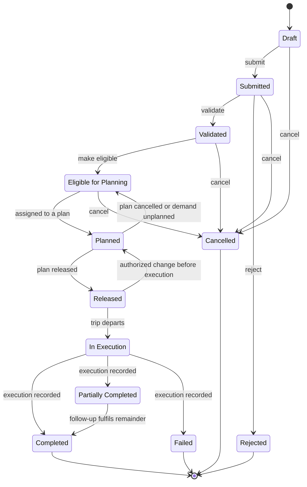

| الحالة | التسمية | نهائية |
| --- | --- | --- |
| `draft` | **Draft** | لا |
| `submitted` | **Submitted** | لا |
| `validated` | **Validated** | لا |
| `eligible` | **Eligible for Planning** | لا |
| `planned` | **Planned** | لا |
| `released` | **Released** | لا |
| `in_execution` | **In Execution** | لا |
| `partially_completed` | **Partially Completed** | لا |
| `completed` | **Completed** | **نعم** |
| `failed` | **Failed** | **نعم** |
| `rejected` | **Rejected** | **نعم** |
| `cancelled` | **Cancelled** | **نعم** |

**الانتقالات المُبوَّبة** — وهذه تقيّم قواعد العمل قبل المضيّ:

| من ← إلى | البوابة | الحارس |
| --- | --- | --- |
| submitted → validated | `demand_validate` | ownership resolved on every line |
| validated → eligible | `demand_eligible` | readiness in (ready, conditionally_ready, partially_ready) |

**الانتقالات ذات الآثار اللاحقة:**

| من ← إلى | ماذا يحدث كذلك |
| --- | --- |
| planned → eligible | scop.unplanned.demand row written |
| in_execution → partially_completed | follow-up demand created |
| in_execution → failed | follow-up demand created |

→ [الطلب بالكامل](../demand/demand-lifecycle.mdx)

---

## الطلب — دورة حياة المرتجع الفرعية

تعمل إلى جانب دورة الحياة الرئيسة لطلبات نوع Return.

**النموذج** `scop.demand` · **الحقل** `return_state` · **5 حالات** · **4 انتقالات**

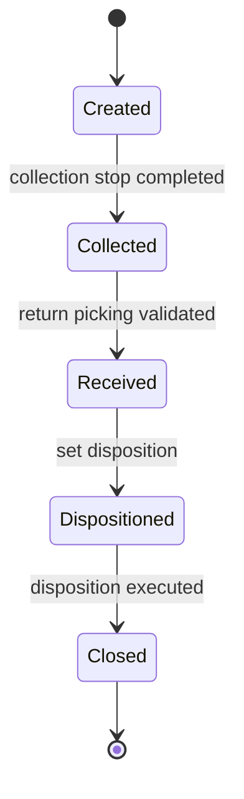

| الحالة | التسمية | نهائية |
| --- | --- | --- |
| `created` | **Created** | لا |
| `collected` | **Collected** | لا |
| `received` | **Received** | لا |
| `dispositioned` | **Dispositioned** | لا |
| `closed` | **Closed** | **نعم** |

→ [الطلب بالكامل](../demand/demand-completion.mdx)

---

## الشحنة

متطلب النقل القابل للتخطيط. ويستطيع التراجع حين تتراجع الجاهزية.

**النموذج** `scop.shipment` · **الحقل** `state` · **6 حالات** · **9 انتقالات**

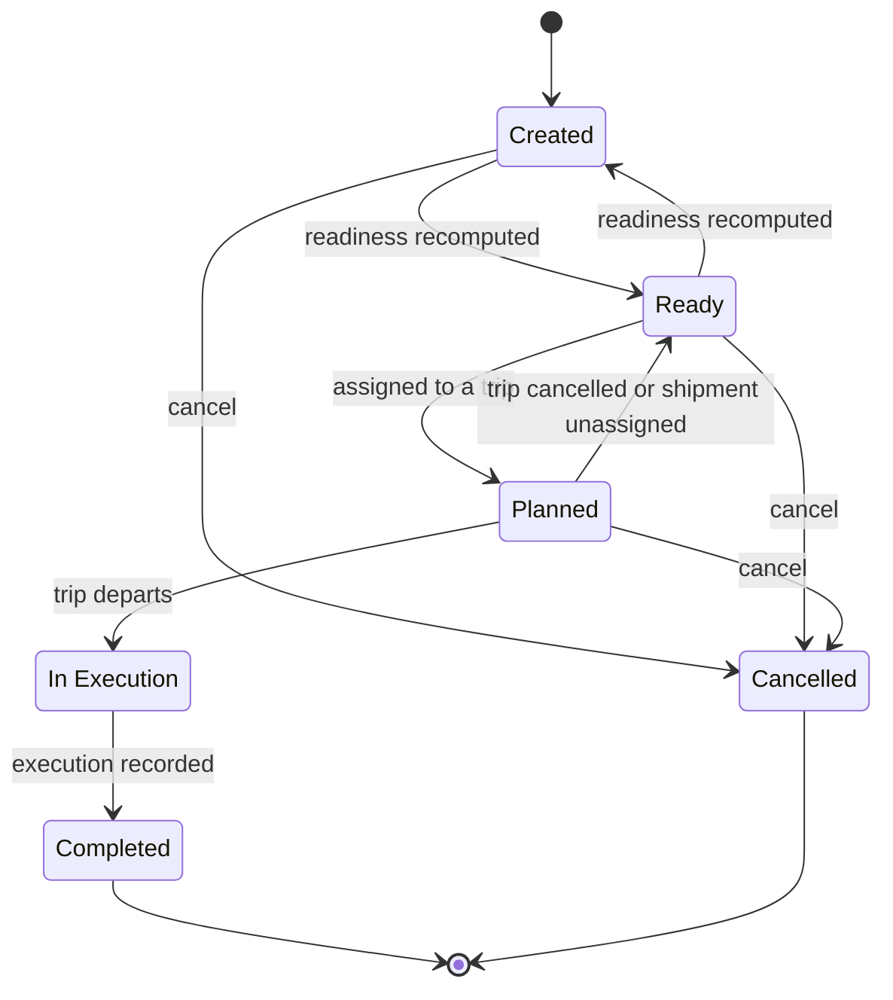

| الحالة | التسمية | نهائية |
| --- | --- | --- |
| `created` | **Created** | لا |
| `ready` | **Ready** | لا |
| `planned` | **Planned** | لا |
| `in_execution` | **In Execution** | لا |
| `completed` | **Completed** | **نعم** |
| `cancelled` | **Cancelled** | **نعم** |

→ [الشحنة بالكامل](../shipments/shipment-management.mdx)

---

## الخطة اليومية

محكومة بـ BR-PLN-001 و BR-PLN-002. و Released نهائية.

**النموذج** `scop.plan` · **الحقل** `state` · **6 حالات** · **7 انتقالات**

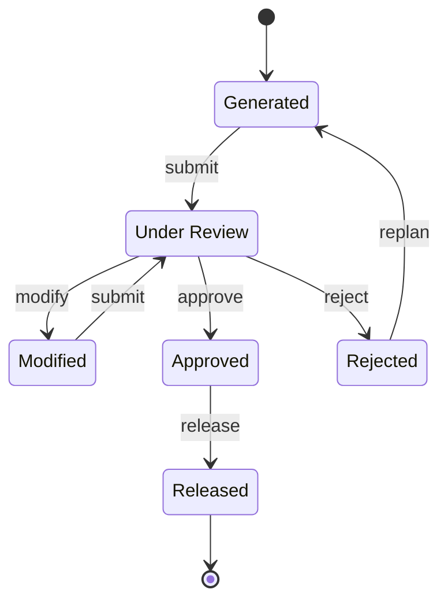

| الحالة | التسمية | نهائية |
| --- | --- | --- |
| `generated` | **Generated** | لا |
| `under_review` | **Under Review** | لا |
| `modified` | **Modified** | لا |
| `approved` | **Approved** | لا |
| `rejected` | **Rejected** | لا |
| `released` | **Released** | **نعم** |

**الانتقالات المُبوَّبة** — وهذه تقيّم قواعد العمل قبل المضيّ:

| من ← إلى | البوابة | الحارس |
| --- | --- | --- |
| under_review → approved | `plan_approve` | no failed_blocking finding; approver != create_uid (BR-PLN-001); scop.approval.authority.forbid_self_approval honoured |
| approved → released | `plan_release` | authority check(release) |

**الانتقالات ذات الآثار اللاحقة:**

| من ← إلى | ماذا يحدث كذلك |
| --- | --- |
| under_review → approved | scop.plan.approval row written |
| under_review → modified | modification_count += 1; modified_by set; recommended_snapshot preserved |
| approved → released | trips -> released; demands -> released; resource assignments -> reserved |
| rejected → generated | a new scop.plan.run is requested |

→ [الخطة اليومية بالكامل](../planning/the-daily-plan.mdx)

---

## تشغيلة التخطيط

محاولةٌ واحدة لبناء خطة. وتتبع الخطة التي أنتجتها.

**النموذج** `scop.plan.run` · **الحقل** `state` · **7 حالات** · **8 انتقالات**

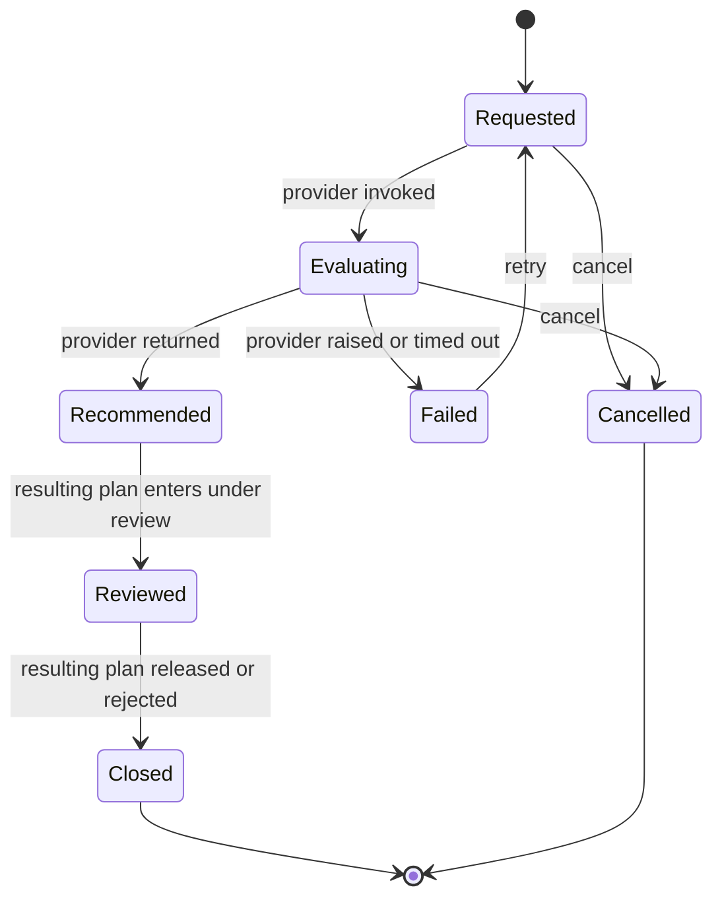

| الحالة | التسمية | نهائية |
| --- | --- | --- |
| `requested` | **Requested** | لا |
| `evaluating` | **Evaluating** | لا |
| `recommended` | **Recommended** | لا |
| `reviewed` | **Reviewed** | لا |
| `failed` | **Failed** | لا |
| `closed` | **Closed** | **نعم** |
| `cancelled` | **Cancelled** | **نعم** |

**الانتقالات ذات الآثار اللاحقة:**

| من ← إلى | ماذا يحدث كذلك |
| --- | --- |
| requested → evaluating | request_json and the 12-field envelope written |
| evaluating → recommended | response_json written; scop.plan created in state generated |
| evaluating → failed | error_class and error_message set |

→ [تشغيلة التخطيط بالكامل](../planning/planning-runs.mdx)

---

## الرحلة

ثلاث عشرة حالة. والستُّ الأُوَل تسوقها الخطة اليومية.

**النموذج** `scop.trip` · **الحقل** `state` · **13 حالة** · **22 انتقالاً**

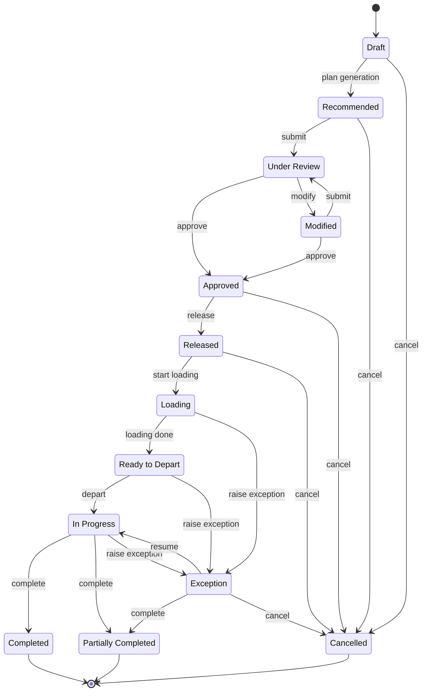

| الحالة | التسمية | نهائية |
| --- | --- | --- |
| `draft` | **Draft** | لا |
| `recommended` | **Recommended** | لا |
| `under_review` | **Under Review** | لا |
| `modified` | **Modified** | لا |
| `approved` | **Approved** | لا |
| `released` | **Released** | لا |
| `loading` | **Loading** | لا |
| `ready_to_depart` | **Ready to Depart** | لا |
| `in_progress` | **In Progress** | لا |
| `exception` | **Exception** | لا |
| `completed` | **Completed** | **نعم** |
| `partially_completed` | **Partially Completed** | **نعم** |
| `cancelled` | **Cancelled** | **نعم** |

**الانتقالات المُبوَّبة** — وهذه تقيّم قواعد العمل قبل المضيّ:

| من ← إلى | البوابة | الحارس |
| --- | --- | --- |
| under_review → approved | `trip_approve` | no failed_blocking finding |
| modified → approved | `trip_approve` | no failed_blocking finding |
| approved → released | `trip_release` | authority check(release) |
| loading → ready_to_depart | `trip_depart` | — |

**الانتقالات ذات الآثار اللاحقة:**

| من ← إلى | ماذا يحدث كذلك |
| --- | --- |
| approved → released | resource assignments -> committed |
| approved → cancelled | resource assignments -> cancelled |
| released → cancelled | resource assignments -> cancelled |
| loading → ready_to_depart | loads -> loaded |
| loading → exception | scop.service.exception invoked |
| ready_to_depart → in_progress | actual_start set; loads -> in_transit; demands -> in_execution |
| ready_to_depart → exception | scop.service.exception invoked |
| in_progress → completed | actual_end set; resource assignments -> closed; loads -> closed |
| in_progress → partially_completed | actual_end set; resource assignments -> closed; loads -> closed; follow-up demand created per failed line |
| in_progress → exception | scop.service.exception invoked |
| exception → partially_completed | actual_end set; resource assignments -> closed |
| exception → cancelled | resource assignments -> cancelled |

→ [الرحلة بالكامل](../execution/trip-lifecycle.mdx)

---

## المحطة — الحالة

إلى أين بلغت الزيارة الفعلية.

**النموذج** `scop.trip.stop` · **الحقل** `status` · **6 حالات** · **7 انتقالات**

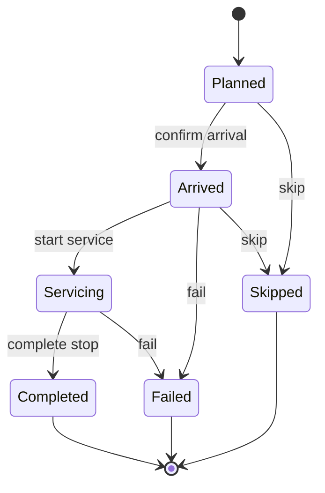

| الحالة | التسمية | نهائية |
| --- | --- | --- |
| `planned` | **Planned** | لا |
| `arrived` | **Arrived** | لا |
| `servicing` | **Servicing** | لا |
| `completed` | **Completed** | **نعم** |
| `failed` | **Failed** | **نعم** |
| `skipped` | **Skipped** | **نعم** |

**الانتقالات المُبوَّبة** — وهذه تقيّم قواعد العمل قبل المضيّ:

| من ← إلى | البوابة | الحارس |
| --- | --- | --- |
| servicing → completed | `stop_complete` | every line has actual_qty derived from the picking |

**الانتقالات ذات الآثار اللاحقة:**

| من ← إلى | ماذا يحدث كذلك |
| --- | --- |
| planned → arrived | actual_arrival set; scop.execution.event written |
| planned → skipped | outcome := skipped |
| arrived → servicing | actual_service_start set; scop.execution.event written |
| arrived → failed | outcome := failed |
| arrived → skipped | outcome := skipped |
| servicing → completed | actual_departure set; outcome := completed or partially_completed; scop.execution.event written |
| servicing → failed | outcome := failed |

→ [المحطة بالكامل](../execution/stops.mdx)

---

## المحطة — النتيجة

كيف انتهت الزيارة. تصنيفٌ لا دورة حياة — فكل قيمة نهائية ولا واحدة تنتقل إلى أخرى.

**النموذج** `scop.trip.stop` · **الحقل** `outcome` · **5 حالات** · **بلا انتقالات**

:::note[لا رسم، لأنه لا آلة]

`outcome` **مجموعة قيم** لا دورة حياة. فكل قيمة نهائية ولا واحدة تؤدي إلى أخرى: إذ تُعطى المحطة نتيجةً واحدة بالضبط، مرةً واحدة، مستنتَجةً مما تحرك فعلاً.

ورسمها مخطط حالات كان سيوحي بانتقالات بين النتائج غير موجودة.

:::

والنتيجة **مستنتَجة لا مختارة**. فالسائق الذي سلّم ثلاث كراتين من خمس سجّل ذلك على تحويل Odoo بالفعل؛ ومطالبته بتصنيف الزيارة كذلك كانت ستدعو الجوابين إلى الاختلاف.

| الحالة | التسمية | نهائية |
| --- | --- | --- |
| `completed` | **Completed** | **نعم** |
| `partially_completed` | **Partially Completed** | **نعم** |
| `failed` | **Failed** | **نعم** |
| `skipped` | **Skipped** | **نعم** |
| `rescheduled` | **Rescheduled** | **نعم** |

→ [المحطة بالكامل](../execution/stops.mdx)

---

## الحمولة

ما هو على المركبة فعلياً. وتتحرك من تلقاء نفسها إلى حد بعيد.

**النموذج** `scop.load` · **الحقل** `state` · **8 حالات** · **10 انتقالات**

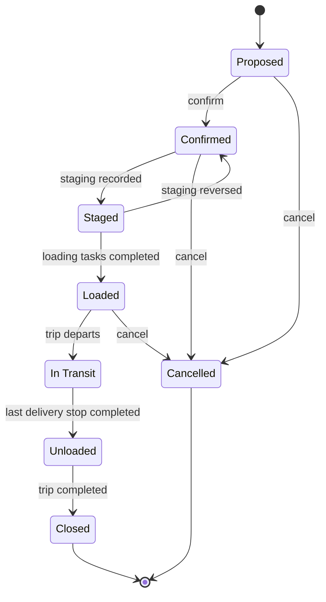

| الحالة | التسمية | نهائية |
| --- | --- | --- |
| `proposed` | **Proposed** | لا |
| `confirmed` | **Confirmed** | لا |
| `staged` | **Staged** | لا |
| `loaded` | **Loaded** | لا |
| `in_transit` | **In Transit** | لا |
| `unloaded` | **Unloaded** | لا |
| `closed` | **Closed** | **نعم** |
| `cancelled` | **Cancelled** | **نعم** |

**الانتقالات المُبوَّبة** — وهذه تقيّم قواعد العمل قبل المضيّ:

| من ← إلى | البوابة | الحارس |
| --- | --- | --- |
| proposed → confirmed | `load_confirm` | capacity feasible at every stop of the sequence |

**الانتقالات ذات الآثار اللاحقة:**

| من ← إلى | ماذا يحدث كذلك |
| --- | --- |
| staged → confirmed | is_staged cleared |

→ [الحمولة بالكامل](../execution/loading-operations.mdx)

---

## الاستثناء

عشر حالات، من الكشف إلى الإغلاق.

**النموذج** `scop.exception` · **الحقل** `state` · **10 حالات** · **10 انتقالات**

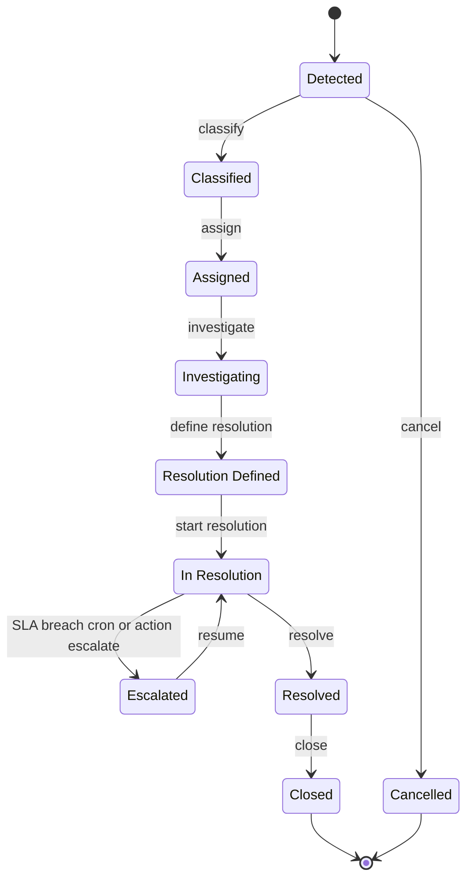

| الحالة | التسمية | نهائية |
| --- | --- | --- |
| `detected` | **Detected** | لا |
| `classified` | **Classified** | لا |
| `assigned` | **Assigned** | لا |
| `investigating` | **Investigating** | لا |
| `resolution_defined` | **Resolution Defined** | لا |
| `in_resolution` | **In Resolution** | لا |
| `escalated` | **Escalated** | لا |
| `resolved` | **Resolved** | لا |
| `closed` | **Closed** | **نعم** |
| `cancelled` | **Cancelled** | **نعم** |

**الانتقالات ذات الآثار اللاحقة:**

| من ← إلى | ماذا يحدث كذلك |
| --- | --- |
| detected → classified | sla_deadline computed from category |
| classified → assigned | mail.activity created |
| in_resolution → escalated | escalation_count += 1; escalated_at set; notify responsible_group_id |

→ [الاستثناء بالكامل](../exceptions/exception-management.mdx)

---

## قاعدة العمل

كيف تُقترَح سياسةٌ وتُعتمَد وتُجدوَل وتُحال إلى التقاعد. موجَّهة لمسؤول النظام.

**النموذج** `scop.business.rule` · **الحقل** `state` · **11 حالة** · **15 انتقالاً**

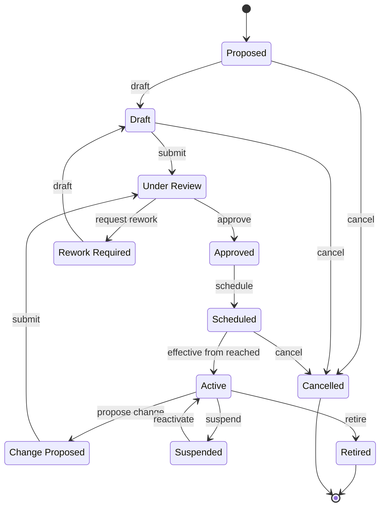

| الحالة | التسمية | نهائية |
| --- | --- | --- |
| `proposed` | **Proposed** | لا |
| `draft` | **Draft** | لا |
| `under_review` | **Under Review** | لا |
| `approved` | **Approved** | لا |
| `rework_required` | **Rework Required** | لا |
| `scheduled` | **Scheduled** | لا |
| `active` | **Active** | لا |
| `change_proposed` | **Change Proposed** | لا |
| `suspended` | **Suspended** | لا |
| `retired` | **Retired** | **نعم** |
| `cancelled` | **Cancelled** | **نعم** |

**الانتقالات ذات الآثار اللاحقة:**

| من ← إلى | ماذا يحدث كذلك |
| --- | --- |
| scheduled → active | supersedes_rule_id -> retired |
| active → change_proposed | a new record is created with the same code and a new version |
| active → suspended | evaluations return 'suspended' without calling the predicate |

→ [قاعدة العمل بالكامل](./business-rules.mdx)

---

## حدث التنفيذ

واقعةٌ فعلية مُسجَّلة، يُتحقَّق منها ثم تُوفَّق مع التحويل. موجَّهة لمسؤول النظام.

**النموذج** `scop.execution.event` · **الحقل** `state` · **3 حالات** · **انتقالان**

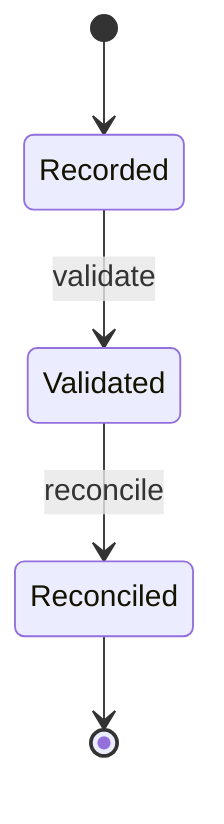

| الحالة | التسمية | نهائية |
| --- | --- | --- |
| `recorded` | **Recorded** | لا |
| `validated` | **Validated** | لا |
| `reconciled` | **Reconciled** | **نعم** |

→ [حدث التنفيذ بالكامل](../concepts/identity-and-traceability.mdx)

---

## ما ليس دورات حياة محكومة

حقلا حالة يبدوان دورتَي حياة وليسا كذلك. لا ترسمهما آلتَي حالات محكومتين.

### مهمة التحميل — الحالة

حقل حالة عادي بلا بوابة على أي حركة.

```text
Pending  →  In Progress  →  Done
                ↓
            Cancelled
```

| الحالة | يضبطها |
| --- | --- |
| **Pending** | تُنشأ مع إطلاق الرحلة |
| **In Progress** | **Start** |
| **Done** | **Done** |
| **Cancelled** | **Cancel** |

→ [عمليات التحميل](../execution/loading-operations.mdx)

### جاهزية المستودع

**محسوبة من الأدلة**، لا ينقلها أحد. وتستطيع التحرك في أي اتجاه بتغيّر الأدلة، ومنه إلى الوراء.

| الجاهزية | قابلة للتخطيط |
| --- | --- |
| **Ready** | **نعم** |
| **Conditionally Ready** | **نعم** |
| **Partially Ready** | لا |
| **Not Ready** | لا |
| **Blocked** | لا |

والشيء الوحيد الذي يستطيعه شخص هو تطبيق **تجاوز مشرف**، وهو يُسجَّل إلى جانب القيمة المحسوبة لا بديلاً عنها.

→ [جاهزية المستودع](../readiness/warehouse-readiness.mdx)

---

## أين تلتقي دورات الحياة

السلسلة التي تحمل العملية من خطة إلى طلب مغلق، دون أن يدفع أحدٌ حالةً يدوياً:

```text
Plan released       →  Trips released
                    →  Demands released
                    →  Resource assignments reserved
                    →  Loading tasks created

Loading started     →  Trip Loading
Loading finished    →  Trip Ready to Depart      →  Loads Loaded

Trip departs        →  Loads In Transit
                    →  Shipments In Execution
                    →  Demands In Execution

Last stop closed    →  Trip Completed or Partially Completed
                    →  Loads Closed
                    →  Shipments Completed
                    →  Demands Completed / Partially Completed / Failed
                    →  Resource assignments closed
                    →  Follow-up demands created for what failed
```

:::info[إن علق شيء، فانظر إلى المنبع]

لا أحد ينقل الشحنات ولا الطلبات عبر حالاتها يدوياً. فإن علق أحدها، كان السبب في أغلب الظن أبكر في هذه السلسلة — وأشيعه **تحويل Odoo لم يُتحقَّق منه**.

→ [التحقق من التسليم في Odoo](../execution/odoo-delivery-validation.mdx)

:::

## صفحات ذات صلة

- [مسرد الحالات](./status-glossary.mdx) — كل تسمية حالة في سطر واحد
- [قواعد العمل](./business-rules.mdx) — ما تقيّمه البوابات
- [نموذج الكائنات](../concepts/the-object-model.mdx)
- [نموذج الحوكمة](../concepts/the-governance-model.mdx)

## التالي

[مسرد الحالات](./status-glossary.mdx).
