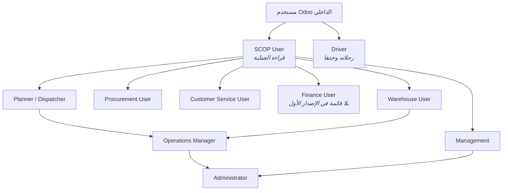
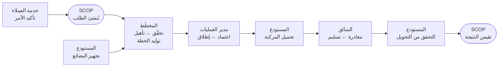

import DocumentInfo from '@site/src/components/DocumentInfo';

# نظرة عامة على الأدوار

<DocumentInfo
  category="دليل المستخدم"
  audience={['عمليات', 'إدارة', 'تخطيط', 'اختبار قبول المستخدم']}
  status="Draft"
  version="1.0"
  owner="فريق المنتج"
  updated="أغسطس 2026"
  readingTime="7 دقائق"
/>

## الأدوار العشرة

تقدّم SCOP عشرة أدوار. ثمانية منها تشغيلية، وواحد إداري، وواحد حجز لإصدار لاحق.

| الدور | المسؤولية في سطر | الصفحة |
| --- | --- | --- |
| **SCOP User** | قراءة العملية. الأساس الذي تُبنى عليه بقية الأدوار التشغيلية | — |
| **Customer Service User** | يملك وعد العميل والمتطلب خلفه | [خدمة العملاء](./customer-service.mdx) |
| **Warehouse User** | يجهّز البضائع ويحمّلها ويتحقق مما تحرك | [المستودع](./warehouse.mdx) |
| **Planner / Dispatcher** | يبني اليوم ويُسند المركبات والسائقين | [المخطِّط / المُوزِّع](./planner-dispatcher.mdx) |
| **Operations Manager** | يعتمد الخطة ويطلقها. ويملك الاستثناءات | [مدير العمليات](./operations-manager.mdx) |
| **Driver** | ينفّذ الرحلة ويسجّل ما حدث | [السائق](./driver.mdx) |
| **Procurement User** | يملك التزامات المورّدين | [المشتريات](./procurement.mdx) |
| **Management** | يقرأ الأداء ولا يغيّر شيئاً | [الإدارة](./management.mdx) |
| **Administrator** | يضبط النطاق والعقد والصلاحيات. ويشخّص | [مسؤول النظام](./administrator.mdx) |
| **Finance User** | *بلا قائمة في الإصدار الأول* | [نطاق الإصدار الأول](../about/release-1-scope.mdx) |

## كيف ترث الأدوار

الدور في SCOP مجموعة، ومعظم المجموعات تُبنى على **SCOP User**. فإعطاء أحدهم `Operations Manager` يعطيه أيضاً كل ما لدى `Planner` و`Warehouse`.

:::warning[Driver لا يرث SCOP User]

**السائق خارج السلّم عمداً.** فهو يُبنى مباشرةً على مستخدم Odoo الداخلي ولا يكتسب شيئاً من SCOP User.

وهذا هو أساس نموذج أمان السائق كله: فالسائق لا يستطيع قراءة الطلبات ولا الشحنات ولا الخطط ولا الجاهزية ولا الحوكمة، لأن لا مجموعة يحملها تمنحه ذلك. وإضافة `SCOP User` إلى سائق تُبطل ذلك بصمت.

راجع [نموذج أمان السائق](../execution/driver-security-model.mdx).

:::

## من يسلّم العمل لمن

تمرّ دورة التشغيل الواحدة عبر خمسة أيدٍ.

والنسخة العملية الكاملة في [تسليم كامل قياسي](../scenarios/standard-full-delivery.mdx).

## لماذا يُفصل الاعتماد عن الإنشاء

أهم خاصية حوكمة في SCOP على الإطلاق:

:::danger[من يُنشئ خطة لا يستطيع اعتمادها]

يرفض `BR-PLN-001` الاعتماد والإطلاق من مؤلف الخطة نفسه. **وهذا يشمل مسؤول النظام.** فالصلاحيات الإدارية لا تمنح صلاحية اعتماد؛ فهما أمران مختلفان.

ولا يستطيع فريق من شخص واحد إتمام دورة SCOP. وهذا مقصود لا سهو.

:::

والقاعدة مشروحة كاملةً في [حوكمة الخطة](../planning/plan-governance.mdx).

## ما يجوز لكل دور فعلاً

القراءة واسعة؛ والتغيير ضيّق. وهذا شكل الأمر عبر الكائنات الرئيسية.

| الكائن | قراءة | تغيير | إنشاء | حذف |
| --- | --- | --- | --- | --- |
| **الطلب** | مستخدم SCOP | المخطِّط | المخطِّط | مسؤول النظام |
| **الشحنة** | مستخدم SCOP | المخطِّط والمستودع | المخطِّط | مسؤول النظام |
| **جاهزية المستودع** | مستخدم SCOP | المخطِّط والمستودع | المخطِّط والمستودع | مسؤول النظام |
| **مهمة التحميل** | مستخدم SCOP | المستودع | المستودع | مسؤول النظام |
| **الخطة اليومية** | مستخدم SCOP | المخطِّط ومدير العمليات | المخطِّط ومدير العمليات | مسؤول النظام |
| **الرحلة** | مستخدم SCOP والمستودع و**السائق (رحلاته وحدها)** | المخطِّط و**السائق (رحلاته وحدها)** | المخطِّط | مسؤول النظام |
| **المحطة** | مستخدم SCOP و**السائق (محطاته وحدها)** | المخطِّط و**السائق (محطاته وحدها)** | المخطِّط | المخطِّط |
| **الحمولة** | مستخدم SCOP و**السائق (حمولاته وحدها)** | المخطِّط والمستودع | المخطِّط | مسؤول النظام |
| **الاستثناء** | مستخدم SCOP | مستخدم SCOP | مستخدم SCOP | مسؤول النظام |
| **عقدة التخطيط** | مستخدم SCOP والسائق | المخطِّط | مسؤول النظام | مسؤول النظام |

و«رحلاته وحدها» للسائق مفروضة بقاعدة سجلات على ربط الموظف بحساب المستخدم، لا بإخفاء قائمة.

## صلاحية الاعتماد منفصلة عن الوصول

القدرة على فتح شاشة ليست كالاستحقاق للتصرف فيها. وتسجّل SCOP ذلك الاستحقاق منفصلاً، في `SCOP → Governance → Approval Authorities`.

| الكائن | الإجراء | المجموعة المستحقة | يُمنع الاعتماد الذاتي |
| --- | --- | --- | --- |
| الخطة اليومية | Approve | Operations Manager | **نعم** |
| الخطة اليومية | Release | Operations Manager | **نعم** |
| الرحلة | Approve | Operations Manager | لا |
| الرحلة | Release | Operations Manager | لا |
| الرحلة | Depart | Planner / Dispatcher | لا |
| الرحلة | Cancel | Planner / Dispatcher | لا |
| الطلب | Plan وReplan وCancel | Planner / Dispatcher | لا |
| الشحنة | Cancel | Planner / Dispatcher | لا |
| الحمولة | Cancel | Warehouse User | لا |

الشرح الكامل في [نموذج الحوكمة](../concepts/the-governance-model.mdx).

## صلاحيات SCOP ليست صلاحيات Odoo

SCOP تمنح صلاحيات SCOP. وحيث يؤدي دور عملَ Odoo نفسه — قراءة المركبات، وإسناد الموظفين، والتحقق من التحويلات — فهو يحتاج مجموعات Odoo أيضاً، و SCOP لا تمنحها.

وهذا ما يقع فيه كل تنصيب مرة على الأقل. والجدول الكامل في [مرجع الصلاحيات](./permissions-reference.mdx).

## اختيار دور لمستخدم جديد

| الشخص… | امنحه |
| --- | --- |
| يستقبل أوامر العملاء ويجيب عن «أين تسليمي» | Customer Service User |
| ينتقي ويجهّز ويحمّل ويتحقق من التحويلات | Warehouse User |
| يبني الخطة اليومية | Planner / Dispatcher **+ Fleet Administrator + Employees Officer + Inventory User** |
| يعتمد الخطة | Operations Manager (شخص *مختلف* عن المخطِّط) |
| يقود | Driver **وحده** — لا شيء غيره |
| يدير وعود المورّدين | Procurement User |
| يريد الأرقام ولا يغيّر شيئاً | Management |
| يضبط إعدادات المنصة | Administrator |

## صفحات ذات صلة

- [مرجع الصلاحيات](./permissions-reference.mdx)
- [نموذج الحوكمة](../concepts/the-governance-model.mdx)
- [حوكمة الخطة](../planning/plan-governance.mdx)
- [نموذج أمان السائق](../execution/driver-security-model.mdx)
