import DocumentInfo from '@site/src/components/DocumentInfo';

# تسليم كامل قياسي

<DocumentInfo
  category="دليل المستخدم"
  audience={['عمليات', 'مستودعات', 'تخطيط', 'سائقون', 'اختبار قبول المستخدم']}
  status="Draft"
  version="1.0"
  owner="فريق المنتج"
  updated="أغسطس 2026"
  readingTime="8 دقائق"
/>

## الحالة

**SCOP Manual Demo Customer** يطلب بضائع للتسليم إلى **SCOP Manual Branch A**. والمخزون متوافر، والمركبة تتّسع، وكل شيء يعمل.

وهذه هي الحالة المرجعية. وكل سيناريو آخر انحرافٌ عنها.

## الأدوار المشارِكة

| الخطوة | الدور |
| --- | --- |
| 1 | خدمة العملاء |
| 2–4 | المخطِّط |
| 3 | المستودع |
| 5 | **مدير العمليات** — شخصٌ آخر |
| 6 | المستودع |
| 7 | السائق |
| 8 | المستودع |

## الدورة

```mermaid
flowchart LR
    A["1 · Order<br/><b>Customer Service</b>"]
    B["2 · Validate + Eligible<br/><b>Planner</b>"]
    C["3 · Stage<br/><b>Warehouse</b>"]
    D["4 · Generate + Submit<br/><b>Planner</b>"]
    E["5 · Approve + Release<br/><b>Ops Manager</b>"]
    F["6 · Load<br/><b>Warehouse</b>"]
    G["7 · Deliver<br/><b>Driver</b>"]
    H["8 · Validate transfer<br/><b>Warehouse</b>"]
    I(["9 · SCOP closes<br/>and measures"])
    A --> B --> C --> D --> E --> F --> G --> H --> I
```

---

## الخطوة 1 — الأمر

**الدور** خدمة العملاء
**أين** **Odoo** — المبيعات

أكّد أمر البيع، بـ**تاريخ تسليم**. فيُنشئ Odoo أمر التسليم.

**ماذا تفعل SCOP** — تلقائياً، دون أن يكتب أحدٌ شيئاً:

| تُنشئ | المحتوى |
| --- | --- |
| **طلباً** واحداً | `DMD-…`، نوعه **Delivery**، ونوع منشئه **Customer Order** |
| **سطر طلب** لكل حركة | الصنف، والكمية، والمالك المشتقّ |
| **تعهُّد خدمة** | من تاريخ التسليم في الأمر |
| حدث `DemandGenerated` | تحت مرجع ترابط واحد |

**تحقّق** `SCOP → Operations → Demands` — ابحث عن رقم الأمر.

:::note[الملكية غير المحلولة هنا طبيعية]

فالتحويل عادةً بلا أسطر حركة بعد، فلا شيء يُقرأ منه مالك. والملكية يُعاد اشتقاقها عند التحقق.

:::

→ [كيف تُنشأ الطلبات](../demand/how-demands-are-created.mdx)

---

## الخطوة 2 — التحقق والتأهيل

**الدور** المخطِّط
**أين** `SCOP → Operations → Demands` ← افتح الطلب

| # | اضغط | ماذا يحدث |
| --- | --- | --- |
| 1 | **Validate** | يُعاد اشتقاق الملكية، ويُقيَّم `BR-INV-002`، وتصير الحالة **Validated** |
| 2 | **Mark Eligible** | يُنعَش التخصيص، وتصير الحالة **Eligible for Planning**، **وتتكوّن الشحنة** |

**تحقّق**

| افحص | توقّع |
| --- | --- |
| الطلب | **Eligible for Planning** |
| تبويب **Shipments** فيه | شحنة واحدة |
| `Operations → Warehouse Readiness` | **Conditionally Ready** |

→ [أهلية التخطيط](../demand/planning-eligibility.mdx)

---

## الخطوة 3 — تجهيز البضائع

**الدور** المستودع
**أين** `SCOP → Operations → Shipments` ← افتح الشحنة

اجمع البضائع وهيّئها في Odoo، ثم اضغط **Stage Everything**.

**تحقّق** تصير الجاهزية **Ready**، والدليل يقول *"Everything is staged."*

→ [جاهزية المستودع](../readiness/warehouse-readiness.mdx)

---

## الخطوة 4 — توليد الخطة وتقديمها

**الدور** المخطِّط
**أين** `SCOP → Planning → Generate a Plan`

| # | افعل |
| --- | --- |
| 1 | اضبط **Plan Date** على التاريخ المطلوب |
| 2 | أكّد الطلبات المعروضة |
| 3 | اختر المركبات، ومنها **SCOP Manual Vehicle** |
| 4 | اضغط **Generate** |
| 5 | افتح الخطة واقرأ تبويب **Unplanned Demand** |
| 6 | اضغط **Submit** |

**تحقّق**

| افحص | توقّع |
| --- | --- |
| `Planning → Planning Runs` | الحالة **Recommended**، والطلب والاستجابة مُسجَّلان |
| `Planning → Daily Plans` | الحالة **Under Review** |
| تبويب **Trips** في الخطة | رحلةٌ واحدة، ممكنة سعوياً |
| الطلب | **Planned** |

→ [توليد خطة](../planning/generate-a-plan.mdx)

---

## الخطوة 5 — الاعتماد والإطلاق

**الدور** **مدير العمليات — شخصٌ غير الذي في الخطوة 4**
**أين** `SCOP → Planning → Daily Plans` ← افتح الخطة

| # | افعل |
| --- | --- |
| 1 | اقرأ تبويب **Unplanned Demand** |
| 2 | تأكّد ألّا رحلة موسومة بأنها غير ممكنة |
| 3 | اضغط **Approve** |
| 4 | اضغط **Release** |

:::danger[إن حاول المخطِّط هذا، رُفض]

فـ`BR-PLN-001` يسمّي القاعدة ويُصرِّح بالسياسة. وذلك هو الضابط يعمل.

:::

**تحقّق**

| افحص | توقّع |
| --- | --- |
| الخطة | **Released** |
| **Approved By** | مدير العمليات، لا المؤلف |
| الرحلة | **Released** |
| الطلب | **Released** |
| `Operations → Loading Tasks` | **مهمة لكل شحنة** |
| `Operations → Resource Assignments` | **Committed** |

→ [حوكمة الخطة](../planning/plan-governance.mdx)

---

## الخطوة 6 — تحميل المركبة

**الدور** المستودع
**أين** `SCOP → Operations → Loading Tasks`

| # | افعل | الأثر |
| --- | --- | --- |
| 1 | اضغط **Start** على المهمة | تنتقل الرحلة إلى **Loading** |
| 2 | حمّل المركبة | — |
| 3 | اضغط **Done** | تصير الرحلة **Ready to Depart** |

**تحقّق** الرحلة **Ready to Depart**؛ والمهمة تسجّل **Actual Duration**.

→ [عمليات التحميل](../execution/loading-operations.mdx)

---

## الخطوة 7 — التسليم

**الدور** السائق
**أين** `SCOP → My Work`

| # | الشاشة | اضغط |
| --- | --- | --- |
| 1 | **My Trips** | **Depart** |
| 2 | **My Stops** ← محطة المستودع | **I have arrived** و**Start unloading** و**Delivered** |
| 3 | **My Stops** ← محطة العميل | **I have arrived** |
| 4 | نفسها | **Start unloading** |
| 5 | تبويب **Proof of delivery** | المستلِم، والتوقيع، والصور |
| 6 | — | **انتظر الخطوة 8** |

:::warning[لا تضغط Delivered بعد]

فمحطة العميل لا تُغلق حتى يُتحقَّق من تحويل Odoo. وضغطه الآن يُرجع رسالةً تقول ذلك بالضبط.

:::

**تحقّق** الرحلة **In Progress**؛ والشحنات والطلبات انتقلت إلى **In Execution** من تلقاء نفسها.

→ [تسليم السائق](../execution/driver-delivery.mdx)

---

## الخطوة 8 — التحقق من التحويل

**الدور** المستودع
**أين** **Odoo** — أمر التسليم

تحقّق منه بـ**الكمية الكاملة**، إذ سُلِّم كل شيء.

**ماذا تفعل SCOP** تقرأ الكميات الفعلية إلى أسطر المحطة وأسطر الطلب.

**تحقّق** تبويب **Quantities** في المحطة يعرض كميات فعلية؛ و**Fulfilled** في الطلب يساوي **Requested**.

→ [التحقق من التسليم في Odoo](../execution/odoo-delivery-validation.mdx)

---

## الخطوة 9 — إغلاق المحطة، ومشاهدة السلسلة تُغلق

**الدور** السائق

اضغط **Delivered** على محطة العميل.

**ماذا تفعل SCOP**، دون أن يدفع أحدٌ حالة:

| السجل | يصير |
| --- | --- |
| المحطة | **Completed**، والنتيجة **Completed** |
| الرحلة | **Completed** |
| حمولاتها | **Closed** |
| الشحنة | **Completed** |
| الطلب | **Completed** |
| تخصيصات الموارد | **Closed** |

---

## تحقّق من الدورة كلها

| افحص | أين | توقّع |
| --- | --- | --- |
| أن الطلب أُغلق | `Operations → Demands` | **Completed** |
| أن الكميات توافق Odoo | زر **Transfers** | متطابقة |
| إثبات التسليم | المحطة | توقيع وصور |
| أنه يظهر في OTIF | `Reporting → OTIF` | **On Time** و**In Full** صحيحان |
| التغطية | `Reporting → Plan Coverage` | 100% لتلك الخطة |
| القصة كلها | `Reporting → Operation Timeline` | كل خطوة، بالترتيب |

:::info[انسخ مرجع الترابط واقرأ الخط الزمني]

تبويب **Technical** في الطلب يحمله. ولصقه في [الخط الزمني للعملية](../reporting/operation-timeline.mdx) يعرض كل إجراء عبر كل سجل، بمن فعله.

وذلك أفضل طريقة مفردة لتأكيد أن دورةً نجحت فعلاً.

:::

## ماذا يُبرهن هذا السيناريو

| الخاصية | يُبرهنها |
| --- | --- |
| أن الطلب يُنشأ تلقائياً | الخطوة 1 — لم يكتب أحدٌ شيئاً |
| أن الملكية لا تُخمَّن أبداً | الخطوة 2 — يُعاد اشتقاقها ثم تُفحَص |
| أن الجاهزية محسوبة من الأدلة | الخطوة 3 |
| أن التخطيط قابل لإعادة التشغيل | الخطوة 4 — احتفظت التشغيلة بطلبها وجوابها |
| أن فصل المهام قائم | الخطوة 5 |
| أن التحميل يُبوِّب المغادرة | الخطوة 6 |
| أن الكميات تأتي من Odoo | الخطوات 7–9 |
| أن السلسلة تُغلق نفسها | الخطوة 9 |
| أن العملية قابلة للقياس | جدول التحقق |

## صفحات ذات صلة

- [طلبان وزيارة واحدة](./two-orders-one-visit.mdx)
- [تسليم جزئي مع طلب مؤجَّل](./partial-delivery-with-backorder.mdx)
- [دليل البدء السريع لـ SCOP](../../quick-start/overview)

## التالي

[طلبان وزيارة واحدة](./two-orders-one-visit.mdx).
