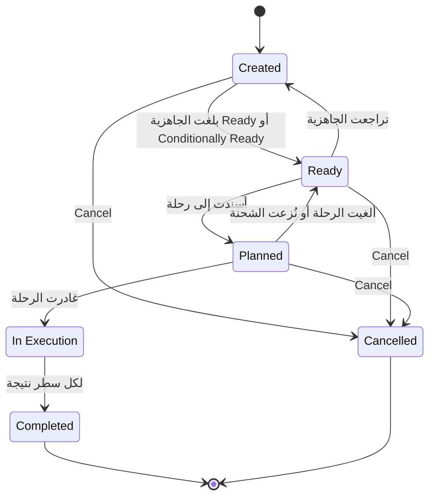

import DocumentInfo from '@site/src/components/DocumentInfo';
import Screenshot from '@site/src/components/Screenshot';

# إدارة الشحنات

<DocumentInfo
  category="دليل المستخدم"
  audience={['تخطيط', 'مستودعات', 'عمليات', 'اختبار قبول المستخدم']}
  status="Draft"
  version="1.0"
  owner="فريق المنتج"
  updated="أغسطس 2026"
  readingTime="8 دقائق"
/>

**الدور**
المخطِّط يملكها. والمستودع يجهّزها. وكل من له دور في SCOP يستطيع قراءتها.

**انتقل إلى**
`SCOP → Operations → Shipments`

## ما هي الشحنة

**الشحنة** **متطلب نقل**: طلب أو أكثر متوافقة تستطيع السفر معاً، بوزن إجمالي وحجم إجمالي وعقدة انطلاق وعقدة وصول وتاريخ مطلوب.

فالطلب يجيب عن *ما يجب أن يتحرك*. والشحنة تجيب عن *ما يوضع على مركبة*.

| الكائن | السؤال | الحبيبة |
| --- | --- | --- |
| **الطلب** | ما يجب أن يتحرك | متطلب عمل واحد |
| **الشحنة** | ما يمكن تخطيطه كحمولة واحدة | متطلب نقل واحد |
| **الرحلة** | من ينقله وبأي ترتيب | مركبة وسائق |
| **المحطة** | أين يُسلَّم | زيارة فعلية واحدة |

## من أين تأتي الشحنة

أنت لا تُنشئ شحنة في التشغيل الطبيعي. بل تتكوّن **تلقائياً** حين يبلغ الطلب **Eligible for Planning**.

→ [التكوين والتجميع](./formation-and-consolidation.mdx)

## قائمة الشحنات

<Screenshot
  src="user-manual/96-shipments-staged-pct.png"
  alt="قائمة الشحنات في SCOP تعرض الوزن والحجم ونسبة التجهيز والجاهزية والحالة."
  caption="صف واحد لكل شحنة. ولاحظ عمود Staged Pct: الشحنة المُجهَّزة بالكامل تُظهر 10000% حيث تعني 100% — خلل عرض معروف."
/>

| العمود | المعنى |
| --- | --- |
| **Reference** | المعرِّف التجاري، `SHP-2026-000007` |
| **Shipment Type** | Delivery · Collection · Transfer · Return |
| **Partner** | الجهة التي تخدمها |
| **Destination Location** | عقدة الوصول |
| **Earliest / Latest Datetime** | النافذة التي يجب أن تتحرك فيها |
| **Total Weight Kg** | مجموع السطور |
| **Total Volume M3** | مجموع السطور |
| **Staged Pct** | كم منها مُجهَّز فعلياً |
| **Readiness** | حالة الجاهزية المحسوبة |
| **Status** | حالة دورة الحياة |

:::warning[عمود Staged Pct يُعرض أكبر مئة مرة]

خلل عرض معروف: تُظهر `100%` على أنها `10000%`. والقيمة **المخزَّنة** صحيحة — والعمود وحده هو المضروب مرتين.

اقرأه كجزء من مئة، أو استخدم **Readiness** بدلاً منه، فهي محسوبة من الأدلة نفسها وغير متأثرة. و Plan Coverage غير متأثر.

**مُعاد التحقق منه على `b2b`:** الشحنة المُجهَّزة بالكامل تعرض `10000%`، وغير المجهَّزة تعرض `0%` بشكل صحيح.

→ [نطاق الإصدار الأول](../about/release-1-scope.mdx)

:::

## نموذج الشحنة

<Screenshot
  src="user-manual/42-shipment-form-consolidated.png"
  alt="نموذج شحنة مُجمَّعة في SCOP يعرض ثلاثة سطور مأخوذة من طلبين مختلفين، وكل سطر يسمّي طلبه."
  caption="SHP-2026-000007 على b2b: ثلاثة سطور وطلبان. اثنان من DMD-2026-000012 وواحد من DMD-2026-000014، وكل سطر ما زال يسمّي الطلب الذي يخصّه."
/>

### الترويسة

```text
Created → Ready → Planned → In Execution → Completed
```

| الزر | متاح حين | الدور |
| --- | --- | --- |
| **Refresh Readiness** | دائماً | أي دور |
| **Stage Everything** | الحالة **Created** أو **Ready** | **المستودع** |
| **Cancel** | ليست Completed أو Cancelled أو In Execution | المخطِّط |

ومجموعتا الحقول هما **Transport Requirement** (النوع والجهة وعقدتا المصدر والوجهة) و**Timing and Load** (النافذة الزمنية والوزن والحجم ونسبة التجهيز).

### سطور الشحنة

| الحقل | المعنى | المصدر |
| --- | --- | --- |
| **Demand** | الطلب الذي يخصّه هذا السطر | **رابط التتبّع** |
| **Product** | ما يتحرك | سطر الطلب |
| **Qty** | كم تحمل هذه الشحنة | الكمية المتبقية من سطر الطلب |
| **Inventory Owner** | من يملكه | منسوخ من سطر الطلب |
| **Ownership Source** | كيف ثبتت الملكية | منسوخ من سطر الطلب |
| **Is Staged** | هل جُهِّزت هذه البضائع فعلياً | يضبطه التجهيز |
| **Staged Qty** | الكمية المُجهَّزة | يضبطه التجهيز |
| **Weight Kg** و**Volume M3** | نصيب السطر | محسوب |

:::info[كل سطر شحنة ما زال يسمّي طلبه]

وهذا ما يجعل الشحنة المُجمَّعة آمنة. فالطلبان اللذان يتشاركان شحنة يبقيان متطلبين اثنين، وكل سطر يُتتبَّع إلى طلبه وتحويل Odoo الخاص به.

وداخل تسليم واحد، قد يكتمل `الطلب أ` بالكامل بينما يكون `الطلب ب` ناقصاً.

:::

### التبويبات الأخرى

| التبويب | يعرض |
| --- | --- |
| **Lines** | المنتجات والكميات والمُلّاك والتجهيز |
| **Readiness** | الحالة المحسوبة وأي تجاوز والدليل بالكلمات |
| **Constraints** | قيود المناولة أو التوافق السارية |
| **Execution** | الرحلة والمحطة وما حدث |

## الحالات الست



| الحالة | المعنى |
| --- | --- |
| **Created** | تكوّنت، لكنها ليست جاهزة بما يكفي للتخطيط |
| **Ready** | الجاهزية Ready أو Conditionally Ready. يمكن تخطيطها |
| **Planned** | أُسندت إلى رحلة |
| **In Execution** | غادرت الرحلة |
| **Completed** | لكل سطر نتيجة. **نهائية** |
| **Cancelled** | سُحبت. **نهائية** |

:::note[Ready قد تتراجع]

خلافاً لمعظم دورات الحياة في SCOP، قد تنتقل الشحنة **Ready ← Created** إن تراجعت الجاهزية — بأن أُلغي حجز أو أُلغي تحويل.

وهذا سلوك صحيح: فالجاهزية محسوبة من الأدلة الحالية، والأدلة تتغير.

:::

## التجهيز

يعلّم **Stage Everything** كل سطر مُجهَّزاً ويعيد حساب الجاهزية.

| | |
| --- | --- |
| **الدور** | المستودع |
| **استخدمه حين** | تكون بضائع **الشحنة كاملةً** مُنتقاة فعلياً وواقفة جاهزة للتحميل |
| **ما يفعله** | يعلّم كل سطر مُجهَّزاً، ويعيد حساب الجاهزية، فتصبح عادةً **Ready** |

<Screenshot
  src="user-manual/93-shipment-staged.png"
  alt="نموذج شحنة في SCOP بعد Stage Everything، وكل سطر مُجهَّز والجاهزية Ready."
  caption="بعد Stage Everything: كل سطر مُجهَّز، والجاهزية Ready، والدليل 'Everything is staged.'"
/>

ولا يمكنك تجهيز أكثر مما تطلبه الشحنة — ترفض SCOP ذلك.

→ [جاهزية المستودع](../readiness/warehouse-readiness.mdx)

## النزع والإلغاء

### نزع شحنة من رحلة

نزع الشحنة من رحلة يعيدها إلى **Ready** ويعيد طلباتها إلى **Eligible for Planning**، مع كتابة صف طلب غير مخطَّط لكل واحد.

→ [الطلب غير المخطَّط](../planning/unplanned-demand.mdx)

### الإلغاء

| | |
| --- | --- |
| **الدور** | المخطِّط *(صلاحية اعتماد: `scop.shipment` / cancel)* |
| **متاح** | حتى تصبح الشحنة In Execution أو Completed أو Cancelled |
| **غير متاح** | بعد مغادرة الرحلة — فالبضائع على مركبة |

وإلغاء الشحنة لا يلغي طلباتها ولا تحويلات Odoo خلفها.

## التحقق

| تحقّق | أين |
| --- | --- |
| وجود الشحنة | تبويب **Shipments** في الطلب |
| أنها تحمل الطلبات الصحيحة | تبويب **Lines**، عمود **Demand** |
| صحة وزنها وحجمها | ترويسة الشحنة |
| أنها قابلة للتخطيط | `Operations → Warehouse Readiness` |
| أنها خُطِّطت | عمود **Trip** في القائمة |

## إذا لم ينجح

| العَرَض | تحقّق من |
| --- | --- |
| لا شحنة بعد **Mark Eligible** | راجع [مشكلات الجاهزية والشحنات](../troubleshooting/readiness-and-shipment-problems.mdx) |
| شحنتان حيث توقعت واحدة | اختلاف المسار أو التاريخ أو النوع — راجع [التكوين والتجميع](./formation-and-consolidation.mdx) |
| شحنة واحدة حيث توقعت اثنتين | المسار والتاريخ والنوع نفسها. هذا هو التجميع يعمل |
| عالقة في **Created** | الجاهزية لم تبلغ Ready أو Conditionally Ready |
| الجاهزية **Blocked** | ملكية غير محلولة، أو كل التحويلات ملغاة |
| **Stage Everything** غير معروض | لست مستخدم مستودع، أو الشحنة تجاوزت **Ready** |
| نسبة التجهيز تبدو عبثية | خلل العرض المعروف — اقرأها كجزء من مئة |

## صفحات ذات صلة

- [التكوين والتجميع](./formation-and-consolidation.mdx)
- [الزيارة الفعلية](./the-physical-visit.mdx)
- [جاهزية المستودع](../readiness/warehouse-readiness.mdx)
- [إدارة الطلب](../demand/demand-management.mdx)

## التالي

[التكوين والتجميع](./formation-and-consolidation.mdx).
